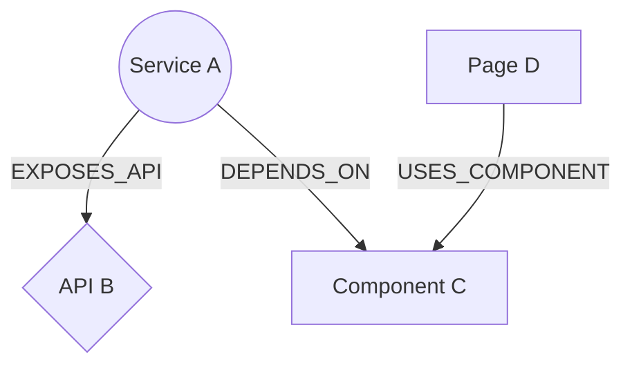

# 知识图谱 MMD 导出功能

## 功能概述

为 documind 项目的知识图谱界面添加了导出 Mermaid Markdown (MMD) 格式的功能，用户可以将当前显示的知识图谱导出为 `.mmd` 文件，方便在其他支持 Mermaid 的工具中使用。

## 实现内容

### 后端实现

#### 1. MMD 转换模块 (`backend/server/mmd.ts`)

实现了将图数据转换为 Mermaid Markdown 格式的核心逻辑：

- **节点形状映射**：根据实体类型自动选择合适的 Mermaid 节点形状
  - `Service` / `Module` → 圆形 `((...))`
  - `API` / `Documentation` / `Document` → 菱形 `{...}`
  - `Page` / `Component` → 矩形 `[...]`
  
- **特殊字符处理**：对节点名称和关系类型中的引号进行转义，确保生成的 MMD 语法正确

- **图定义**：生成 `graph TD`（从上到下）的 Mermaid 图定义

#### 2. API 路由 (`backend/server/routers.ts`)

在 `graph` 路由下新增 `exportMmd` 接口：

```typescript
graph.exportMmd: publicProcedure
  .input(z.object({
    types: z.array(...).optional(),
    statuses: z.array(...).optional(),
  }))
  .query(async ({ input }) => {
    const graphData = await db.getGraphData(input);
    return generateMmdFromGraphData(graphData);
  })
```

- 接收与 `getData` 相同的过滤参数（类型和状态）
- 返回 MMD 格式的字符串

#### 3. 单元测试 (`backend/server/mmd.test.ts`)

包含 4 个测试用例：

- ✓ 验证基本的 MMD 生成功能
- ✓ 验证特殊字符处理
- ✓ 验证空图数据处理
- ✓ 验证通过 tRPC 路由调用

### 前端实现

#### 1. 导出按钮 (`backend/client/src/pages/Graph.tsx`)

在知识图谱页面顶部工具栏添加了"导出 MMD"按钮：

- 位置：实体列表按钮左侧
- 图标：下载图标 (Download)
- 状态：当图谱加载中或无数据时禁用

#### 2. 导出功能实现

```typescript
const handleExportMmd = async () => {
  // 1. 调用后端 API 获取 MMD 内容
  const mmdContent = await trpc.graph.exportMmd.query({
    types: selectedTypes,
    statuses: selectedStatuses,
  });
  
  // 2. 创建 Blob 并触发下载
  const blob = new Blob([mmdContent], { type: 'text/markdown' });
  const url = URL.createObjectURL(blob);
  const link = document.createElement('a');
  link.href = url;
  link.download = `knowledge-graph-${date}.mmd`;
  link.click();
  
  // 3. 清理资源
  URL.revokeObjectURL(url);
};
```

- 根据当前筛选条件导出对应的图谱数据
- 文件名格式：`knowledge-graph-YYYY-MM-DD.mmd`
- 导出成功后显示提示消息

## 使用方法

1. 打开知识图谱页面
2. 使用类型和状态筛选器选择要导出的实体
3. 点击顶部工具栏的"导出 MMD"按钮
4. 浏览器会自动下载 `.mmd` 文件

## 导出文件示例



## 技术栈

- **后端**：TypeScript + tRPC + Zod
- **前端**：React + TypeScript + Lucide Icons
- **测试**：Vitest

## 提交记录

- `c77e23f` - feat: Add graph export to MMD format (后端实现)
- `938f14b` - feat: Add export MMD button to knowledge graph UI (前端实现)

## 注意事项

- 导出的 MMD 文件包含当前筛选条件下的所有节点和边
- 节点 ID 使用数据库中的数字 ID
- 关系类型使用英文标识（如 `DEPENDS_ON`）
- 建议使用支持 Mermaid 的编辑器（如 VS Code + Mermaid 插件）查看和编辑导出的文件
