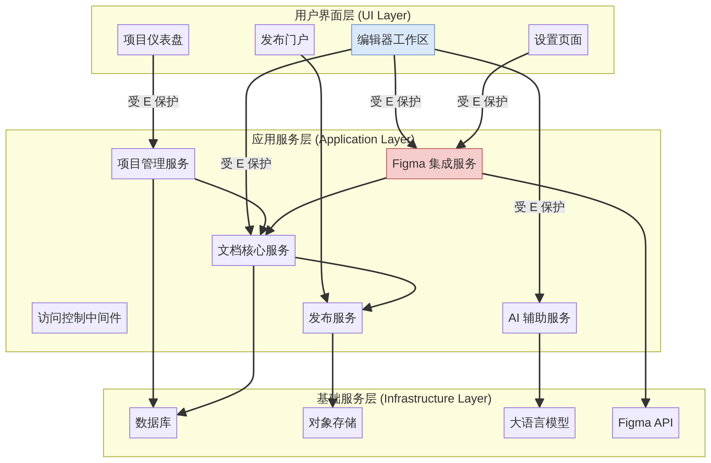

# DocuMind MVP 项目计划书

**项目名称**：DocuMind - 新一代 AI 驱动的智能产品文档协作平台 (MVP)
**版本**：1.0
**日期**：2025-12-07
**项目负责人**：Manus AI (产品经理)

---

## 1. 项目概述

### 1.1 项目背景

当前产品文档的撰写和维护流程存在诸多痛点：文档与设计稿、代码脱节，更新不及时；大量重复性的人力撰写工作耗时耗力；文档缺乏交互性，开发者体验差。DocuMind 旨在通过深度集成 AI 能力和外部“事实源”（如 Figma），革命化产品文档的创作与消费体验。

### 1.2 项目目标

本次 MVP 项目的核心目标是：**验证以 Figma 集成为起点的、由 AI 驱动的全功能编辑器，在产品文档创作中的端到端效率提升**。我们将为产品的首位深度用户（即您）提供一个功能完整、可立即投入使用的单人创作工具，并以此为基础收集反馈，迭代优化。

### 1.3 成功指标

*   **效率提升**：用户能在 5 分钟内从 Figma 同步组件并查看自动生成的组件文档。
*   **创作体验**：用户能在 15 分钟内撰写一个完整的页面文档（包括用户故事、页面状态、交互说明）。
*   **AI 价值**：AI 生成的用户故事有 80%+ 的采纳率（用户直接使用或仅做小幅修改）。
*   **交付质量**：发布的文档在浏览器中能正确渲染所有交互式示例和 API 测试器。

---

## 2. 项目范围

### 2.1 核心功能范围 (In-Scope)

| 模块 | 核心功能 |
| :--- | :--- |
| **访问控制** | 硬编码密码保护，简化访问流程。 |
| **项目管理** | 极简的项目创建和列表查看。 |
| **集成中心** | **Figma 集成**：配置 Figma API Key 和文件 URL，自动同步组件信息生成或更新文档草稿。 |
| **编辑器工作区** | **全功能编辑器**：提供包含交互式示例、API 测试器、完整上下文侧边栏（评论、版本、AI 助手）的完整编辑体验。 |
| **高级 AI 辅助** | AI 影响分析、AI 聊天助手、文本生成与润色。 |
| **发布门户** | 一键发布为包含完整交互体验的只读静态网站。 |

### 2.2 排除功能范围 (Out-of-Scope)

*   **多用户与协作**：不支持多用户环境、实时协作和复杂的权限管理。
*   **其他集成**：除 Figma 外，不支持 GitHub, Jira 等其他第三方工具的集成。
*   **企业级功能**：如 SSO、审计日志、私有化部署等。

---

## 3. 项目交付物

1.  **DocuMind MVP 应用程序**：一个可部署的 Web 应用，包含本计划书中定义的所有功能。
2.  **功能架构图**：描述系统各模块及其依赖关系。
    
3.  **页面信息架构图**：描述应用内所有页面及其跳转关系。
    
4.  **项目源代码**：完整的、结构清晰的前后端源代码。
5.  **部署说明**：关于如何配置和部署该应用的简要说明文档。

---

## 4. 项目时间计划与里程碑

项目总周期预计为 **10-14 周**。我们将分阶段进行开发，每个阶段结束时都会有一个明确的里程碑。

| 阶段 | 主要任务 | 预计工时 | 里程碑 |
| :--- | :--- | :--- | :--- |
| **第一阶段** | 密码保护、项目管理、编辑器基础框架 | 1-2 周 | 基础应用框架搭建完成，可访问受保护的仪表盘。 |
| **第二阶段** | 四层文档结构、模板系统、手动关联 | 2 周 | 编辑器支持四种文档类型的创建和手动关联。 |
| **第三阶段** | 交互式示例、API 测试器 | 2 周 | 组件和 API 文档支持 Live Demo 和在线测试。 |
| **第四阶段** | **Figma 集成** | 2-3 周 | **核心里程碑**：可从 Figma 自动同步组件并生成文档。 |
| **第五阶段** | AI 功能集成 | 2-3 周 | 编辑器内集成所有高级 AI 辅助功能。 |
| **第六阶段** | 发布服务、静态网站生成 | 1-2 周 | 实现一键发布功能，可生成公开的只读文档网站。 |
| **第七阶段** | 集成测试、优化与部署 | 1-2 周 | **项目交付**：完成所有功能测试，应用成功部署。 |

---

## 5. 资源计划

### 5.1 技术栈

*   **前端**：React + TypeScript + TailwindCSS
*   **后端**：Node.js (Express) 或 Python (FastAPI)
*   **数据库**：PostgreSQL
*   **对象存储**：AWS S3 或其他云存储
*   **LLM 集成**：OpenAI API 或其他兼容 API
*   **编辑器核心**：Monaco Editor 或 CodeMirror
*   **Figma 集成**：Figma REST API

### 5.2 项目成员

*   **产品经理**：Manus AI
*   **核心用户/利益相关者**：您

---

## 6. 风险管理

| 风险类别 | 风险描述 | 可能性 | 影响 | 应对措施 |
| :--- | :--- | :--- | :--- | :--- |
| **技术风险** | Figma API 发生重大变更，导致集成功能中断。 | 低 | 高 | 关注 Figma 开发者公告，为 API 版本做好兼容性设计。 |
| **技术风险** | 大语言模型（LLM）返回结果不稳定或不符合预期。 | 中 | 中 | 设计健壮的 Prompt Engineering 策略，增加重试和纠错机制，允许用户手动修正 AI 结果。 |
| **技术风险** | 交互式示例的沙箱环境安全性不足，可能存在代码注入风险。 | 中 | 高 | 采用成熟的 iframe 沙箱或 Web Worker 方案，严格限制代码执行权限。 |
| **进度风险** | 核心功能（Figma 集成、交互式示例）开发复杂度超出预期。 | 中 | 高 | 在开发早期进行技术预研和原型验证，及时调整方案；将复杂功能分解为更小的任务。 |

---

## 7. 附录：详细设计

（此部分包含之前已确认的 MVP 详细设计，包括核心页面布局、Figma 集成流程、AI 功能设计等，此处不再赘述，详情请参考 `documind_mvp_revised.md`）
