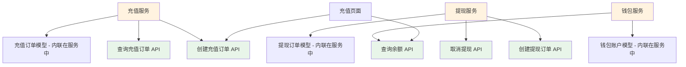

# 服务 + API 架构方案

## 核心理念

**服务（Service）是核心，API 是服务的对外接口**。

```
服务文档（核心）
    ├─ 业务逻辑
    ├─ 数据模型（内联）
    └─ 暴露的 API
        ├─ API 1
        ├─ API 2
        └─ API 3
```

### 与之前方案的对比

| 方案 | 组织方式 | 核心思想 |
|------|---------|---------|
| **之前方案** | API + 服务 + 模型（三层） | API 是独立的契约，服务和模型是实现细节 |
| **服务+API 方案** | 服务 + API（两层） | 服务是核心，包含业务逻辑和数据模型，API 是服务的接口 |

## 一、架构设计

### 1.1 后端层的组织结构

```
backend/
├── services/                   # 服务层（核心）
│   ├── wallet-service.md       # 钱包服务
│   ├── deposit-service.md      # 充值服务
│   └── withdraw-service.md     # 提现服务
└── apis/                       # API 层（接口定义）
    ├── create-deposit.md       # 创建充值订单 API
    ├── create-withdraw.md      # 创建提现订单 API
    └── get-balance.md          # 查询余额 API
```

### 1.2 文档关系



### 1.3 核心原则

1. **服务是业务逻辑的唯一事实源**：所有业务规则、状态机、事务处理都在服务文档中定义
2. **数据模型内联在服务中**：不单独创建模型文档，而是在服务文档中定义相关的数据模型
3. **API 是服务的接口契约**：API 文档只定义接口规格，业务逻辑引用服务文档
4. **服务可以不暴露 API**：有些服务是内部服务，只被其他服务调用，不需要 API 文档

## 二、服务文档结构（增强版）

### 2.1 服务文档的章节结构

```markdown
---
id: deposit-service
type: service
title: 充值服务
---

# 充值服务

## 1. 概述
[服务的职责和边界]

## 2. 业务规则
[核心业务逻辑和约束条件]

## 3. 状态机
[如果有状态管理，描述状态转换]

## 4. 数据模型（新增）
[定义服务使用的数据模型]

### 4.1 充值订单模型
[字段定义、关系定义、数据库映射]

### 4.2 其他模型
[如果有多个模型]

## 5. 核心方法
[服务的核心方法和接口]

## 6. 暴露的 API（新增）
[列出此服务暴露的所有 API]

## 7. 依赖关系
[依赖的其他服务、外部 API]

## 8. 事务处理
[事务策略和一致性保证]

## 9. 技术规格
[技术栈、部署配置、安全性]

## 10. 变更历史
[版本迭代记录]
```

### 2.2 数据模型在服务文档中的定义方式

#### 方式 1：简化表格（推荐）

```markdown
## 4. 数据模型

### 4.1 充值订单（DepositOrder）

**表名**：`deposit_orders`

| 字段 | 类型 | 必填 | 说明 | 约束 |
|------|------|------|------|------|
| id | String | 是 | 订单 ID | UUID，主键 |
| userId | String | 是 | 用户 ID | 外键 → users.id |
| amount | Decimal(10,2) | 是 | 充值金额 | 10.00-50000.00 |
| paymentMethod | Enum | 是 | 支付方式 | alipay, wechat, bank |
| status | Enum | 是 | 订单状态 | pending, processing, completed, failed, closed |
| createdAt | DateTime | 是 | 创建时间 | 自动生成 |
| updatedAt | DateTime | 是 | 更新时间 | 自动更新 |

**索引**：
- PRIMARY KEY: `id`
- INDEX: `user_id`, `status`, `created_at`
- UNIQUE INDEX: `third_party_order_no`

**关系**：
- 属于用户（多对一）：`userId` → `users.id`
```

#### 方式 2：内联 SQL（可选）

```markdown
## 4. 数据模型

### 4.1 充值订单（DepositOrder）

\`\`\`sql
CREATE TABLE deposit_orders (
  id VARCHAR(36) PRIMARY KEY COMMENT '订单 ID',
  user_id VARCHAR(36) NOT NULL COMMENT '用户 ID',
  amount DECIMAL(10,2) NOT NULL COMMENT '充值金额',
  payment_method ENUM('alipay', 'wechat', 'bank') NOT NULL COMMENT '支付方式',
  status ENUM('pending', 'processing', 'completed', 'failed', 'closed') 
    DEFAULT 'pending' COMMENT '订单状态',
  created_at TIMESTAMP DEFAULT CURRENT_TIMESTAMP COMMENT '创建时间',
  updated_at TIMESTAMP DEFAULT CURRENT_TIMESTAMP ON UPDATE CURRENT_TIMESTAMP,
  INDEX idx_user_id (user_id),
  INDEX idx_status (status)
) ENGINE=InnoDB DEFAULT CHARSET=utf8mb4 COMMENT='充值订单表';
\`\`\`

**业务约束**：
- 充值金额范围：10.00 - 50,000.00 元
- 订单有效期：创建后 30 分钟
```

## 三、API 文档结构（简化版）

### 3.1 API 文档的章节结构

```markdown
---
id: create-deposit
type: api
title: 创建充值订单
relatedService: deposit-service    # 新增：关联的服务
---

# 创建充值订单

## 1. 接口定义

**请求方法**：POST
**请求路径**：`/api/wallet/deposits`
**所属服务**：[@充值服务](../services/deposit-service.md)

## 2. 请求参数

| 参数 | 类型 | 必填 | 说明 | 示例 |
|------|------|------|------|------|
| amount | number | 是 | 充值金额 | 100.00 |
| paymentMethod | string | 是 | 支付方式 | "alipay" |

## 3. 响应数据

| 字段 | 类型 | 说明 | 示例 |
|------|------|------|------|
| orderId | string | 订单 ID | "550e8400-..." |
| paymentUrl | string | 支付链接 | "https://..." |

## 4. 错误码

| 错误码 | 说明 | HTTP 状态码 |
|--------|------|-------------|
| DEPOSIT_001 | 充值金额不符合规则 | 400 |
| DEPOSIT_002 | 不支持的支付方式 | 400 |

## 5. 业务逻辑

详见 [@充值服务](../services/deposit-service.md)

## 6. 示例

### 请求示例
\`\`\`json
{
  "amount": 100.00,
  "paymentMethod": "alipay"
}
\`\`\`

### 响应示例
\`\`\`json
{
  "orderId": "550e8400-e29b-41d4-a716-446655440000",
  "paymentUrl": "https://pay.example.com/order/xxx"
}
\`\`\`
```

### 3.2 API 文档的简化原则

1. **接口契约为主**：重点描述请求、响应、错误码
2. **业务逻辑引用服务**：不重复描述业务规则，通过 `@` 引用服务文档
3. **保持简洁**：API 文档应该快速查阅，不应过于冗长

## 四、完整示例：充值功能

### 4.1 目录结构

```
docs/modules/wallet/
├── README.md                       # 钱包模块
├── pages/
│   └── deposit-page.md             # 充值页面
├── components/
│   └── balance-card.md             # 余额卡片
└── backend/
    ├── services/                   # 服务层（核心）
    │   ├── wallet-service.md       # 钱包服务
    │   └── deposit-service.md      # 充值服务
    └── apis/                       # API 层（接口）
        ├── get-balance.md          # 查询余额 API
        └── create-deposit.md       # 创建充值订单 API
```

### 4.2 充值服务文档（核心）

```markdown
---
id: deposit-service
type: service
title: 充值服务
status: completed
---

# 充值服务

## 1. 概述

充值服务负责处理用户充值的完整业务流程，包括订单创建、支付回调处理、余额更新等。

### 使用场景
- 用户在充值页面发起充值请求
- 第三方支付平台回调通知支付结果
- 后台管理员手动补单

## 2. 业务规则

### 2.1 充值金额限制
- 最小充值金额：10.00 元
- 最大充值金额：50,000.00 元
- 金额必须是正数，最多保留 2 位小数

### 2.2 订单有效期
- 订单创建后 30 分钟内有效
- 超时自动关闭，状态变更为 `closed`

### 2.3 幂等性保证
- 使用第三方支付订单号作为幂等键
- 重复回调直接返回成功，不重复处理

## 3. 状态机

\`\`\`mermaid
stateDiagram-v2
    [*] --> pending: 创建订单
    pending --> processing: 用户支付
    pending --> closed: 超时/取消
    processing --> completed: 支付成功
    processing --> failed: 支付失败
    completed --> [*]
    failed --> [*]
    closed --> [*]
\`\`\`

| 状态 | 说明 | 可转换到的状态 |
|------|------|---------------|
| pending | 待支付 | processing, closed |
| processing | 支付中 | completed, failed |
| completed | 已完成 | - |
| failed | 已失败 | - |
| closed | 已关闭 | - |

## 4. 数据模型

### 4.1 充值订单（DepositOrder）

**表名**：`deposit_orders`

| 字段 | 类型 | 必填 | 说明 | 约束 |
|------|------|------|------|------|
| id | String | 是 | 订单 ID | UUID，主键 |
| userId | String | 是 | 用户 ID | 外键 → users.id |
| amount | Decimal(10,2) | 是 | 充值金额 | 10.00-50000.00 |
| paymentMethod | Enum | 是 | 支付方式 | alipay, wechat, bank |
| status | Enum | 是 | 订单状态 | pending, processing, completed, failed, closed |
| thirdPartyOrderNo | String | 否 | 第三方订单号 | 唯一索引 |
| paymentUrl | String | 否 | 支付链接 | - |
| paidAt | DateTime | 否 | 支付时间 | - |
| expiredAt | DateTime | 是 | 过期时间 | 创建时间 + 30分钟 |
| createdAt | DateTime | 是 | 创建时间 | 自动生成 |
| updatedAt | DateTime | 是 | 更新时间 | 自动更新 |

**索引**：
- PRIMARY KEY: `id`
- INDEX: `user_id`, `status`, `created_at`
- UNIQUE INDEX: `third_party_order_no`

**关系**：
- 属于用户（多对一）：`userId` → `users.id`
- 生成交易记录（一对一）：`id` → `transaction_records.order_id`

## 5. 核心方法

### 5.1 createDepositOrder(userId, amount, paymentMethod)

**功能**：创建充值订单

**参数**：
- `userId` (String): 用户 ID
- `amount` (Decimal): 充值金额
- `paymentMethod` (String): 支付方式

**返回值**：`DepositOrder` 对象

**异常**：
- `InvalidAmountError`: 金额不符合规则
- `UnsupportedPaymentMethodError`: 不支持的支付方式

**处理流程**：
1. 验证充值金额（10-50000 元）
2. 验证支付方式
3. 创建充值订单记录
4. 调用第三方支付接口生成支付链接
5. 返回订单对象

### 5.2 handlePaymentCallback(callbackData)

**功能**：处理支付回调

**参数**：
- `callbackData` (Object): 第三方支付平台的回调数据

**返回值**：`Boolean` - 处理是否成功

**异常**：
- `InvalidSignatureError`: 签名验证失败
- `OrderNotFoundError`: 订单不存在

**处理流程**：
1. 验证回调签名
2. 检查幂等性（通过 `thirdPartyOrderNo`）
3. 更新订单状态为 `completed`
4. 调用钱包服务增加余额
5. 创建交易记录
6. 发送充值成功通知

## 6. 暴露的 API

- [@创建充值订单](../apis/create-deposit.md) - POST `/api/wallet/deposits`
- [@查询充值订单](../apis/get-deposit.md) - GET `/api/wallet/deposits/:id`

## 7. 依赖关系

### 依赖的服务
- [@钱包服务](./wallet-service.md) - 更新用户余额

### 依赖的外部 API
- 支付宝支付 API - 创建支付订单
- 微信支付 API - 创建支付订单

### 依赖的基础设施
- MySQL 数据库 - 存储订单数据
- Redis 缓存 - 幂等性控制
- RabbitMQ 消息队列 - 异步通知

## 8. 事务处理

### 8.1 充值成功事务

**涉及的操作**：
1. 更新充值订单状态为 `completed`
2. 调用钱包服务增加余额
3. 创建交易记录

**事务策略**：
- 使用数据库事务保证原子性
- 如果任一步骤失败，回滚所有操作
- 订单状态保持 `processing`，等待重试

**一致性保证**：
- 通过幂等键防止重复处理
- 通过分布式锁保证并发安全

## 9. 技术规格

### 技术栈
- 编程语言：TypeScript
- 框架：NestJS
- ORM：TypeORM
- 数据库：MySQL 8.0

### 性能指标
- 创建订单响应时间 (P95): < 200ms
- 回调处理响应时间 (P95): < 500ms
- 吞吐量 (QPS): > 500

### 安全性
- 支付回调签名验证
- 金额精度控制
- 防重放攻击

## 10. 变更历史

| 日期 | 版本 | 变更内容 | 变更人 |
|------|------|---------|--------|
| 2025-12-08 | v1.0.0 | 初始版本 | 李四 |
```

### 4.3 创建充值订单 API 文档（简化）

```markdown
---
id: create-deposit
type: api
title: 创建充值订单
relatedService: deposit-service
---

# 创建充值订单

## 1. 接口定义

**请求方法**：POST
**请求路径**：`/api/wallet/deposits`
**所属服务**：[@充值服务](../services/deposit-service.md)

## 2. 请求参数

| 参数 | 类型 | 必填 | 说明 | 示例 |
|------|------|------|------|------|
| amount | number | 是 | 充值金额 | 100.00 |
| paymentMethod | string | 是 | 支付方式（alipay/wechat/bank） | "alipay" |

## 3. 响应数据

### 成功响应（200）

| 字段 | 类型 | 说明 | 示例 |
|------|------|------|------|
| orderId | string | 订单 ID | "550e8400-..." |
| paymentUrl | string | 支付链接 | "https://pay.example.com/..." |
| expiredAt | string | 订单过期时间 | "2025-12-08T11:00:00Z" |

### 错误响应

| 错误码 | 说明 | HTTP 状态码 |
|--------|------|-------------|
| DEPOSIT_001 | 充值金额不符合规则 | 400 |
| DEPOSIT_002 | 不支持的支付方式 | 400 |

## 4. 业务逻辑

详见 [@充值服务](../services/deposit-service.md) 的 `createDepositOrder` 方法。

## 5. 示例

### 请求示例

\`\`\`bash
curl -X POST https://api.example.com/api/wallet/deposits \
  -H "Content-Type: application/json" \
  -H "Authorization: Bearer {token}" \
  -d '{
    "amount": 100.00,
    "paymentMethod": "alipay"
  }'
\`\`\`

### 响应示例

\`\`\`json
{
  "orderId": "550e8400-e29b-41d4-a716-446655440000",
  "paymentUrl": "https://pay.example.com/order/xxx",
  "expiredAt": "2025-12-08T11:00:00Z"
}
\`\`\`

## 6. 变更历史

| 日期 | 版本 | 变更内容 | 变更人 |
|------|------|---------|--------|
| 2025-12-08 | v1.0.0 | 初始版本 | 李四 |
```

## 五、优势分析

### 5.1 相比"API + 服务 + 模型"方案的优势

| 维度 | API + 服务 + 模型 | 服务 + API |
|------|------------------|-----------|
| **文档数量** | 多（每个模型单独文档） | 少（模型内联在服务中） |
| **维护成本** | 高（需要同步三类文档） | 低（只需同步两类文档） |
| **信息集中度** | 分散（需要跨文档查找） | 集中（服务文档包含全部信息） |
| **理解难度** | 高（需要理解三层关系） | 低（服务是核心，API 是接口） |
| **适用场景** | 大型系统，模型复用度高 | 中小型系统，服务边界清晰 |

### 5.2 核心优势

1. **信息集中**：服务文档包含业务逻辑、数据模型、事务处理等所有信息，无需跨文档查找
2. **维护简单**：只需维护服务和 API 两类文档，减少同步成本
3. **职责清晰**：服务是业务逻辑的唯一事实源，API 是接口契约
4. **易于理解**：新人只需阅读服务文档即可理解完整的业务逻辑

## 六、渐进式创建流程

### 6.1 需求阶段（产品经理）

产品经理只需创建：
- 模块文档
- 页面文档
- 组件文档
- **服务占位符**（在模块文档中列出需要哪些服务）

示例：
```markdown
## 需要的后端服务（占位符）
- 充值服务：处理用户充值业务
- 提现服务：处理用户提现业务
- 钱包服务：管理用户余额
```

### 6.2 设计阶段（后端工程师）

后端工程师根据产品需求，创建：
1. **服务文档**（核心）：定义业务逻辑、数据模型、核心方法
2. **API 文档**（接口）：定义对外暴露的接口规格

### 6.3 实现阶段（开发工程师）

开发工程师：
1. 根据服务文档实现代码
2. 使用自动化工具同步数据模型（从代码更新到服务文档中的模型定义）
3. 使用自动化工具校验 API 文档与代码的一致性

## 七、总结

**服务 + API 方案**将服务文档作为核心，数据模型内联在服务中，API 文档作为接口契约。这种方式：

1. **减少文档数量**：不需要单独的模型文档
2. **降低维护成本**：信息集中在服务文档中
3. **提高可读性**：一个服务文档包含完整的业务逻辑
4. **保持灵活性**：简单服务可以不暴露 API，只被内部调用

这种方案更适合**中小型项目**和**服务边界清晰**的系统。
