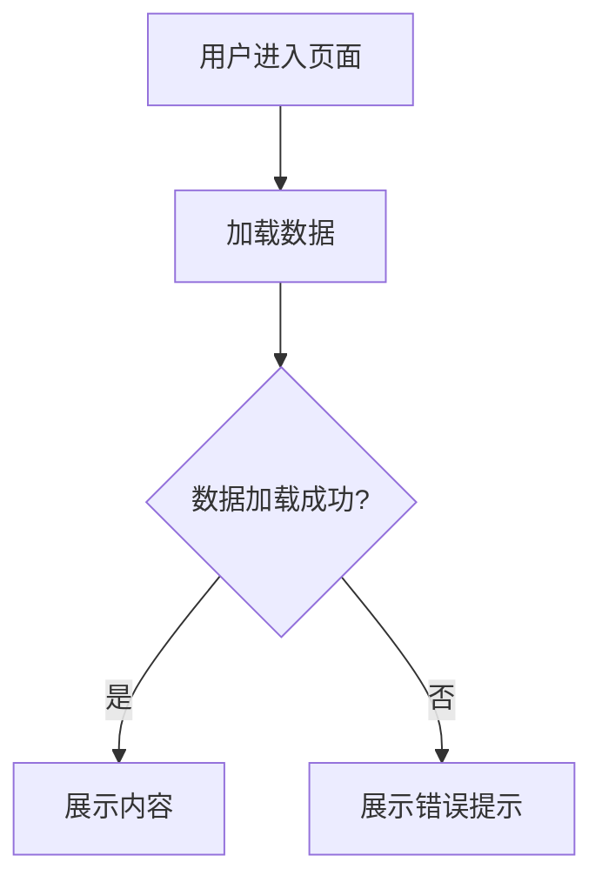

# 巴西博彩平台 MVP 测试方案分析与补充建议

## 一、用户方案分析

### 1.1 文档部分方案

**用户提出的文档架构**:
- 三方数据层(sportRader) → 服务 → API/WebSocket 层 → 组件 → 页面 → 模块
- 额外增加用户用例(交互)文档
- 文档存放于 Git 仓库,使用 Markdown 文件存储
- 支持仓库内文件跳转
- 构建索引页

**方案优势**:

这个方案展现了对文档层级结构的深刻理解。首先,文档架构清晰,从数据源到模块的六层结构完整覆盖了博彩平台的技术栈,特别是将三方数据层(sportRader)作为最底层,体现了对数据驱动业务的认知。其次,Git 仓库存储方案具有版本控制、协作友好、易于备份、支持 CI/CD 等天然优势。Markdown 格式的选择也很合理,具备轻量级、可读性强、支持代码高亮、易于转换等特点。文件跳转功能能够建立文档之间的关联,形成知识网络。索引页的设计则提供了统一的入口,便于导航和查找。

**潜在问题**:

然而,这个方案也存在一些需要注意的问题。首先是层级过多的问题,六层结构加上用户用例,可能导致文档层级过深,增加维护复杂度。其次是与 DocuMind 理念的偏差,DocuMind 的核心是四层结构(模块→页面→组件→API),用户方案的六层结构与之不完全一致。再者是缺少明确的文档模板,不同层级的文档应该有标准化的模板和字段定义。此外,文档关联机制不够明确,仅提到"支持仓库内文件跳转",但没有说明如何实现和管理关联关系。最后,缺少搜索功能,仅有索引页可能不足以支持大规模文档的快速查找。

### 1.2 Figma 部分方案

**用户提出的两步流程**:

第一步是使用 Manus 的 Figma 相关功能,结合指定的提示词,生成对应的组件基础文档模板。第二步是产品经理基于第一步的文档进行修改和撰写,然后 Manus 基于这个文档生成符合项目理念的可交互组件 HTML 文件。

**方案优势**:

这个方案充分利用了 AI 能力。第一步的自动化生成能够大幅减少手动录入工作,提升初始文档创建效率。第二步的人工审核和修改确保了文档质量,避免完全依赖 AI 可能产生的错误。生成可交互组件 HTML 文件的设计则提供了直观的组件展示,便于开发和测试团队理解设计意图。整个流程体现了"AI 辅助 + 人工审核"的最佳实践,既提升效率又保证质量。

**潜在问题**:

但这个方案也有一些需要完善的地方。首先是 Figma 数据提取机制不明确,没有说明如何从 Figma 获取组件信息,是使用 Figma API 还是其他方式。其次是提示词设计缺失,第一步提到"结合指定的提示词",但没有说明提示词的具体内容和设计原则。再者是文档模板标准化问题,生成的"组件基础文档模板"应该有统一的格式和必填字段。此外,HTML 组件生成逻辑不清晰,第二步提到"生成符合项目理念的可交互组件 HTML 文件",但没有说明生成逻辑、技术栈选择(React/Vue/原生 HTML)等。还有版本同步机制缺失,当 Figma 中的组件更新后,如何同步到文档和 HTML 文件。最后是文档与代码的关联问题,生成的 HTML 文件如何与文档关联,如何在文档中引用和展示。

---

## 二、核心问题识别

基于以上分析,我识别出以下核心问题需要解决:

### 2.1 文档架构问题

**问题**: 六层结构与 DocuMind 的四层结构不一致,可能导致概念混淆。

**影响**: 增加学习成本,不利于团队理解和使用。

**建议**: 需要明确如何将六层结构映射到 DocuMind 的四层结构,或者调整架构以保持一致性。

### 2.2 文档模板标准化问题

**问题**: 缺少各层级文档的标准模板和字段定义。

**影响**: 文档质量参差不齐,不利于自动化处理和 AI 辅助。

**建议**: 需要为每个层级设计标准化的文档模板,包括必填字段、可选字段、格式规范等。

### 2.3 Figma 集成机制问题

**问题**: Figma 数据提取和同步机制不明确。

**影响**: 无法实现自动化的 Figma 到文档的流程,可能需要大量手动工作。

**建议**: 需要明确 Figma 数据提取方式(API/插件),设计同步流程和频率。

### 2.4 AI 提示词设计问题

**问题**: 缺少用于生成文档模板的提示词设计。

**影响**: AI 生成的文档质量不可控,可能需要大量人工修改。

**建议**: 需要设计高质量的提示词模板,包括上下文、输出格式、示例等。

### 2.5 HTML 组件生成问题

**问题**: HTML 组件生成的技术方案和实现逻辑不明确。

**影响**: 可能导致生成的组件不符合项目技术栈,或者无法正常运行。

**建议**: 需要明确技术栈选择、组件生成逻辑、样式处理、交互实现等。

### 2.6 文档与组件关联问题

**问题**: 文档、Figma 组件、HTML 组件之间的关联关系不明确。

**影响**: 难以追踪组件的设计来源和实现状态,不利于版本管理。

**建议**: 需要建立清晰的关联机制,例如通过唯一标识符(ID)关联。

### 2.7 搜索与导航问题

**问题**: 仅有索引页,缺少全文搜索和高级导航功能。

**影响**: 在文档规模增长后,查找效率低下。

**建议**: 需要引入搜索功能,可以使用静态站点生成器的搜索插件或自建搜索索引。

---

## 三、补充建议

基于以上问题识别,我提出以下补充建议:

### 3.1 文档架构优化建议

**建议方案**: 将六层结构重新映射到 DocuMind 的四层结构

**映射关系**:

**第一层 - 模块层**: 对应用户方案中的"模块"层,例如"体育投注模块"、"账户管理模块"等。

**第二层 - 页面层**: 对应用户方案中的"页面"层,例如"赛事列表页"、"投注单页"等。同时,将"用户用例(交互)"文档作为页面文档的一部分,在页面文档中增加"用户故事"和"交互流程"章节。

**第三层 - 组件层**: 对应用户方案中的"组件"层,例如"投注卡片"、"赔率按钮"等。

**第四层 - API 层**: 合并用户方案中的"API/WebSocket 层"、"服务层"和"三方数据层"。在 API 文档中,通过章节区分不同层级,例如"后端服务 API"、"WebSocket 接口"、"三方数据源(sportRader)"等。

**优势**: 保持与 DocuMind 理念的一致性,简化文档层级,降低维护复杂度,同时保留了原方案的完整信息。

### 3.2 文档模板标准化建议

**建议**: 为每个层级设计标准化的 Markdown 模板

**模块文档模板** (`module_template.md`):

```markdown
# 模块名称

## 基本信息
- **模块 ID**: `module_xxx`
- **负责人**: 
- **状态**: 设计中/开发中/已完成
- **最后更新**: YYYY-MM-DD

## 模块概述
[模块的整体描述,包括功能范围、业务价值等]

## 包含页面
- [@页面1](./pages/page1.md)
- [@页面2](./pages/page2.md)

## 相关模块
- [@模块2](../module2/README.md)

## 技术架构
[模块的技术架构说明,包括技术栈、依赖关系等]

## 变更历史
| 日期 | 版本 | 变更内容 | 变更人 |
|------|------|---------|--------|
| YYYY-MM-DD | v1.0 | 初始版本 | XXX |
```

**页面文档模板** (`page_template.md`):

```markdown
# 页面名称

## 基本信息
- **页面 ID**: `page_xxx`
- **所属模块**: [@模块名称](../README.md)
- **Figma 链接**: [查看设计稿](https://figma.com/...)
- **状态**: 设计中/开发中/已完成
- **最后更新**: YYYY-MM-DD

## 用户故事
作为 [用户角色],我希望 [功能描述],以便 [业务价值]。

## 页面状态
### 默认状态
[描述页面的默认展示状态]

### 加载状态
[描述数据加载时的状态]

### 错误状态
[描述错误情况下的状态]

## 交互流程


## 使用的组件
- [@组件1](../components/component1.md) - 用途说明
- [@组件2](../components/component2.md) - 用途说明

## 调用的 API
- [@API1](../apis/api1.md) - 用途说明
- [@API2](../apis/api2.md) - 用途说明

## 交互说明
[详细的交互说明,包括点击、滑动、输入等操作的响应]

## 变更历史
| 日期 | 版本 | 变更内容 | 变更人 |
|------|------|---------|--------|
| YYYY-MM-DD | v1.0 | 初始版本 | XXX |
```

**组件文档模板** (`component_template.md`):

```markdown
# 组件名称

## 基本信息
- **组件 ID**: `component_xxx`
- **Figma 组件 ID**: `figma_xxx` (从 Figma 自动同步)
- **Figma 链接**: [查看设计稿](https://figma.com/...)
- **状态**: 设计中/开发中/已完成
- **最后更新**: YYYY-MM-DD

## 组件概述
[组件的功能描述和使用场景]

## 组件预览
[可交互组件 HTML 文件的嵌入]
<iframe src="./component_xxx.html" width="100%" height="400px"></iframe>

## 组件属性 (Props)
| 属性名 | 类型 | 必填 | 默认值 | 说明 |
|--------|------|------|--------|------|
| prop1 | string | 是 | - | 属性说明 |
| prop2 | number | 否 | 0 | 属性说明 |

## 组件变体
### 变体1: 默认样式
[描述和截图]

### 变体2: 禁用状态
[描述和截图]

## 组件状态
- **正常**: [描述]
- **悬停**: [描述]
- **点击**: [描述]
- **禁用**: [描述]

## 使用示例
```jsx
<ComponentName 
  prop1="value1"
  prop2={123}
/>
```

## 调用的 API
- [@API1](../apis/api1.md) - 用途说明

## 依赖的组件
- [@子组件1](./subcomponent1.md)

## 被使用的页面
- [@页面1](../pages/page1.md)
- [@页面2](../pages/page2.md)

## 变更历史
| 日期 | 版本 | 变更内容 | 变更人 | Figma 版本 |
|------|------|---------|--------|-----------|
| YYYY-MM-DD | v1.0 | 初始版本 | XXX | v1.0 |
```

**API 文档模板** (`api_template.md`):

```markdown
# API 名称

## 基本信息
- **API ID**: `api_xxx`
- **API 类型**: REST API / WebSocket / 三方数据源
- **端点**: `GET /api/xxx`
- **状态**: 设计中/开发中/已完成
- **最后更新**: YYYY-MM-DD

## API 概述
[API 的功能描述和使用场景]

## 请求参数
### 路径参数
| 参数名 | 类型 | 必填 | 说明 |
|--------|------|------|------|
| id | string | 是 | 资源 ID |

### 查询参数
| 参数名 | 类型 | 必填 | 默认值 | 说明 |
|--------|------|------|--------|------|
| page | number | 否 | 1 | 页码 |
| limit | number | 否 | 20 | 每页数量 |

### 请求体
```json
{
  "field1": "value1",
  "field2": 123
}
```

## 响应格式
### 成功响应 (200)
```json
{
  "code": 0,
  "message": "success",
  "data": {
    "field1": "value1",
    "field2": 123
  }
}
```

### 错误响应 (400/500)
```json
{
  "code": 1001,
  "message": "error message",
  "data": null
}
```

## 错误码
| 错误码 | 说明 | 处理建议 |
|--------|------|---------|
| 1001 | 参数错误 | 检查请求参数 |
| 1002 | 资源不存在 | 确认资源 ID |

## API 测试
[可交互的 API 测试器]

## 调用示例
```javascript
fetch('/api/xxx', {
  method: 'GET',
  headers: {
    'Content-Type': 'application/json'
  }
})
.then(response => response.json())
.then(data => console.log(data));
```

## 被使用的组件
- [@组件1](../components/component1.md)

## 被使用的页面
- [@页面1](../pages/page1.md)

## 依赖的服务
- **后端服务**: service_xxx
- **三方数据源**: sportRader API

## 变更历史
| 日期 | 版本 | 变更内容 | 变更人 |
|------|------|---------|--------|
| YYYY-MM-DD | v1.0 | 初始版本 | XXX |
```

### 3.3 Figma 集成机制建议

**建议方案**: 使用 Figma REST API + Manus AI 的组合方案

**第一步: Figma 数据提取**

使用 Figma REST API 获取组件信息。需要准备 Figma Personal Access Token,确定要同步的 Figma 文件 ID。编写脚本调用 Figma API,获取组件列表、组件属性、组件变体、组件截图等信息。将获取的数据保存为 JSON 文件,作为后续步骤的输入。

**第二步: 生成组件文档**

使用 Manus AI,结合 Figma 数据和预设的提示词,生成组件文档。提示词应该包含 Figma 组件的 JSON 数据、组件文档模板、输出格式要求(Markdown)、必填字段说明等。Manus AI 根据提示词生成初始的组件文档,保存到 Git 仓库的指定路径。

**第三步: 人工审核和修改**

产品经理或设计师审核生成的文档,补充 AI 无法自动生成的内容,例如用户故事、交互说明、使用场景等。修改不准确或不完整的内容,确保文档质量。提交修改后的文档到 Git 仓库。

**第四步: 生成可交互组件 HTML**

使用 Manus AI,基于修改后的组件文档,生成可交互的 HTML 文件。提示词应该包含组件文档的 Markdown 内容、技术栈要求(例如使用原生 HTML/CSS/JS 或 React)、交互要求(例如支持属性切换、状态切换)、样式要求(例如使用 TailwindCSS)等。Manus AI 根据提示词生成 HTML 文件,保存到组件文档的同级目录。在组件文档中通过 iframe 或链接引用 HTML 文件。

**第五步: 版本同步**

定期(例如每周)重新执行第一步,获取 Figma 的最新数据。对比新旧数据,识别变更的组件。对于变更的组件,重新执行第二步到第四步,生成新版本的文档和 HTML。在组件文档的"变更历史"中记录变更内容和 Figma 版本。

### 3.4 AI 提示词设计建议

**提示词模板 1: 生成组件文档**

```
你是一位专业的产品文档撰写专家,擅长根据 Figma 设计稿生成结构化的组件文档。

## 任务
根据以下 Figma 组件信息,生成一份符合模板要求的组件文档(Markdown 格式)。

## Figma 组件信息
```json
{
  "id": "component_xxx",
  "name": "投注卡片",
  "description": "用于展示单个投注选项的卡片组件",
  "properties": [
    {"name": "赔率", "type": "number"},
    {"name": "状态", "type": "string", "options": ["正常", "禁用"]}
  ],
  "variants": [
    {"name": "默认样式", "thumbnail": "url1"},
    {"name": "禁用状态", "thumbnail": "url2"}
  ]
}
```

## 文档模板
[此处插入组件文档模板的内容]

## 输出要求
1. 严格按照模板格式输出
2. 基本信息部分直接使用 Figma 数据填充
3. 组件属性部分根据 Figma properties 生成表格
4. 组件变体部分根据 Figma variants 生成章节
5. 其他章节(如用户故事、使用示例等)生成合理的占位内容,标注为"[待补充]"
6. 输出完整的 Markdown 文档,不要省略任何章节

## 输出
```

**提示词模板 2: 生成可交互组件 HTML**

```
你是一位专业的前端开发工程师,擅长根据组件文档生成可交互的 HTML 组件。

## 任务
根据以下组件文档,生成一个可交互的 HTML 文件,用于展示组件的不同状态和变体。

## 组件文档
[此处插入组件文档的 Markdown 内容]

## 技术要求
1. 使用原生 HTML/CSS/JavaScript,不依赖任何框架
2. 使用 TailwindCSS CDN 进行样式设计
3. 组件应该是响应式的,适配不同屏幕尺寸
4. 提供交互控制面板,允许用户切换组件的属性和状态
5. 组件样式应该尽可能还原 Figma 设计稿

## 交互要求
1. 在页面顶部提供控制面板,包含所有可配置的属性(Props)
2. 用户修改属性后,组件应该实时更新
3. 提供状态切换按钮(正常/悬停/点击/禁用)
4. 提供变体切换按钮(如果有多个变体)

## 输出要求
1. 输出完整的 HTML 文件,包含 <!DOCTYPE html> 声明
2. 所有 CSS 和 JavaScript 代码内联在 HTML 文件中
3. 代码应该有良好的注释和格式
4. 文件应该可以直接在浏览器中打开运行

## 输出
```

### 3.5 Git 仓库结构建议

**建议的目录结构**:

```
betting-platform-docs/
├── README.md                    # 项目总索引页
├── .gitignore
├── scripts/                     # 自动化脚本
│   ├── sync_figma.js           # Figma 同步脚本
│   ├── generate_index.js       # 索引页生成脚本
│   └── build_site.js           # 静态站点构建脚本
├── templates/                   # 文档模板
│   ├── module_template.md
│   ├── page_template.md
│   ├── component_template.md
│   └── api_template.md
├── modules/                     # 模块文档
│   ├── sports-betting/          # 体育投注模块
│   │   ├── README.md           # 模块文档
│   │   ├── pages/              # 页面文档
│   │   │   ├── event-list.md
│   │   │   └── event-detail.md
│   │   ├── components/         # 组件文档
│   │   │   ├── bet-card.md
│   │   │   ├── bet-card.html   # 可交互组件
│   │   │   ├── odds-button.md
│   │   │   └── odds-button.html
│   │   └── apis/               # API 文档
│   │       ├── get-events.md
│   │       └── place-bet.md
│   ├── account-management/      # 账户管理模块
│   │   └── ...
│   └── ...
├── shared/                      # 共享资源
│   ├── components/             # 共享组件
│   └── apis/                   # 共享 API
└── assets/                      # 资源文件
    ├── images/                 # 图片
    └── diagrams/               # 架构图等
```

### 3.6 索引页和导航建议

**建议**: 使用静态站点生成器(如 VitePress、Docusaurus)构建文档网站

**方案优势**:

静态站点生成器提供了多项优势。首先是自动生成导航和侧边栏,无需手动维护索引页。其次是内置全文搜索功能,支持快速查找文档。再者是支持 Markdown 扩展,例如代码高亮、Mermaid 图表、自定义容器等。此外还支持自定义主题,可以定制符合品牌风格的文档网站。最后是支持部署到静态托管服务,例如 GitHub Pages、Vercel、Netlify 等。

**推荐工具**: VitePress (Vue 生态,性能优秀,配置简单)

**配置示例** (`.vitepress/config.js`):

```javascript
export default {
  title: '巴西博彩平台设计文档',
  description: '基于 DocuMind 理念的产品文档',
  themeConfig: {
    nav: [
      { text: '首页', link: '/' },
      { text: '模块', link: '/modules/' },
      { text: '共享资源', link: '/shared/' }
    ],
    sidebar: {
      '/modules/': [
        {
          text: '体育投注模块',
          items: [
            { text: '模块概述', link: '/modules/sports-betting/' },
            { text: '页面文档', link: '/modules/sports-betting/pages/' },
            { text: '组件文档', link: '/modules/sports-betting/components/' },
            { text: 'API 文档', link: '/modules/sports-betting/apis/' }
          ]
        }
      ]
    },
    search: {
      provider: 'local'
    }
  }
}
```

### 3.7 自动化脚本建议

**建议**: 编写自动化脚本,减少手动工作

**脚本 1: Figma 同步脚本** (`scripts/sync_figma.js`)

功能包括:调用 Figma API 获取组件信息,对比本地文档,识别新增、更新、删除的组件,调用 Manus AI 生成或更新组件文档,记录同步日志。

**脚本 2: 索引页生成脚本** (`scripts/generate_index.js`)

功能包括:扫描 Git 仓库中的所有文档,提取文档的元信息(标题、状态、最后更新时间等),生成模块索引、页面索引、组件索引、API 索引,更新 README.md 文件。

**脚本 3: 静态站点构建脚本** (`scripts/build_site.js`)

功能包括:调用 VitePress 构建命令,生成静态网站,部署到托管服务(可选),生成构建报告。

### 3.8 版本管理建议

**建议**: 使用 Git 的分支和标签管理文档版本

**分支策略**:

采用 `main` 分支作为稳定版本,所有已发布的文档都在此分支。`develop` 分支作为开发版本,正在编写或修改的文档在此分支。`feature/*` 分支用于新功能或新模块的文档开发。`hotfix/*` 分支用于紧急修复。

**标签策略**:

每次发布新版本时,打上版本标签,例如 `v1.0.0`、`v1.1.0` 等。标签应该与产品版本对应,便于追溯。

**提交规范**:

遵循 Conventional Commits 规范,例如 `docs: 更新投注卡片组件文档`、`feat: 新增账户管理模块文档`、`fix: 修正 API 文档中的错误` 等。

---

## 四、完整实施方案

基于以上分析和建议,我提出以下完整的 MVP 测试实施方案:

### 4.1 准备阶段 (第 1 周)

**任务清单**:

1. 创建 Git 仓库,初始化目录结构
2. 准备文档模板(模块、页面、组件、API)
3. 配置 VitePress,搭建文档网站框架
4. 获取 Figma Personal Access Token
5. 确定要同步的 Figma 文件和组件范围
6. 设计 AI 提示词模板(组件文档生成、HTML 组件生成)
7. 编写 Figma 同步脚本的初始版本

**产出**:

- Git 仓库和目录结构
- 标准化的文档模板
- 可运行的文档网站框架
- AI 提示词模板
- Figma 同步脚本

### 4.2 试点阶段 (第 2-3 周)

**任务清单**:

1. 选择一个核心模块作为试点(建议选择"体育投注模块")
2. 在 Figma 中整理该模块的设计文件,确保组件命名规范
3. 运行 Figma 同步脚本,获取组件信息
4. 使用 Manus AI 生成组件文档(基于 Figma 数据和提示词)
5. 产品经理审核和修改组件文档
6. 使用 Manus AI 生成可交互组件 HTML 文件
7. 手动创建模块文档、页面文档、API 文档
8. 在文档中建立关联关系(使用 `@` 引用)
9. 构建文档网站,验证导航、搜索、文档跳转等功能
10. 收集团队反馈,识别问题和改进点

**产出**:

- 一个完整的模块文档(包含模块、页面、组件、API 四层)
- 可交互的组件 HTML 文件
- 可访问的文档网站
- 试点总结报告

### 4.3 优化阶段 (第 4 周)

**任务清单**:

1. 根据试点反馈,优化文档模板
2. 优化 AI 提示词,提升生成质量
3. 完善 Figma 同步脚本,增加错误处理和日志记录
4. 编写索引页生成脚本和静态站点构建脚本
5. 优化文档网站的样式和交互
6. 编写使用指南,说明如何创建和维护文档
7. 组织团队培训,介绍工作流程和工具使用

**产出**:

- 优化后的文档模板和提示词
- 完善的自动化脚本
- 使用指南和培训材料

### 4.4 推广阶段 (第 5-8 周)

**任务清单**:

1. 将其他模块纳入文档管理
2. 批量执行 Figma 同步,生成所有组件文档
3. 团队协作,完善各模块的文档
4. 建立定期同步机制(例如每周一次)
5. 持续优化文档质量和工具功能
6. 收集使用数据,评估效果

**产出**:

- 覆盖所有模块的完整文档体系
- 稳定运行的文档管理流程
- 效果评估报告

---

## 五、关键成功因素

### 5.1 Figma 文件规范

Figma 文件的规范性直接影响自动化流程的效果。组件命名应该清晰、一致,例如使用 `Button/Primary`、`Card/BetCard` 等层级命名。组件应该使用 Figma 的 Properties 和 Variants 功能,明确定义属性和变体。组件应该有清晰的描述(Description),说明用途和使用场景。设计文件应该有良好的组织结构,使用 Pages 和 Frames 进行分类。

### 5.2 AI 提示词质量

AI 提示词的质量决定了生成文档的准确性和完整性。提示词应该提供充分的上下文,包括 Figma 数据、文档模板、输出要求等。提示词应该明确输出格式,例如 Markdown、JSON 等。提示词应该包含示例,帮助 AI 理解预期输出。提示词应该迭代优化,根据生成结果不断调整。

### 5.3 团队协作

文档管理需要团队的共同参与。设计师负责维护 Figma 文件,确保设计规范。产品经理负责审核和完善文档,补充业务逻辑和用户故事。开发工程师负责维护 API 文档和技术架构说明。需要建立定期的文档评审机制,确保文档质量。

### 5.4 工具和脚本维护

自动化工具和脚本需要持续维护。Figma API 可能会更新,需要及时调整脚本。Manus AI 的能力可能会提升,可以探索更多应用场景。VitePress 等工具可能会发布新版本,需要跟进更新。需要建立脚本的文档和测试,确保可维护性。

---

## 六、风险与应对

### 6.1 Figma API 限流

**风险**: Figma API 有速率限制,频繁调用可能被限流。

**应对**: 采用手动触发同步,避免自动化频繁调用。在脚本中增加速率控制和重试机制。缓存 Figma 数据,减少不必要的 API 调用。

### 6.2 AI 生成质量不稳定

**风险**: AI 生成的文档可能不准确或不完整。

**应对**: 设计高质量的提示词,提供充分的上下文和示例。建立人工审核流程,确保文档质量。收集生成结果,持续优化提示词。

### 6.3 文档维护成本

**风险**: 随着文档规模增长,维护成本可能增加。

**应对**: 通过自动化脚本减少手动工作。建立文档质量监控机制,及时发现和修复问题。培训团队成员,提升文档编写能力。

### 6.4 技术栈选择

**风险**: HTML 组件生成的技术栈可能与实际项目不一致。

**应对**: 在提示词中明确技术栈要求,例如使用 React、Vue 或原生 HTML。如果项目使用特定框架,可以调整提示词生成对应的代码。生成的 HTML 组件主要用于展示和演示,不一定要与生产代码完全一致。

---

## 七、总结

用户提出的 MVP 测试方案具有很好的基础,抓住了 DocuMind 的核心理念。通过以上补充建议,可以进一步完善方案,确保实施的可行性和效果。

**核心补充点**:

1. **文档架构优化**: 将六层结构映射到四层结构,保持与 DocuMind 理念的一致性
2. **文档模板标准化**: 为每个层级设计标准化的 Markdown 模板
3. **Figma 集成机制**: 明确使用 Figma REST API + Manus AI 的组合方案
4. **AI 提示词设计**: 提供高质量的提示词模板
5. **Git 仓库结构**: 设计清晰的目录结构和文件组织方式
6. **索引页和导航**: 使用 VitePress 等静态站点生成器
7. **自动化脚本**: 编写 Figma 同步、索引生成、站点构建等脚本
8. **版本管理**: 使用 Git 分支和标签管理文档版本

通过这些补充,MVP 测试方案将更加完整和可执行,能够有效验证 DocuMind 理念在博彩平台设计工作中的应用效果。
