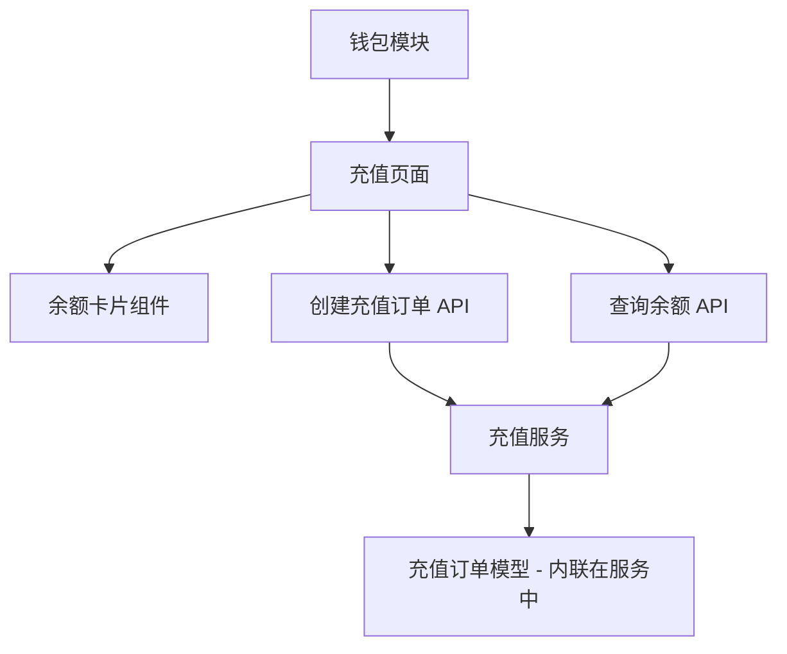

# 充值功能完整示例

> 本示例展示如何使用 DocuMind v5 的"服务+API"架构来组织一个完整的功能模块文档。

## 示例说明

本示例以"充值功能"为例，展示了从模块到页面、组件、服务、API 的完整文档组织方式。

## 目录结构

```
wallet-deposit/
├── README.md                           # 本文件
├── module.md                           # 钱包模块文档
├── pages/
│   └── deposit-page.md                 # 充值页面文档
├── components/
│   └── balance-card.md                 # 余额卡片组件文档
└── backend/
    ├── services/
    │   └── deposit-service.md          # 充值服务文档（核心）
    └── apis/
        ├── create-deposit.md           # 创建充值订单 API
        └── get-balance.md              # 查询余额 API
```

## 文档关系



## 渐进式创建流程示例

### 阶段 1：需求（产品经理）

**创建文档**:
1. `module.md` - 定义钱包模块的业务价值
2. `pages/deposit-page.md` - 描述充值页面的用户故事
3. `components/balance-card.md` - 定义余额卡片组件
4. 在 `module.md` 中增加服务占位符："需要充值服务"

### 阶段 2：设计（后端工程师）

**创建文档**:
1. `backend/services/deposit-service.md` - 详细设计充值服务
   - 定义业务规则
   - 定义数据模型（内联）
   - 定义核心方法
2. `backend/apis/create-deposit.md` - 定义创建充值订单 API
3. `backend/apis/get-balance.md` - 定义查询余额 API

### 阶段 3：实现（开发工程师）

**工作内容**:
1. 根据服务文档实现代码
2. 使用自动化工具同步数据模型
3. 更新文档状态为 `completed`

## 关键特点

1. **服务是核心**: `deposit-service.md` 包含了业务逻辑、数据模型、核心方法等完整信息
2. **API 是接口**: `create-deposit.md` 和 `get-balance.md` 只定义接口契约，业务逻辑引用服务文档
3. **数据模型内联**: 充值订单模型直接定义在 `deposit-service.md` 中，不单独创建模型文档
4. **文档引用**: 使用 `[@文档标题](相对路径)` 语法建立文档间的关联

## 使用方法

1. 查看各个文档，了解完整的文档组织方式
2. 复制此示例作为新功能的起点
3. 根据实际业务需求调整内容

## 相关文档

- [DocuMind v5 规范](../../standards/00-specification-v5.md)
- [服务文档模板](../../templates/service-template.md)
- [API 文档模板](../../templates/api-template.md)
- [服务+API 架构设计](../../architecture/service-api-architecture.md)
