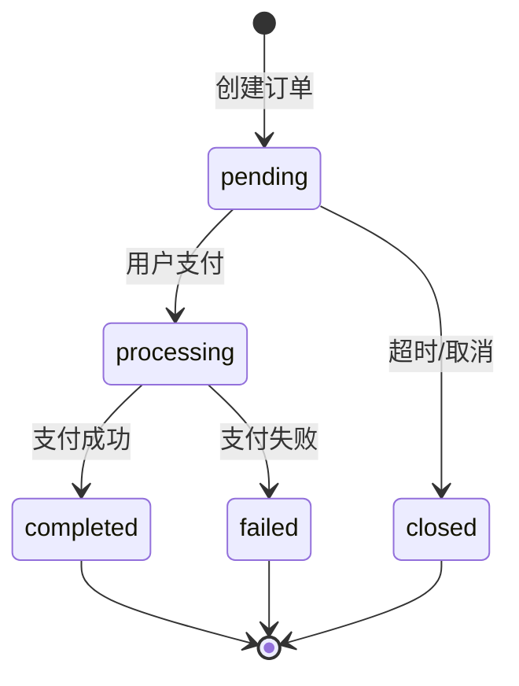

# 充值服务

## 1. 概述

充值服务负责处理用户充值的完整业务流程，包括订单创建、支付回调处理、余额更新等。

### 1.1. 服务职责

- 创建充值订单
- 调用第三方支付接口生成支付链接
- 处理支付回调，更新订单状态
- 充值成功后更新用户余额
- 记录充值交易

### 1.2. 使用场景

- 用户在充值页面发起充值请求
- 第三方支付平台回调通知支付结果
- 后台管理员手动补单

### 1.3. 服务边界

- ❌ 不负责: 用户余额的扣减（由消费服务负责）
- ❌ 不负责: 提现业务（由提现服务负责）

---

## 2. 业务规则

### 2.1. 充值金额限制

- 最小充值金额：10.00 元
- 最大充值金额：50,000.00 元
- 金额必须是正数，最多保留 2 位小数

### 2.2. 订单有效期

- 订单创建后 30 分钟内有效
- 超时自动关闭，状态变更为 `closed`

### 2.3. 幂等性保证

- 使用第三方支付订单号作为幂等键
- 重复回调直接返回成功，不重复处理

### 2.4. 风控规则

- 同一用户 24 小时内最多充值 10 次
- 单日充值总额不超过 100,000 元

---

## 3. 状态机

### 3.1. 状态定义

| 状态值 | 状态名称 | 说明 | 可转换到的状态 |
|--------|---------|------|---------------|
| pending | 待支付 | 订单已创建，等待用户支付 | processing, closed |
| processing | 支付中 | 用户已发起支付，等待支付结果 | completed, failed |
| completed | 已完成 | 支付成功，余额已到账 | - |
| failed | 已失败 | 支付失败 | - |
| closed | 已关闭 | 订单超时或用户取消 | - |

### 3.2. 状态转换图

### 3.3. 状态转换规则

**pending → processing**:
- 触发条件: 用户在第三方支付平台发起支付
- 前置检查: 订单未过期
- 后置操作: 记录支付发起时间

**processing → completed**:
- 触发条件: 收到第三方支付成功回调
- 前置检查: 验证回调签名，检查幂等性
- 后置操作: 更新用户余额，创建交易记录，发送通知

**processing → failed**:
- 触发条件: 收到第三方支付失败回调
- 前置检查: 验证回调签名
- 后置操作: 记录失败原因

---

## 4. 数据模型

### 4.1. 充值订单（DepositOrder）

**表名**: `deposit_orders`

**用途**: 记录用户的充值请求和支付状态

| 字段 | 类型 | 必填 | 说明 | 约束 |
|------|------|------|------|------|
| id | String | 是 | 订单 ID | UUID，主键 |
| userId | String | 是 | 用户 ID | 外键 → users.id |
| amount | Decimal(10,2) | 是 | 充值金额 | 10.00-50000.00 |
| paymentMethod | Enum | 是 | 支付方式 | alipay, wechat, bank |
| status | Enum | 是 | 订单状态 | pending, processing, completed, failed, closed |
| thirdPartyOrderNo | String | 否 | 第三方订单号 | 唯一索引 |
| paymentUrl | String | 否 | 支付链接 | - |
| paidAt | DateTime | 否 | 支付时间 | - |
| expiredAt | DateTime | 是 | 过期时间 | 创建时间 + 30分钟 |
| createdAt | DateTime | 是 | 创建时间 | 自动生成 |
| updatedAt | DateTime | 是 | 更新时间 | 自动更新 |

**索引**:
- PRIMARY KEY: `id`
- INDEX: `user_id`, `status`, `created_at`
- UNIQUE INDEX: `third_party_order_no`

**关系**:
- 属于用户（多对一）: `userId` → `users.id`
- 生成交易记录（一对一）: `id` → `transaction_records.order_id`

**业务约束**:
- 充值金额范围：10.00 - 50,000.00 元
- 订单有效期：创建后 30 分钟
- 第三方订单号全局唯一

---

## 5. 核心方法

### 5.1. createDepositOrder(userId, amount, paymentMethod)

**功能**: 创建充值订单

**参数**:
- `userId` (String): 用户 ID
- `amount` (Decimal): 充值金额
- `paymentMethod` (String): 支付方式（alipay/wechat/bank）

**返回值**: `DepositOrder` 对象

**异常**:
- `InvalidAmountError`: 金额不符合规则
- `UnsupportedPaymentMethodError`: 不支持的支付方式
- `RiskControlError`: 触发风控规则

**处理流程**:
1. 验证充值金额（10-50000 元）
2. 验证支付方式
3. 风控检查（24小时充值次数、单日充值总额）
4. 创建充值订单记录（状态: pending）
5. 调用第三方支付接口生成支付链接
6. 更新订单的 `paymentUrl` 和 `thirdPartyOrderNo`
7. 返回订单对象

**业务规则**:
- 金额必须在 10-50000 元之间
- 同一用户 24 小时内最多充值 10 次
- 单日充值总额不超过 100,000 元

### 5.2. handlePaymentCallback(callbackData)

**功能**: 处理支付回调

**参数**:
- `callbackData` (Object): 第三方支付平台的回调数据

**返回值**: `Boolean` - 处理是否成功

**异常**:
- `InvalidSignatureError`: 签名验证失败
- `OrderNotFoundError`: 订单不存在
- `OrderExpiredError`: 订单已过期

**处理流程**:
1. 验证回调签名
2. 根据 `thirdPartyOrderNo` 查找订单
3. 检查订单状态（只有 pending 或 processing 状态才能处理）
4. 检查幂等性（如果已经是 completed 状态，直接返回成功）
5. 更新订单状态为 `completed`
6. 调用钱包服务增加余额
7. 创建交易记录
8. 发送充值成功通知
9. 返回成功

**业务规则**:
- 使用 `thirdPartyOrderNo` 作为幂等键
- 重复回调直接返回成功
- 订单过期后不能处理回调

---

## 6. 暴露的 API

| API 名称 | HTTP 方法 | 路径 | 说明 | 文档链接 |
|---------|----------|------|------|---------|
| 创建充值订单 | POST | `/api/wallet/deposits` | 创建充值订单并返回支付链接 | [@创建充值订单](../apis/create-deposit.md) |
| 查询充值订单 | GET | `/api/wallet/deposits/:id` | 根据订单 ID 查询订单详情 | 待补充 |

---

## 7. 依赖关系

### 7.1. 依赖的服务

| 服务名称 | 用途 | 文档链接 |
|---------|------|---------|
| 钱包服务 | 更新用户余额 | 待补充 |
| 通知服务 | 发送充值成功通知 | 待补充 |

### 7.2. 依赖的外部 API

| API 名称 | 提供方 | 用途 | 文档链接 |
|---------|--------|------|---------|
| 支付宝支付 API | 支付宝 | 创建支付订单 | https://opendocs.alipay.com/ |
| 微信支付 API | 微信支付 | 创建支付订单 | https://pay.weixin.qq.com/wiki/doc/api/ |

### 7.3. 依赖的基础设施

| 基础设施 | 用途 | 配置要求 |
|---------|------|---------|
| MySQL | 数据持久化 | 版本 8.0+ |
| Redis | 幂等性控制、风控计数 | 版本 6.0+ |
| RabbitMQ | 异步通知 | 版本 3.8+ |

---

## 8. 事务处理

### 8.1. 充值成功事务

**涉及的操作**:
1. 更新充值订单状态为 `completed`
2. 调用钱包服务增加余额
3. 创建交易记录

**事务策略**:
- 使用数据库事务保证原子性
- 如果任一步骤失败，回滚所有操作
- 订单状态保持 `processing`，等待重试

**一致性保证**:
- 通过幂等键（`thirdPartyOrderNo`）防止重复处理
- 通过分布式锁保证并发安全

**失败处理**:
- 更新余额失败: 回滚事务，记录错误日志，触发告警
- 创建交易记录失败: 回滚事务，记录错误日志

---

## 9. 技术规格

### 9.1. 技术栈

| 技术 | 版本 | 用途 |
|------|------|------|
| 编程语言 | TypeScript 5.0 | - |
| 框架 | NestJS 10.0 | - |
| ORM | TypeORM 0.3 | 数据库访问 |
| 数据库 | MySQL 8.0 | 数据持久化 |

### 9.2. 性能指标

| 指标 | 目标值 | 说明 |
|------|--------|------|
| createDepositOrder 响应时间 (P95) | < 200ms | 不包含第三方支付接口调用时间 |
| handlePaymentCallback 响应时间 (P95) | < 500ms | 包含余额更新时间 |
| 吞吐量 (QPS) | > 500 | 峰值场景 |

### 9.3. 安全性

- 支付回调签名验证
- 金额精度控制（使用 Decimal 类型）
- 防重放攻击（幂等性控制）
- 敏感信息加密存储

### 9.4. 可观测性

**日志**:
- INFO: 订单创建、状态变更
- WARN: 风控拦截、订单过期
- ERROR: 支付回调失败、余额更新失败

**监控指标**:
- 订单创建成功率
- 支付成功率
- 平均充值金额
- 风控拦截率

**告警规则**:
- 支付成功率 < 95%: 触发告警
- 回调处理失败率 > 1%: 触发告警

---

## 10. 变更历史

| 日期 | 版本 | 变更内容 | 变更人 |
|------|------|---------|--------|
| 2025-12-08 | v1.0.0 | 初始版本，完成充值核心功能 | 后端工程师 |
