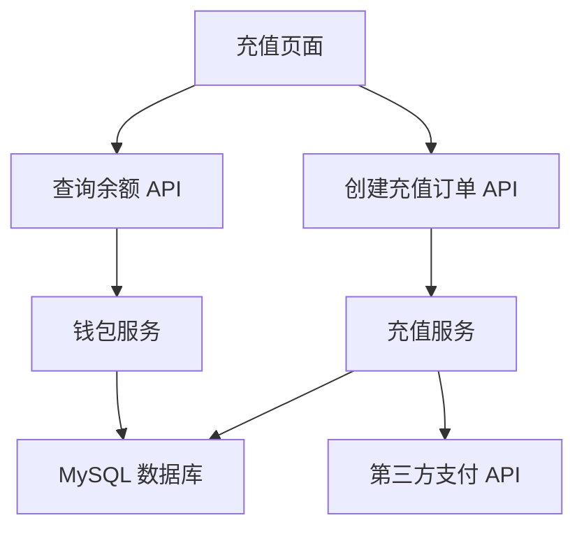

# 钱包模块

## 基本信息

- **模块 ID**: `wallet`
- **状态**: `completed`
- **负责人**: `产品经理`
- **最后更新**: `2025-12-08`

## 模块概述

钱包模块是平台的核心财务模块，为用户提供资金管理功能。用户可以通过钱包进行充值、提现、查询余额和交易记录等操作。

### 核心功能

1. **充值功能**: 用户可以通过支付宝、微信、银行卡等方式充值到钱包账户
2. **提现功能**: 用户可以将钱包余额提现到绑定的银行卡
3. **余额查询**: 用户可以实时查看钱包余额
4. **交易记录**: 用户可以查看充值、提现、消费等交易记录

### 目标用户

- 平台所有注册用户
- 需要进行资金操作的用户

## 包含页面

- [@充值页面](./pages/deposit-page.md) - 用户充值入口，支持多种支付方式
- 提现页面 - 用户提现入口（待补充）
- 钱包首页 - 余额展示和交易记录（待补充）

## 相关模块

- 用户模块 - 提供用户身份验证
- 订单模块 - 消费扣款时调用钱包服务

## 后端服务（占位符）

> 产品经理在需求阶段，用自然语言列出此模块需要的后端服务。后端工程师会在设计阶段补充详细的服务文档和 API 文档。

- **充值服务**: 处理用户充值业务，包括订单创建、支付回调处理、余额更新
- **提现服务**: 处理用户提现业务，包括提现申请、审核、打款
- **钱包服务**: 管理用户余额，提供余额查询、交易记录查询功能

## 技术架构

### 数据流

1. **充值流程**: 用户 → 充值页面 → 创建充值订单 API → 充值服务 → 第三方支付 → 支付回调 → 更新余额
2. **余额查询**: 用户 → 充值页面 → 查询余额 API → 钱包服务 → 返回余额

## 变更历史

| 日期 | 版本 | 变更内容 | 变更人 |
|---|---|---|---|
| 2025-12-08 | v1.0.0 | 初始版本，完成充值功能设计 | 产品经理 |
