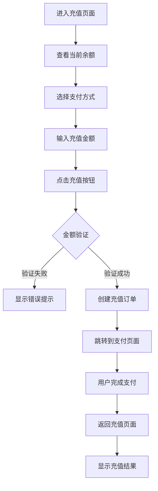

# 充值页面

## 1. 页面概述

充值页面是用户向钱包账户充值的入口。用户可以选择支付方式、输入充值金额，然后跳转到第三方支付平台完成支付。

### 使用场景

- 用户钱包余额不足时，需要充值
- 用户主动为钱包充值以备后用

## 2. 页面结构

```
充值页面
├── 余额卡片
│   ├── 当前余额显示
│   └── 刷新按钮
├── 支付方式选择器
│   ├── 支付宝
│   ├── 微信支付
│   └── 银行卡
├── 金额输入组件
│   ├── 快捷金额按钮（100/500/1000）
│   └── 自定义金额输入框
└── 充值按钮
```

## 3. 用户流程



## 4. 使用的组件

- [@余额卡片](../components/balance-card.md) - 显示当前余额
- 支付方式选择器 - 选择支付方式（待补充）
- 金额输入组件 - 输入充值金额（待补充）

## 5. 调用的 API

- [@查询余额 API](../backend/apis/get-balance.md) - 页面加载时查询当前余额
- [@创建充值订单 API](../backend/apis/create-deposit.md) - 用户点击充值按钮时创建订单

## 6. 交互规则

### 6.1. 金额验证

- **最小充值金额**: 10.00 元
- **最大充值金额**: 50,000.00 元
- **金额格式**: 最多保留 2 位小数

### 6.2. 支付方式

- 默认选中支付宝
- 用户可以切换到微信支付或银行卡

### 6.3. 充值流程

1. 用户输入金额后，点击"充值"按钮
2. 前端验证金额是否符合规则
3. 调用"创建充值订单 API"
4. 获取支付链接后，跳转到第三方支付页面
5. 用户完成支付后，第三方支付平台回调后端
6. 用户返回充值页面，显示充值结果

## 7. 错误处理

| 错误场景 | 错误提示 | 处理方式 |
|---------|---------|---------|
| 金额小于 10 元 | "充值金额不能小于 10 元" | 禁用充值按钮 |
| 金额大于 50000 元 | "单笔充值金额不能超过 50000 元" | 禁用充值按钮 |
| 未选择支付方式 | "请选择支付方式" | 高亮支付方式选择器 |
| 创建订单失败 | "创建订单失败，请稍后重试" | 显示错误提示 |

## 8. 变更历史

| 日期 | 版本 | 变更内容 | 变更人 |
|---|---|---|---|
| 2025-12-08 | v1.0.0 | 初始版本 | 产品经理 |
