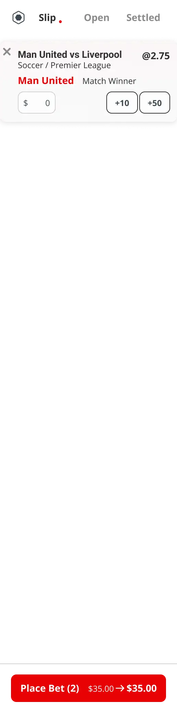
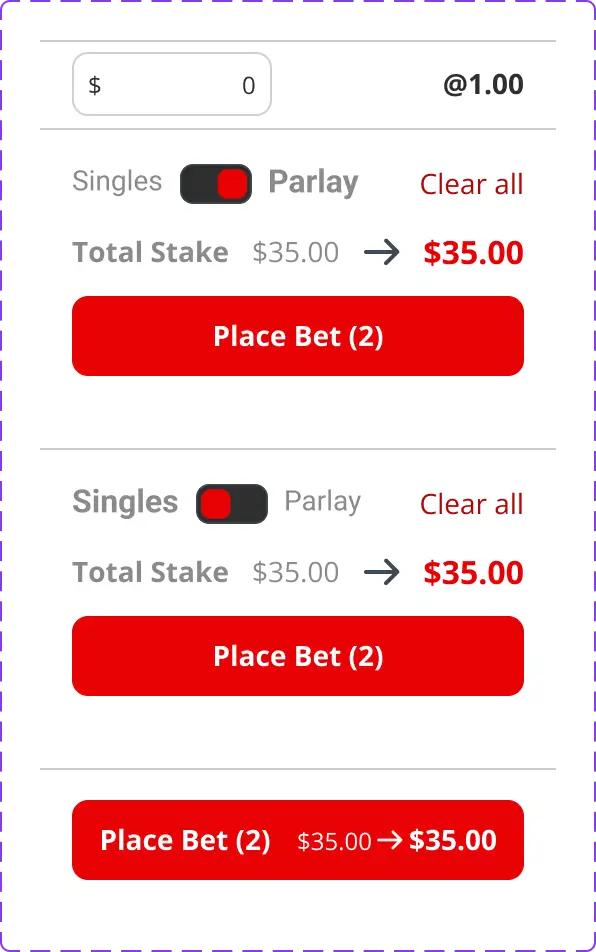

# 投注栏 `[组件]`

## 1. 概述

投注栏是一个全局组件，通常固定在页面右侧（桌面端）或从底部滑出（移动端）。它是用户与投注功能交互的核心界面，集成了三大功能：管理当前待提交的注单（Slip），查看已提交但未结算的注单（Open），以及浏览近期已结算的注单历史（Settled）。

**Slip Tab** 是该组件的核心，它包含一个动态的注单列表和一个智能工具栏。其设计旨在为用户提供一个流畅、高效且防错的投注创建体验。

## 2. 视觉预览

| 投注栏 (Slip Tab) | 投注工具栏 (多状态) |
| :---: | :---: |
|  |  |

## 3. 组件剖析

投注栏主要由三个部分构成：顶部标签页导航、内容显示区和底部动作工具栏。

| 序号 | 元素名称 | 功能描述 |
| :--- | :--- | :--- |
| 1 | `.tab-nav` | 用于在“注单(Slip)”、“待结算(Open)”和“已结算(Settled)”三个视图间切换。 |
| 2 | `.slip-list` | 在“注单(Slip)”Tab中，用于显示用户添加的投注卡片列表。 |
| 3 | `.toolbar` | 位于底部的工具栏，包含模式切换、总金额、预计派彩和下单按钮。用户不使用时会收缩以节省空间。 |
| 4 | `.bet-slip-card` | 注单列表中的单个投注卡片，详情参见 [@注单卡片](./bet-slip-card.md)。 |

## 4. Slip Tab 详细设计

### 4.1. 注单列表 (Slip List)

- **排序逻辑**: 默认情况下，注单按照被添加的时间顺序排列。然而，为了便于用户识别和处理冲突，当一个与已在列表中的注单属于 **同一场比赛** 的新注单被添加时，它将被插入到那张旧注单的紧邻下方。

- **卡片组件**: 列表中的每一项都是一个独立的 [@注单卡片](./bet-slip-card.md) 组件实例，负责展示单个投注选项的详细信息和状态。

### 4.2. 底部工具栏 (Toolbar)

工具栏的设计理念是 **“悬浮时收缩，使用时展开”**，以在不牺牲功能的前提下最大化注单列表的可见区域。

- **收缩状态 (悬浮)**: 当用户没有与工具栏交互时，它会收缩至一个较小的高度，仅显示核心的下单按钮，按钮内会集成关键信息，如 **“下单 (2) ￥35.00 -> ￥35.00”**，直观展示注单数量、总投注额和预计总派彩。

- **展开状态**: 当用户点击或聚焦到工具栏时，它会完全展开，显示所有功能选项，包括：
  - **模式切换**: `Singles` / `Parlay` (单关/串关) 的切换开关。
  - **全部清除**: `Clear all` 按钮，用于一键清空所有注单。
  - **总投注额**: `Total Stake` 显示所有注单的总金额。

## 5. 行为与交互 (新手模式)

为了提升新手用户的体验，投注栏在“新手模式”下引入了多项自动化和智能化处理逻辑，核心交互逻辑请参考 **《MTS新手模式投注栏交互设计》** 文档。

### 5.1. 互斥选项自动处理

- **规则**: 当用户在同一场比赛中选择了互斥的盘口选项（例如，已选“主胜”后又选“客胜”）。
- **系统动作**: 系统将 **自动用新选项替换旧的冲突选项**，无需用户手动移除。
- **用户反馈**: 界面会弹出一个短暂的通知（例如：“已自动替换冲突选项”），告知用户发生了自动操作。

### 5.2. 异常选项智能处理

- **场景**: 当注单列表中存在已锁定、已失效或存在串关冲突的“异常选项”时。
- **系统动作**: 
  1. 异常选项在卡片上会被明确标记（例如，变灰、显示警告图标）。
  2. 下单按钮的文本会变为 **“移除异常并下单”**，颜色变为警告色（如橙色）。
  3. 用户点击该按钮后，系统会自动移除所有异常选项，并提交剩余的有效注单。
- **用户反馈**: 操作后，系统会显示通知（例如：“已自动移除 X 个异常选项并成功下单”）。

### 5.3. 快捷金额与历史金额

- **快捷按钮**: 金额输入框附近提供 `+10`, `+50` 等快捷按钮，方便用户快速增加投注额。
- **上次金额**: 提供 `Last` 按钮，点击后会自动将上一次 **成功提交** 的投注总金额填充到当前的总金额输入框中。

## 6. 技术规格

### 6.1. 关联关系

- **调用的 API**: [@提交投注](../apis/place-bet.md), [@获取待结算注单](../apis/get-open-bets.md), [@获取已结算注单](../apis/get-settled-bets.md)
- **依赖的组件**: [@注单卡片](./bet-slip-card.md), [@Toast](../components/toast.md)
- **被使用的页面**: 全局使用，在所有允许投注的页面中可见。

### 6.2. 技术细节

- **Figma 组件链接**: [在 Figma 中查看](https://www.figma.com/file/7dGazbQunLjNP51HlRthUP/bet-slip-and-toolbar)
- **代码组件名称**: `<BetSlip>`
- **代码仓库路径**: `src/components/global/BetSlip.tsx`

## 7. 变更历史

| 日期 | 版本 | 变更内容 | 变更人 | 
| :--- | :--- | :--- | :--- | 
| 2025-12-07 | v3.0.0 | 初始版本，基于v6模板创建，并集成三Tab结构。 | @manus-ai |
| 2025-12-08 | v3.1.0 | 根据Figma设计和交互文档全面更新Slip Tab的设计，包括列表排序逻辑、工具栏多状态交互和新手模式下的自动化行为。 | @manus-ai |
