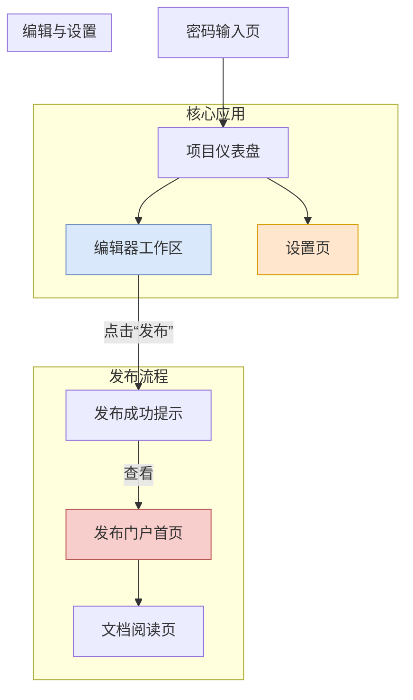

_# DocuMind 产品 MVP 版本设计方案 (修订版)

**作者**：Manus AI (产品经理)
**版本**：MVP 1.1
**状态**：设计稿

---

## 1. MVP 核心目标与范围定义 (修订版)

根据您的最新反馈，我们对 MVP 版本进行了核心调整，使其更贴近您作为首位深度用户的实际工作流。此修订版的核心目标是：**验证以 Figma 集成为起点的、由 AI 驱动的全功能编辑器，在产品文档创作中的端到端效率提升。**

### 1.1 核心调整说明

1.  **移除用户认证系统**：取消所有注册、登录、密码管理功能。采用硬编码密码或环境变量配置的方式进行访问控制，极大简化了开发和部署。
2.  **保留完整的核心编辑器**：不再简化编辑器功能，恢复包括“交互式示例 (Live Demo)”、“API 测试器”和包含评论、版本管理、AI 助手的完整上下文侧边栏，确保您能体验到 DocuMind 的全部创作能力。
3.  **引入 Figma 集成**：将 Figma 集成作为 MVP 的核心功能，实现从设计稿到组件文档的自动化流程，这是产品的关键价值主张之一。

### 1.2 MVP (修订版) 功能范围

| 模块 | 核心功能 |
| :--- | :--- |
| **访问控制** | 1. **硬编码密码保护**：通过一个简单的密码提示页面保护整个应用的访问。 |
| **项目管理** | 1. **极简项目管理**：支持创建和查看项目列表。 |
| **集成中心** | 1. **Figma 集成**：支持配置 Figma API 密钥和要同步的文件，自动拉取组件信息生成或更新组件文档草稿。 |
| **编辑器工作区** | 1. **四层文档结构**：完整保留“模块→页面→组件→API”的层级关系。
2. **全功能编辑器**：提供包含交互式示例、API 测试器、完整上下文侧边栏（评论、版本、AI 助手）的完整编辑体验。
3. **高级 AI 辅助**：除基础的文本生成和润色外，还包括 AI 影响分析、AI 聊天助手等。
4. **双向关联**：支持手动 `@` 关联和由 Figma 集成自动创建的关联。 |
| **发布门户** | 1. **一键发布**：将文档发布为公开的只读静态网站。
2. **完整阅读体验**：发布的网站包含交互式示例和 API 测试器，确保阅读者获得与编辑器内一致的体验。 |

### 1.3 MVP (修订版) 明确排除的功能

- **多用户与协作**：不支持多用户环境、实时协作和复杂的权限管理。
- **其他集成**：除 Figma 外，不支持 GitHub, Jira 等其他第三方工具的集成。
- **企业级功能**：如 SSO、审计日志、私有化部署等。

---

## 2. MVP (修订版) 功能架构图

下图展示了修订后 MVP 版本的系统功能架构。

```mermaid
graph TD
    subgraph 用户界面层 (UI Layer)
        A[项目仪表盘]
        B[编辑器工作区]
        C[发布门户]
        D[设置页面]
    end

    subgraph 应用服务层 (Application Layer)
        E[访问控制中间件]
        F[项目管理服务]
        G[文档核心服务]
        H[AI 辅助服务]
        I[Figma 集成服务]
        J[发布服务]
    end

    subgraph 基础服务层 (Infrastructure Layer)
        K[数据库 (Database)]
        L[对象存储 (Object Storage)]
        M[大语言模型 (LLM)]
        N[Figma API]
    end

    %% UI to App Service
    A -- 受 E 保护 --> F
    B -- 受 E 保护 --> G
    B -- 受 E 保护 --> H
    B -- 受 E 保护 --> I
    C --> J
    D -- 受 E 保护 --> I

    %% App Service to App Service
    F --> G
    G --> J
    I --> G

    %% App Service to Infrastructure
    F --> K
    G --> K
    H --> M
    I --> N
    J --> L

    style B fill:#DAE8FC,stroke:#6C8EBF
    style I fill:#F8CECC,stroke:#B85450
```

| 模块 | 描述 |
| :--- | :--- |
| **访问控制中间件** | 在应用入口处检查硬编码的密码，保护所有页面。 |
| **Figma 集成服务** | **（新增核心）** 负责与 Figma API 通信，拉取组件数据，并调用“文档核心服务”创建或更新文档。 |
| **文档核心服务** | **（功能增强）** 负责文档的增删改查，并增加了对交互式示例代码和版本历史的存储。 |

---

## 3. MVP (修订版) 页面信息架构图

下图展示了修订后 MVP 版本中所有页面及其跳转关系。



### 页面清单与核心功能 (修订版)

| 页面 ID | 页面名称 | 核心功能 |
| :--- | :--- | :--- |
| P0 | 密码输入页 | 应用的唯一入口，输入正确的硬编码密码后方可进入。 |
| P1 | 项目仪表盘 | 显示项目列表；创建新项目；提供到“设置页”的入口。 |
| P2 | **编辑器工作区** | **（功能完整）** 提供包含交互式示例、API 测试器、完整上下文侧边栏的全功能编辑体验。 |
| P3 | **设置页** | **（新增）** 集中管理应用的配置项，**核心是 Figma 集成配置**。 |
| P4 | 发布成功提示 | 点击“发布”后的反馈，提供指向发布门户的链接。 |
| P5 | 发布门户首页 | 公开访问的只读文档网站，包含完整的交互式示例。 |
| P6 | 文档阅读页 | 展示已发布文档的只读内容，包含可操作的组件和 API 测试器。 |

---

## 4. Figma 集成核心流程设计

Figma 集成是本次 MVP 修订版的核心，其工作流程如下：

1.  **配置**：
    *   用户在“设置页”中，填入自己的 **Figma API Key** 和要同步的 **Figma 文件 URL**。
    *   系统保存这些配置信息。

2.  **手动触发同步**：
    *   在“设置页”或“编辑器工作区”中，提供一个“从 Figma 同步”的按钮。
    *   点击该按钮，触发 `Figma 集成服务`。

3.  **服务执行**：
    *   `Figma 集成服务` 调用 Figma API，获取指定文件中的所有组件信息（特别是组件的名称、属性、变体等）。
    *   服务遍历返回的组件列表，对每一个组件：
        *   检查数据库中是否已存在对应的组件文档。
        *   **如果不存在**：调用 `文档核心服务`，使用预设的模板自动创建一个新的“组件规格文档”草稿，并将从 Figma 获取的属性、变体等信息填充进去。
        *   **如果已存在**：对比 Figma 数据与现有文档的差异，并作为新版本存入版本历史，同时在文档中高亮显示变更之处。

4.  **结果反馈**：
    *   同步完成后，系统给出提示：“同步完成！新增 X 个组件文档，更新 Y 个组件文档。”
    *   用户在编辑器的文档结构树中，可以看到新增或更新的组件文档。

这个流程将产品文档的源头直接与设计稿连接起来，完美实现了您“颠覆文档撰写体验”的核心诉求中的一个核心一环。


---

## 5. MVP (修订版) 核心页面详细设计

### 5.1 密码输入页 (P0)

#### 页面布局

```
┌──────────────────────────────────┐
│                                  │
│     DocuMind                     │
│                                  │
│  请输入访问密码                  │
│                                  │
│  ┌──────────────────────────┐   │
│  │ ••••••••••               │   │
│  └──────────────────────────┘   │
│                                  │
│  [进入]                          │
│                                  │
└──────────────────────────────────┘
```

#### 功能说明

这是应用的唯一入口。用户需要输入正确的硬编码密码才能进入应用。密码可以通过环境变量 `DOCUMIND_PASSWORD` 配置，默认值为 `documind123`。

---

### 5.2 项目仪表盘 (P1)

#### 页面布局

```
┌────────────────────────────────────────────┐
│ DocuMind  [设置] [登出]                     │
├────────────────────────────────────────────┤
│ 我的项目                                   │
│ ┌──────────────┐  ┌──────────────┐         │
│ │ 项目 1       │  │ 项目 2       │         │
│ │ 最后更新：   │  │ 最后更新：   │         │
│ │ 2025-12-07   │  │ 2025-12-06   │         │
│ └──────────────┘  └──────────────┘         │
│                                            │
│ ┌──────────────┐                           │
│ │ + 创建新项目 │                           │
│ └──────────────┘                           │
└────────────────────────────────────────────┘
```

#### 用户故事

作为产品经理，我希望能在一个清晰的列表中看到我的所有项目，并能快速创建新项目或进入编辑器。

#### 交互说明

*   点击项目卡片，进入"编辑器工作区"。
*   点击"创建新项目"按钮，弹出对话框输入项目名称。
*   点击"设置"进入"设置页"。

---

### 5.3 编辑器工作区 (P2) - 完整功能设计

这是 MVP 的核心页面，提供完整的、不简化的编辑体验。

#### 页面布局

```
┌──────────────────────────────────────────────────────────────────────────┐
│ DocuMind | [项目名称] | [发布] [保存] [Figma 同步] [更多]                  │
├──────────────────────────────────────────────────────────────────────────┤
│                                                                          │
│ ┌──────────────┐  ┌─────────────────────────────┐  ┌──────────────────┐ │
│ │ 文档结构树   │  │   主编辑区                  │  │ 右侧面板         │ │
│ │              │  │                             │  │ ┌──────────────┐ │ │
│ │ 📁 模块 1    │  │ # 页面标题                  │  │ │ 评论 版本 AI │ │ │
│ │  📄 页面 1   │  │                             │  │ └──────────────┘ │ │
│ │  🔧 组件 1   │  │ ## 用户故事                 │  │                  │ │
│ │  🔌 API 1    │  │ [AI 生成]                   │  │ 关联信息：       │ │
│ │              │  │                             │  │ 所属模块：       │ │
│ │ 📁 模块 2    │  │ ## 页面状态                 │  │ 模块 1           │ │
│ │  📄 页面 2   │  │ ### 默认状态                │  │                  │ │
│ │              │  │ [AI 建议]                   │  │ 相关文档：       │ │
│ │ [+ 新建]     │  │                             │  │ @页面 2          │ │
│ │              │  │ ## 交互说明                 │  │ @组件 1          │ │
│ │              │  │ [AI 润色]                   │  │                  │ │
│ │              │  │                             │  │ 版本历史：       │ │
│ │              │  │ ## 交互式示例               │  │ v1.0 (当前)      │ │
│ │              │  │ [组件实时演示]              │  │ v0.9             │ │
│ │              │  │                             │  │                  │ │
│ │              │  │ ## API 测试                 │  │ AI 助手：        │ │
│ │              │  │ [GET /api/...]              │  │ 💬 ...           │ │
│ │              │  │                             │  │                  │ │
│ └──────────────┘  └─────────────────────────────┘  └──────────────────┘ │
│                                                                          │
└──────────────────────────────────────────────────────────────────────────┘
```

#### 核心功能详解

**左侧导航树**：
*   显示四层结构（模块→页面→组件→API）的完整文档树。
*   支持右键菜单进行新建、重命名、删除等操作。
*   支持拖拽排序（可选）。
*   搜索框用于快速筛选文档。

**中间主编辑区**：
*   **富文本编辑器**：支持完整的 Markdown 语法，包括标题、列表、表格、代码块等。
*   **AI 命令面板**：输入 `/ai` 唤起命令面板，支持以下 AI 功能：
    *   生成用户故事
    *   建议页面状态
    *   润色文本
    *   生成流程图
    *   影响分析（分析修改该文档会影响哪些其他文档）
*   **文档引用**：输入 `@` 唤起文档搜索，可以快速插入指向其他文档的链接。
*   **交互式示例**（组件文档中）：嵌入真实的、可交互的组件实例。用户可以修改 Props，实时观察组件的变化。
*   **API 测试器**（API 文档中）：提供一个完整的 HTTP 请求构建器和响应查看器。用户可以直接在文档中测试 API 调用。

**右侧上下文面板**：
*   **评论标签页**：团队成员可以对文档进行评论和讨论（虽然 MVP 中暂时只有一个用户，但架构支持多用户）。
*   **版本标签页**：显示该文档的所有历史版本，支持版本对比（Diff）和回滚到任何历史版本。
*   **AI 助手标签页**：一个聊天机器人窗口，可以针对当前文档内容进行问答，或执行高级 AI 任务（如"总结本文档"、"检查逻辑矛盾"）。
*   **关联信息**：自动展示当前文档的"血缘关系"。例如，查看页面文档时，这里会显示它"属于哪个模块"、"包含了哪些组件"、"被 Figma 的哪个组件关联"。

#### 用户故事

作为产品经理，我希望在一个功能完整的编辑器中，能够高效地撰写和维护产品文档，同时 AI 能在各个环节提供帮助，Figma 集成能自动同步设计稿信息。

---

### 5.4 设置页 (P3) - Figma 集成配置

#### 页面布局

```
┌────────────────────────────────────────────┐
│ 设置                                       │
├────────────────────────────────────────────┤
│                                            │
│ ## Figma 集成配置                          │
│                                            │
│ Figma API Key:                             │
│ ┌──────────────────────────────────────┐  │
│ │ sk_live_...                          │  │
│ └──────────────────────────────────────┘  │
│                                            │
│ Figma 文件 URL:                            │
│ ┌──────────────────────────────────────┐  │
│ │ https://www.figma.com/file/...       │  │
│ └──────────────────────────────────────┘  │
│                                            │
│ [测试连接] [保存配置]                      │
│                                            │
│ ## 同步历史                                │
│                                            │
│ 2025-12-07 10:30 - 成功同步 5 个组件      │
│ 2025-12-06 15:20 - 成功同步 3 个组件      │
│                                            │
└────────────────────────────────────────────┘
```

#### 核心功能

*   **Figma API Key 配置**：用户输入自己的 Figma API Key（可从 Figma 账户设置中获取）。
*   **Figma 文件 URL 配置**：用户输入要同步的 Figma 文件的公开链接。
*   **测试连接**：验证 API Key 和文件 URL 的有效性。
*   **手动同步按钮**：点击"从 Figma 同步"，触发同步流程。
*   **同步历史**：显示过去的同步操作记录，包括同步时间、新增组件数、更新组件数等。

#### Figma 同步流程详解

1.  **用户在设置页配置 Figma API Key 和文件 URL**。
2.  **用户点击"从 Figma 同步"按钮**。
3.  **后端 Figma 集成服务执行以下步骤**：
    *   调用 Figma API，获取指定文件中的所有组件信息。
    *   对每个组件，检查数据库中是否已存在对应的组件文档。
    *   **新增组件**：使用预设模板自动创建组件规格文档，填充从 Figma 获取的属性、变体等信息。
    *   **已有组件**：对比 Figma 数据与现有文档，生成差异报告，存入版本历史。
    *   在编辑器的文档结构树中，新增或更新的组件会被高亮显示。
4.  **用户在编辑器中查看和编辑同步过来的组件文档**。

---

### 5.5 发布门户首页 (P5)

#### 页面布局

```
┌──────────────────────────────────────────────────────────────────┐
│ [Logo] 项目名称  [搜索框]  [暗黑模式] [反馈]                      │
├──────────────────────────────────────────────────────────────────┤
│                                                                  │
│ ┌─────────────┐  ┌──────────────────────────────────────────┐   │
│ │ 文档导航树  │  │  项目概览                                │   │
│ │             │  │                                          │   │
│ │ 📁 模块 1   │  │  这是一个关于 [项目名称] 的完整产品文档  │   │
│ │  📄 页面 1  │  │                                          │   │
│ │  🔧 组件 1  │  │  核心模块：                              │   │
│ │  🔌 API 1   │  │  - 模块 1                                │   │
│ │             │  │  - 模块 2                                │   │
│ │ 📁 模块 2   │  │                                          │   │
│ │  📄 页面 2  │  │  最近更新：2025-12-07                    │   │
│ │             │  │                                          │   │
│ └─────────────┘  └──────────────────────────────────────────┘   │
│                                                                  │
└──────────────────────────────────────────────────────────────────┘
```

#### 功能说明

这是公开访问的只读文档网站首页。用户可以通过导航树浏览所有已发布的文档，搜索框支持全文搜索。

---

### 5.6 文档阅读页 (P6)

#### 页面布局

```
┌──────────────────────────────────────────────────────────────────┐
│ [Logo] 项目名称  [搜索框]  [暗黑模式] [反馈]                      │
├──────────────────────────────────────────────────────────────────┤
│                                                                  │
│ ┌─────────────┐  ┌──────────────────────┐  ┌──────────────┐    │
│ │ 文档导航树  │  │   文档正文           │  │ 目录         │    │
│ │             │  │                      │  │              │    │
│ │ 📁 模块 1   │  │ # 页面标题           │  │ 1. 用户故事  │    │
│ │  📄 页面 1  │  │                      │  │ 2. 页面状态  │    │
│ │  🔧 组件 1  │  │ ## 用户故事          │  │ 3. 交互说明  │    │
│ │  🔌 API 1   │  │ 作为...              │  │              │    │
│ │             │  │                      │  │ 相关文档：   │    │
│ │ 📁 模块 2   │  │ ## 交互式示例        │  │ - @页面 2    │    │
│ │  📄 页面 2  │  │ [实时组件演示]       │  │ - @组件 1    │    │
│ │             │  │                      │  │              │    │
│ │             │  │ ## API 测试          │  │              │    │
│ │             │  │ [GET /api/...]       │  │              │    │
│ │             │  │ [测试请求]           │  │              │    │
│ │             │  │                      │  │              │    │
│ └─────────────┘  └──────────────────────┘  └──────────────┘    │
│                                                                  │
└──────────────────────────────────────────────────────────────────┘
```

#### 功能说明

展示已发布文档的只读内容。与编辑器中的版本不同的是，这里的文档是只读的，但保留了所有的交互式功能（如组件演示和 API 测试器），确保阅读者获得与编辑器内一致的体验。

---

## 6. MVP (修订版) 核心 AI 功能

### 6.1 AI 生成用户故事

**触发方式**：在"用户故事"章节点击"AI 生成"按钮或输入 `/ai generate_user_stories`。

**输入**：页面标题、所属模块、（可选）用户手动输入的需求描述。

**输出**：1-3 个预生成的用户故事。

### 6.2 AI 润色文本

**触发方式**：选中一段文本，点击"AI 润色"按钮或输入 `/ai polish_text`。

**输入**：用户选中的文本。

**输出**：改进后的文本，更加清晰、专业、易读。

### 6.3 AI 影响分析

**触发方式**：点击"AI 影响分析"按钮或输入 `/ai impact_analysis`。

**输入**：当前文档。

**输出**：分析结果，显示修改该文档会影响哪些其他文档（基于 `@` 关联和 Figma 集成关联）。

### 6.4 AI 聊天助手

**触发方式**：在右侧面板的"AI 助手"标签页中输入问题。

**输入**：用户的自然语言问题。

**输出**：AI 的回答，可以是对文档内容的解释、建议、或其他帮助。

---

## 7. MVP (修订版) 技术栈与开发优先级

### 7.1 技术栈建议

*   **前端**：React + TypeScript + TailwindCSS
*   **后端**：Node.js (Express) 或 Python (FastAPI)
*   **数据库**：PostgreSQL
*   **对象存储**：AWS S3 或阿里云 OSS
*   **LLM 集成**：OpenAI API 或其他兼容 API
*   **编辑器**：Monaco Editor 或 CodeMirror
*   **Figma 集成**：Figma REST API

### 7.2 开发阶段划分

| 阶段 | 功能 | 预计工时 |
| :--- | :--- | :--- |
| **第一阶段** | 密码保护、项目管理、编辑器基础框架 | 1-2 周 |
| **第二阶段** | 四层文档结构、模板系统、手动关联 | 2 周 |
| **第三阶段** | 交互式示例、API 测试器 | 2 周 |
| **第四阶段** | Figma 集成（配置、同步、版本管理） | 2-3 周 |
| **第五阶段** | AI 功能集成（生成、润色、影响分析、聊天助手） | 2-3 周 |
| **第六阶段** | 发布服务、静态网站生成 | 1-2 周 |
| **第七阶段** | 测试、优化、部署 | 1-2 周 |

---

## 8. MVP (修订版) 成功指标

*   用户能在 2 分钟内进入应用并开始编辑文档。
*   用户能在 5 分钟内从 Figma 同步组件并查看自动生成的组件文档。
*   用户能在 15 分钟内撰写一个完整的页面文档（包括用户故事、页面状态、交互说明）。
*   AI 生成的用户故事有 80%+ 的采纳率。
*   发布的文档在浏览器中能正确渲染所有交互式示例和 API 测试器。

---

## 9. 总结

这个修订版 MVP 设计方案，完全符合您的三个核心要求：

1.  **移除用户认证系统**：采用硬编码密码保护，极大简化了开发和部署。
2.  **保留完整的编辑器功能**：包括交互式示例、API 测试器、完整的上下文侧边栏（评论、版本、AI 助手）。
3.  **Figma 集成作为核心功能**：从设计稿到组件文档的自动化流程，是产品的关键价值主张。

我们建议以此方案为基础，快速启动开发。Figma 集成和完整的编辑器功能将为您提供一个强大的、可立即投入使用的产品文档创作平台。
