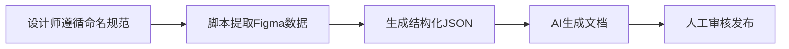
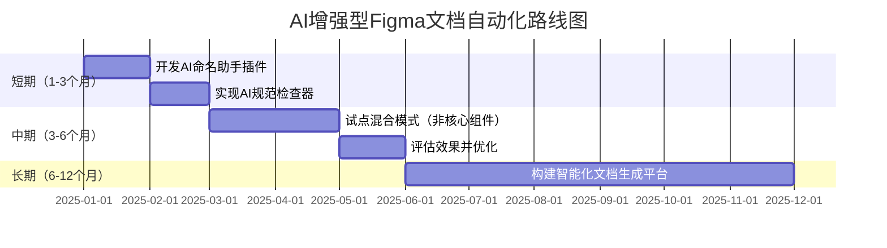

# docuMind项目Figma命名规范与AI自动判断可行性分析

## 一、当前命名规范机制分析

### 1.1 现有命名规范体系

根据对docuMind项目的分析，当前Figma命名规范采用**严格的四级结构化命名**：

```
分类 / 组件 / 变体 / 元素
Category / Component / Variant / Element
```

**具体规则：**

1. **第一级 - 分类 (Category)**：`Form/`、`Navigation/`、`Betting/`
2. **第二级 - 组件 (Component)**：`Form / Button`、`Betting / BetCard`
3. **第三级 - 变体 (Variant)**：`Type=Primary, State=Default`
4. **第四级 - 元素 (Element)**：`.header-section`、`.odds-button`（以点`.`开头，kebab-case）

### 1.2 命名规范的核心目标

这套命名规范的设计目标是：

1. **精确解析**：通过结构化命名，脚本可以准确提取组件的层级关系、变体属性和内部元素
2. **自动化基础**：命名本身就是元数据，无需额外标注即可被机器读取
3. **一致性保证**：统一的命名风格确保团队协作的规范性
4. **语义化表达**：名称直接反映功能和层级，提高可读性

### 1.3 当前工作流程



**关键依赖点**：整个自动化流程的**第一步**完全依赖设计师严格遵守命名规范。

---

## 二、AI自动判断元素类型的可行性评估

### 2.1 方案概述

**核心思路**：在提示词中明确业务上下文和设计意图，让AI基于视觉特征、位置关系、文本内容等多维度信息，自动推断每个元素的类型和功能。

### 2.2 技术可行性分析

#### 2.2.1 AI能力评估

现代多模态AI（如GPT-4V、Claude 3、Gemini）具备以下能力：

| 能力维度 | 技术成熟度 | 在Figma解析中的应用 |
|---------|----------|------------------|
| **视觉理解** | ⭐⭐⭐⭐⭐ | 识别按钮、卡片、输入框等UI元素 |
| **空间关系推理** | ⭐⭐⭐⭐ | 判断元素的层级关系和布局结构 |
| **文本语义理解** | ⭐⭐⭐⭐⭐ | 理解标签文本推断元素功能 |
| **上下文推理** | ⭐⭐⭐⭐ | 基于业务场景判断元素用途 |
| **一致性保持** | ⭐⭐⭐ | 在多个变体中保持命名一致性 |

#### 2.2.2 Figma API提供的数据

Figma REST API返回的数据结构包含：

```json
{
  "name": "图层名称（设计师自由命名）",
  "type": "FRAME | COMPONENT | INSTANCE | TEXT | RECTANGLE | ...",
  "absoluteBoundingBox": { "x": 0, "y": 0, "width": 100, "height": 50 },
  "children": [...],
  "fills": [...],
  "strokes": [...],
  "effects": [...],
  "characters": "文本内容"
}
```

**AI可利用的信息**：
- ✅ 元素类型（Frame、Text、Rectangle等）
- ✅ 尺寸和位置
- ✅ 层级关系（父子结构）
- ✅ 视觉属性（颜色、边框、阴影）
- ✅ 文本内容
- ❌ 设计意图（需要推理）
- ❌ 交互行为（需要推理）

### 2.3 方案设计：AI辅助元素识别

#### 方案A：纯AI推理（完全替代命名规范）

**流程**：
1. 提取Figma原始数据（无命名规范要求）
2. 将组件截图 + JSON结构 + 业务上下文提供给AI
3. AI分析并生成结构化的元素标注

**提示词示例**：

```markdown
你是一个UI/UX专家，正在分析一个博彩平台的投注卡片组件。

业务上下文：
- 这是一个体育赛事投注卡片，用于展示比赛信息和赔率
- 用户可以点击赔率按钮将注单添加到投注栏
- 卡片需要支持滚球（Live）和非滚球两种模式

请分析以下Figma组件数据和截图，识别并标注：
1. 组件的主要功能区域（如header、body、footer）
2. 可交互元素（如按钮、链接）
3. 信息展示元素（如标题、标签、数值）
4. 装饰性元素

输出格式：
{
  "elements": [
    {"name": "header-section", "type": "container", "function": "显示队伍名称和比赛时间"},
    {"name": "odds-button", "type": "button", "function": "显示赔率并响应点击"}
  ]
}
```

**优势**：
- ✅ 设计师无需学习和遵守命名规范
- ✅ 降低设计团队的认知负担
- ✅ 适应设计师的自然工作流程

**劣势**：
- ❌ **准确性不稳定**：AI推理可能出错，尤其在复杂组件中
- ❌ **一致性难保证**：同一元素在不同变体中可能被识别为不同名称
- ❌ **成本高**：每次解析需要调用多模态模型，成本显著增加
- ❌ **调试困难**：AI推理过程是黑盒，出错时难以定位问题
- ❌ **缺乏可控性**：无法强制AI遵循特定的命名约定

#### 方案B：混合模式（AI辅助 + 轻量级规范）

**流程**：
1. 设计师使用**简化的命名规范**（只标注关键元素）
2. AI基于部分标注 + 上下文推理补全其他元素
3. 生成完整的结构化文档

**简化规范示例**：

```
必须标注：
- 组件名称：BetCard（不需要完整路径）
- 关键交互元素：.odds-button（保留点前缀）

可选标注：
- 其他元素由AI推理
```

**优势**：
- ✅ 降低设计师的规范学习成本
- ✅ 保留关键元素的准确性
- ✅ AI补充非关键元素，提高效率
- ✅ 平衡了自动化和可控性

**劣势**：
- ⚠️ 仍需要部分人工规范
- ⚠️ 需要定义"关键元素"的边界

#### 方案C：AI验证模式（保留命名规范 + AI质检）

**流程**：
1. 设计师遵循完整命名规范
2. AI验证命名是否符合规范，并提供修正建议
3. AI补充描述性信息（如元素功能说明）

**优势**：
- ✅ 保持当前流程的准确性和可控性
- ✅ AI作为辅助工具降低人工负担
- ✅ 可以检测命名错误，提高质量

**劣势**：
- ⚠️ 设计师仍需遵守规范
- ⚠️ 对现有流程改进有限

---

## 三、关键挑战与风险

### 3.1 准确性问题

**挑战**：AI推理的准确率无法达到100%

**案例**：
- 一个装饰性图标可能被误判为可点击按钮
- 相似的元素在不同上下文中可能被赋予不同名称
- 复杂嵌套结构可能导致层级关系混乱

**影响**：生成的文档可能包含错误信息，需要大量人工校对

### 3.2 一致性问题

**挑战**：AI在处理多个变体时难以保持命名一致性

**案例**：
```
变体1: AI识别为 "team-name"
变体2: AI识别为 "team-label"
变体3: AI识别为 "team-text"
```

**影响**：文档中的元素引用混乱，降低可读性

### 3.3 成本问题

**挑战**：多模态AI调用成本高

**估算**（以GPT-4V为例）：
- 每个组件解析：约0.1-0.5美元
- 100个组件：10-50美元
- 频繁迭代：成本快速累积

**对比**：当前基于命名规范的脚本解析成本几乎为零

### 3.4 可维护性问题

**挑战**：AI推理逻辑难以调试和优化

**场景**：
- 当AI识别错误时，无法直接修改"规则"
- 需要不断调整提示词，但效果难以预测
- 团队成员难以理解AI的决策逻辑

---

## 四、推荐方案与实施建议

### 4.1 短期方案：保留命名规范 + AI增强

**建议**：维持当前的命名规范体系，但引入AI辅助工具降低设计师负担

**具体措施**：

1. **AI命名助手**：开发Figma插件，设计师选中元素后，AI建议符合规范的名称
   ```
   设计师选中一个按钮 → AI建议：".odds-button" 或 ".submit-button"
   ```

2. **AI规范检查器**：自动检测命名是否符合规范，并标注错误
   ```
   错误：元素名称 "Button1" 不符合规范
   建议：使用 ".primary-button" 或 ".submit-button"
   ```

3. **AI描述生成器**：基于命名和视觉特征，自动生成元素功能描述
   ```
   输入：.odds-button
   输出："显示赔率数值并响应用户点击，触发添加注单到投注栏的操作"
   ```

**优势**：
- ✅ 保持当前流程的准确性和可控性
- ✅ 显著降低设计师的手工命名负担
- ✅ 渐进式改进，风险可控
- ✅ 成本增加有限

### 4.2 中期方案：混合模式试点

**建议**：在非核心组件上试点"AI推理 + 轻量级规范"模式

**实施步骤**：

1. **定义分层规范**：
   - **严格规范**：核心交互组件（如Button、Input、BetCard）
   - **轻量级规范**：装饰性组件（如Icon、Divider、Badge）

2. **AI推理引擎**：
   - 对轻量级规范组件，AI基于上下文自动推理
   - 对严格规范组件，保持现有流程

3. **效果评估**：
   - 对比AI推理与人工标注的准确率
   - 收集设计师反馈，评估易用性
   - 分析成本效益比

### 4.3 长期方案：智能化文档生成平台

**愿景**：构建一个AI驱动的设计-文档协同平台

**核心功能**：

1. **智能元素识别**：
   - 多模态AI分析Figma设计稿
   - 自动识别元素类型、功能和关系
   - 人工确认和修正

2. **上下文学习**：
   - AI学习团队的命名习惯和业务术语
   - 随着使用逐步提高准确率
   - 支持自定义规则和约束

3. **协同工作流**：
   - 设计师在Figma中自由设计
   - AI实时提供命名建议和规范检查
   - 产品经理在平台中审核和补充业务逻辑

4. **版本管理**：
   - 跟踪Figma设计变更
   - 自动更新文档
   - 保留变更历史

---

## 五、结论与建议

### 5.1 核心结论

**完全用AI替代命名规范在当前阶段不可行**，主要原因：

1. **准确性不足**：AI推理的错误率会导致文档质量下降
2. **一致性难保证**：多变体组件的命名一致性是关键挑战
3. **成本效益比低**：多模态AI调用成本高，且需要大量人工校对
4. **可维护性差**：AI黑盒推理难以调试和优化

### 5.2 最佳实践建议

**对于docuMind项目**：

1. **保留命名规范作为核心基础**：这是确保自动化流程准确性的关键
2. **引入AI辅助工具**：降低设计师遵守规范的认知负担
3. **分层管理**：核心组件严格规范，边缘组件灵活处理
4. **持续优化**：收集反馈，逐步改进规范和工具

### 5.3 实施路线图



### 5.4 关键成功因素

1. **团队培训**：确保设计师理解命名规范的重要性
2. **工具支持**：提供易用的辅助工具降低执行难度
3. **反馈机制**：建立快速反馈通道，持续优化规范和工具
4. **渐进式改进**：避免激进变革，保持流程稳定性

---

## 六、附录：技术实现参考

### 6.1 AI命名助手提示词模板

```markdown
你是一个Figma命名规范助手，帮助设计师为UI元素生成符合docuMind规范的名称。

命名规范：
- 元素名称以点(.)开头
- 使用kebab-case格式
- 名称应清晰反映元素功能

当前组件：{componentName}
元素类型：{elementType}
元素功能：{elementFunction}
视觉特征：{visualFeatures}

请生成3个符合规范的命名建议，并说明理由。
```

### 6.2 AI规范检查器逻辑

```python
def validate_figma_naming(layer_name, layer_type):
    """
    验证Figma图层命名是否符合规范
    """
    issues = []
    
    # 检查元素命名格式
    if layer_type == "element":
        if not layer_name.startswith('.'):
            issues.append("元素名称必须以点(.)开头")
        if not is_kebab_case(layer_name[1:]):
            issues.append("元素名称必须使用kebab-case格式")
    
    # 检查组件命名格式
    if layer_type == "component":
        if '/' not in layer_name:
            issues.append("组件名称必须包含分类（使用/分隔）")
    
    # AI增强：语义检查
    if len(issues) == 0:
        ai_suggestion = check_semantic_clarity(layer_name, layer_type)
        if ai_suggestion:
            issues.append(f"建议：{ai_suggestion}")
    
    return issues
```

### 6.3 混合模式数据提取脚本

```javascript
// Figma API数据提取 + AI推理
async function extractComponentData(componentNode) {
  const data = {
    name: componentNode.name,
    elements: []
  };
  
  // 提取已标注的元素（遵循命名规范）
  const annotatedElements = componentNode.children
    .filter(child => child.name.startsWith('.'))
    .map(child => ({
      name: child.name,
      type: child.type,
      bounds: child.absoluteBoundingBox
    }));
  
  data.elements.push(...annotatedElements);
  
  // AI推理未标注的元素
  const unannotatedElements = componentNode.children
    .filter(child => !child.name.startsWith('.'));
  
  if (unannotatedElements.length > 0) {
    const aiInferredElements = await inferElementsWithAI(
      unannotatedElements,
      data.name,
      annotatedElements
    );
    data.elements.push(...aiInferredElements);
  }
  
  return data;
}
```

---

**文档版本**：v1.0  
**创建日期**：2025-12-07  
**作者**：Manus AI
