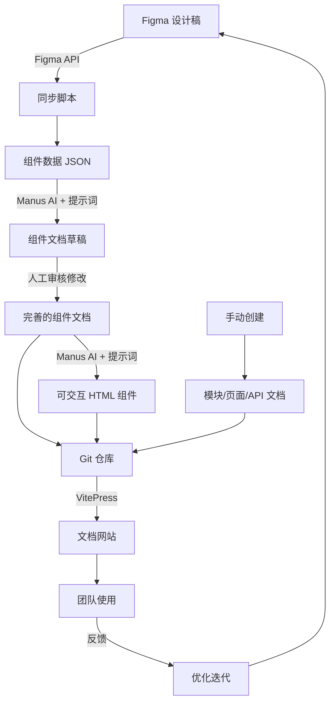

# MVP 测试方案快速实施指南

## 📋 核心补充建议总结

基于你的 MVP 方案,我识别出以下需要补充的关键点:

### 1. 文档架构调整
**问题**: 六层结构与 DocuMind 的四层结构不一致  
**建议**: 将六层结构映射到四层 - 模块/页面/组件/API,其中 API 层合并服务层、WebSocket 层和三方数据层

### 2. 文档模板标准化
**问题**: 缺少标准化的文档模板  
**建议**: 为每个层级设计 Markdown 模板,包含必填字段和可选字段

### 3. Figma 集成机制
**问题**: Figma 数据提取和同步机制不明确  
**建议**: 使用 Figma REST API + 自动化脚本 + Manus AI 的组合方案

### 4. AI 提示词设计
**问题**: 缺少高质量的提示词模板  
**建议**: 设计专用提示词,包含 Figma 数据、文档模板、输出格式要求

### 5. HTML 组件生成
**问题**: 技术方案和实现逻辑不明确  
**建议**: 使用原生 HTML/CSS/JS + TailwindCSS,提供交互控制面板

### 6. 文档网站构建
**问题**: 仅有索引页,缺少搜索和导航  
**建议**: 使用 VitePress 构建静态文档网站,支持搜索和自动导航

### 7. 自动化脚本
**问题**: 缺少自动化工具  
**建议**: 编写 Figma 同步脚本、索引生成脚本、站点构建脚本

### 8. 版本管理
**问题**: 版本同步机制不明确  
**建议**: 使用 Git 分支和标签,建立定期同步机制

---

## 🚀 快速开始指南

### 第 1 步: 准备工作 (1 天)

**创建 Git 仓库**
```bash
mkdir betting-platform-docs
cd betting-platform-docs
git init
```

**初始化目录结构**
```bash
mkdir -p modules/{sports-betting,account-management}/{pages,components,apis}
mkdir -p templates scripts shared/{components,apis} assets/{images,diagrams}
```

**安装 VitePress**
```bash
npm init -y
npm install -D vitepress
```

**配置 VitePress** (创建 `.vitepress/config.js`)
```javascript
export default {
  title: '巴西博彩平台设计文档',
  description: '基于 DocuMind 理念的产品文档',
  themeConfig: {
    nav: [
      { text: '首页', link: '/' },
      { text: '模块', link: '/modules/' }
    ],
    sidebar: 'auto',
    search: {
      provider: 'local'
    }
  }
}
```

**获取 Figma Access Token**
1. 登录 Figma
2. 进入 Settings → Account → Personal Access Tokens
3. 生成新 Token 并保存

---

### 第 2 步: 准备文档模板 (半天)

我已经为你准备了四个标准化模板,详见 `mvp_analysis.md` 的第 3.2 节。

将这些模板保存到 `templates/` 目录:
- `module_template.md`
- `page_template.md`
- `component_template.md`
- `api_template.md`

---

### 第 3 步: 编写 Figma 同步脚本 (1 天)

**创建 `scripts/sync_figma.js`**

```javascript
import fetch from 'node-fetch';
import fs from 'fs';
import path from 'path';

// 配置
const FIGMA_TOKEN = process.env.FIGMA_TOKEN;
const FIGMA_FILE_ID = process.env.FIGMA_FILE_ID;
const OUTPUT_DIR = './figma_data';

// 获取 Figma 文件数据
async function fetchFigmaFile() {
  const response = await fetch(
    `https://api.figma.com/v1/files/${FIGMA_FILE_ID}`,
    {
      headers: {
        'X-Figma-Token': FIGMA_TOKEN
      }
    }
  );
  
  if (!response.ok) {
    throw new Error(`Figma API error: ${response.statusText}`);
  }
  
  return await response.json();
}

// 提取组件信息
function extractComponents(fileData) {
  const components = [];
  
  function traverse(node) {
    if (node.type === 'COMPONENT') {
      components.push({
        id: node.id,
        name: node.name,
        description: node.description || '',
        properties: extractProperties(node),
        variants: extractVariants(node)
      });
    }
    
    if (node.children) {
      node.children.forEach(traverse);
    }
  }
  
  traverse(fileData.document);
  return components;
}

// 提取组件属性
function extractProperties(node) {
  // 根据 Figma 节点结构提取属性
  // 这里需要根据实际情况调整
  return [];
}

// 提取组件变体
function extractVariants(node) {
  // 根据 Figma 节点结构提取变体
  // 这里需要根据实际情况调整
  return [];
}

// 保存数据
function saveData(components) {
  if (!fs.existsSync(OUTPUT_DIR)) {
    fs.mkdirSync(OUTPUT_DIR, { recursive: true });
  }
  
  fs.writeFileSync(
    path.join(OUTPUT_DIR, 'components.json'),
    JSON.stringify(components, null, 2)
  );
  
  console.log(`✅ 同步完成,共 ${components.length} 个组件`);
}

// 主函数
async function main() {
  try {
    console.log('🔄 开始同步 Figma 数据...');
    const fileData = await fetchFigmaFile();
    const components = extractComponents(fileData);
    saveData(components);
  } catch (error) {
    console.error('❌ 同步失败:', error.message);
    process.exit(1);
  }
}

main();
```

**运行脚本**
```bash
export FIGMA_TOKEN="your_token_here"
export FIGMA_FILE_ID="your_file_id_here"
node scripts/sync_figma.js
```

---

### 第 4 步: 使用 Manus AI 生成组件文档 (试点阶段)

**准备提示词**

将以下提示词保存为 `prompts/generate_component_doc.txt`:

```
你是一位专业的产品文档撰写专家,擅长根据 Figma 设计稿生成结构化的组件文档。

## 任务
根据以下 Figma 组件信息,生成一份符合模板要求的组件文档(Markdown 格式)。

## Figma 组件信息
{FIGMA_DATA}

## 文档模板
{TEMPLATE}

## 输出要求
1. 严格按照模板格式输出
2. 基本信息部分直接使用 Figma 数据填充
3. 组件属性部分根据 Figma properties 生成表格
4. 组件变体部分根据 Figma variants 生成章节
5. 其他章节生成合理的占位内容,标注为"[待补充]"
6. 输出完整的 Markdown 文档

请输出完整的组件文档:
```

**使用 Manus 生成文档**

1. 打开 Manus
2. 读取 `figma_data/components.json` 中的组件数据
3. 读取 `templates/component_template.md` 模板
4. 将组件数据和模板填入提示词
5. 让 Manus 生成组件文档
6. 将生成的文档保存到对应路径,例如 `modules/sports-betting/components/bet-card.md`

---

### 第 5 步: 人工审核和修改 (试点阶段)

**产品经理的工作**

1. 打开 Manus 生成的组件文档
2. 检查基本信息是否准确
3. 补充"组件概述"章节,说明组件的用途和使用场景
4. 补充"使用示例"章节,提供代码示例
5. 补充"调用的 API"和"被使用的页面"章节,建立文档关联
6. 修正任何不准确或不完整的内容
7. 提交到 Git 仓库

---

### 第 6 步: 使用 Manus AI 生成可交互组件 HTML (试点阶段)

**准备提示词**

将以下提示词保存为 `prompts/generate_component_html.txt`:

```
你是一位专业的前端开发工程师,擅长根据组件文档生成可交互的 HTML 组件。

## 任务
根据以下组件文档,生成一个可交互的 HTML 文件,用于展示组件的不同状态和变体。

## 组件文档
{COMPONENT_DOC}

## 技术要求
1. 使用原生 HTML/CSS/JavaScript,不依赖任何框架
2. 使用 TailwindCSS CDN 进行样式设计
3. 组件应该是响应式的,适配不同屏幕尺寸
4. 提供交互控制面板,允许用户切换组件的属性和状态

## 交互要求
1. 在页面顶部提供控制面板,包含所有可配置的属性
2. 用户修改属性后,组件应该实时更新
3. 提供状态切换按钮(正常/悬停/点击/禁用)
4. 提供变体切换按钮(如果有多个变体)

## 输出要求
1. 输出完整的 HTML 文件,包含 <!DOCTYPE html> 声明
2. 所有 CSS 和 JavaScript 代码内联在 HTML 文件中
3. 代码应该有良好的注释和格式
4. 文件应该可以直接在浏览器中打开运行

请输出完整的 HTML 文件:
```

**使用 Manus 生成 HTML**

1. 打开 Manus
2. 读取修改后的组件文档
3. 将文档内容填入提示词
4. 让 Manus 生成 HTML 文件
5. 将生成的 HTML 保存到组件文档同级目录,例如 `modules/sports-betting/components/bet-card.html`
6. 在组件文档中添加 HTML 引用:
   ```markdown
   ## 组件预览
   <iframe src="./bet-card.html" width="100%" height="400px"></iframe>
   ```

---

### 第 7 步: 创建其他层级文档 (试点阶段)

**手动创建模块文档**

基于 `templates/module_template.md`,创建 `modules/sports-betting/README.md`

**手动创建页面文档**

基于 `templates/page_template.md`,创建页面文档,例如 `modules/sports-betting/pages/event-list.md`

在页面文档中,使用 `@` 引用组件:
```markdown
## 使用的组件
- [@投注卡片](../components/bet-card.md) - 展示单个投注选项
```

**手动创建 API 文档**

基于 `templates/api_template.md`,创建 API 文档,例如 `modules/sports-betting/apis/get-events.md`

---

### 第 8 步: 构建文档网站 (试点阶段)

**创建首页** (`index.md`)
```markdown
# 巴西博彩平台设计文档

欢迎来到巴西博彩平台的设计文档。本文档基于 DocuMind 理念,采用四层结构组织产品知识。

## 模块列表

- [体育投注模块](./modules/sports-betting/)
- [账户管理模块](./modules/account-management/)

## 快速导航

- [组件索引](./shared/components/)
- [API 索引](./shared/apis/)
```

**构建网站**
```bash
npm run docs:dev  # 本地预览
npm run docs:build  # 构建生产版本
```

**访问网站**
打开浏览器访问 `http://localhost:5173`

---

### 第 9 步: 收集反馈和优化 (试点阶段)

**收集反馈**
- 邀请设计、开发、产品团队试用文档网站
- 收集对文档结构、内容、交互的反馈
- 识别问题和改进点

**优化方案**
- 根据反馈调整文档模板
- 优化 AI 提示词,提升生成质量
- 完善 Figma 同步脚本
- 优化文档网站的样式和交互

---

## 📊 完整工作流程图



---

## ⚠️ 注意事项

### Figma 文件规范
- 组件命名要清晰一致,例如 `Button/Primary`、`Card/BetCard`
- 使用 Figma 的 Properties 和 Variants 功能
- 为组件添加描述(Description)
- 保持设计文件的良好组织结构

### AI 提示词优化
- 根据实际生成结果不断调整提示词
- 提供充分的上下文和示例
- 明确输出格式要求
- 可以为不同类型的组件设计专用提示词

### 文档质量控制
- 建立人工审核流程,确保文档准确性
- 定期审查文档,更新过时内容
- 建立文档质量标准和检查清单
- 使用 Git 提交规范,便于追溯变更

### 版本同步机制
- 建立定期同步机制(例如每周一次)
- 在组件文档中记录 Figma 版本号
- 使用 Git 标签标记重要版本
- 建立变更通知机制,及时告知团队

---

## 🎯 成功标准

### 试点阶段成功标准
- ✅ 完成一个模块的完整文档(模块/页面/组件/API 四层)
- ✅ 至少 5 个组件有可交互的 HTML 展示
- ✅ 文档网站可正常访问,搜索和导航功能正常
- ✅ 团队反馈积极,认可文档的实用性
- ✅ Figma 同步流程可正常运行

### 长期成功标准
- ✅ 覆盖所有功能模块的文档
- ✅ 文档与 Figma 保持同步,变更及时反映
- ✅ 团队日常使用文档网站作为参考
- ✅ 文档质量稳定,错误率低
- ✅ 设计与开发协作效率提升

---

## 📚 参考资源

- **Figma API 文档**: https://www.figma.com/developers/api
- **VitePress 文档**: https://vitepress.dev/
- **Markdown 语法**: https://www.markdownguide.org/
- **TailwindCSS 文档**: https://tailwindcss.com/
- **Git 最佳实践**: https://www.conventionalcommits.org/

---

## 💡 下一步行动

1. **今天**: 创建 Git 仓库,初始化目录结构,安装 VitePress
2. **明天**: 准备文档模板,获取 Figma Token,编写同步脚本
3. **本周**: 选择试点模块,执行 Figma 同步,使用 Manus 生成组件文档
4. **下周**: 完善试点模块的所有文档,构建文档网站,收集反馈
5. **下月**: 根据反馈优化方案,推广到其他模块

祝你的 MVP 测试顺利! 🚀
