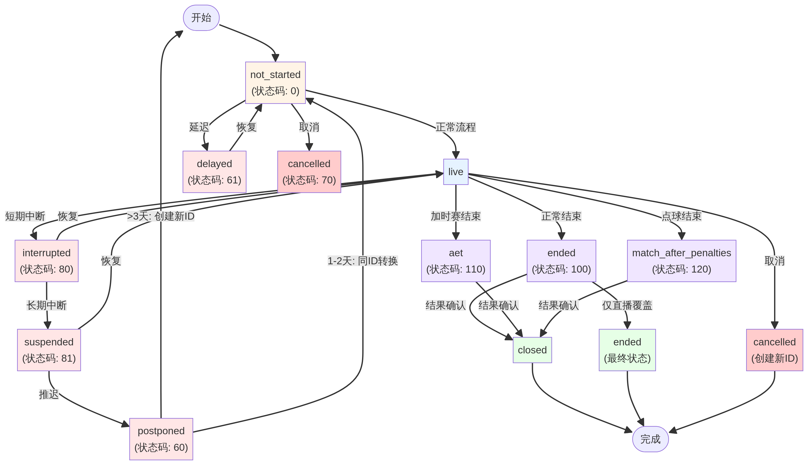
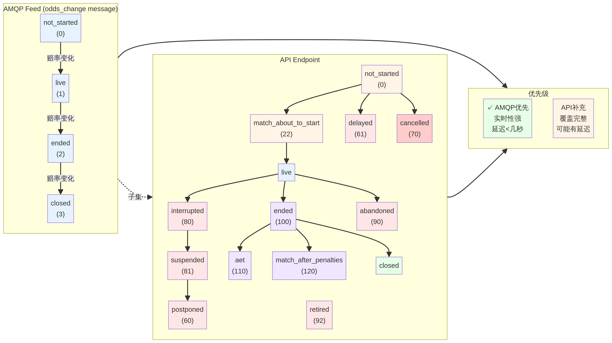
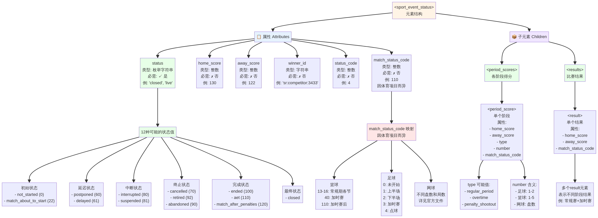
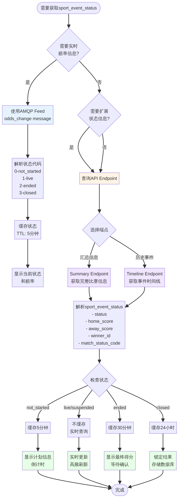
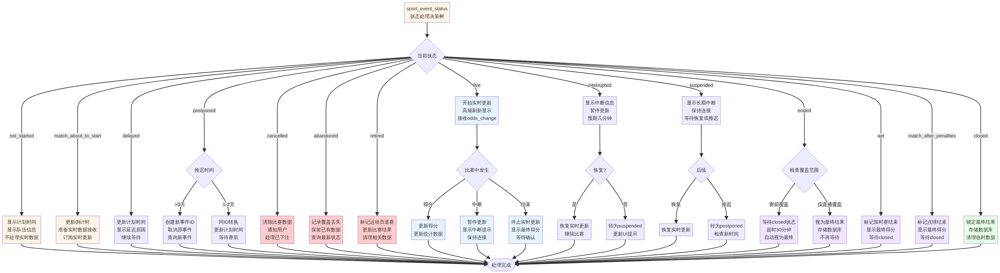
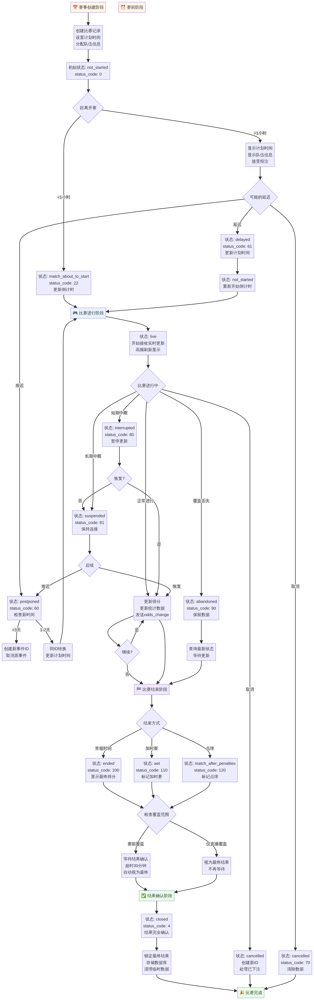

# Sportradar `<sport_event_status>` 元素完整指南

## 概述

`<sport_event_status>` 元素是Sportradar统一赔率反馈（UOF）API中的核心组件，用于提供与体育比赛状态相关的详细信息。该元素主要在**Summary API端点**和**Timeline API端点**的响应中出现，为客户端应用提供实时的比赛状态更新和结果确认信息。

---

## 一、比赛状态的完整分类体系

### 1.1 状态值与状态码的对应关系

Sportradar定义了12种不同的比赛状态，每种状态都有对应的数值代码。下表详细列出了所有可能的状态值及其含义：

| 状态值 | 状态码 | 描述 | 类型 |
|--------|--------|------|------|
| `not_started` | 0 | 比赛尚未开始。Betradar可能无实时覆盖，或比赛已开始但覆盖信息未知，比赛将在Betradar录入结果时转为closed | 初始状态 |
| `match_about_to_start` | 22 | 比赛即将开始，通常在赛前几分钟出现 | 初始状态 |
| `postponed` | 60 | 比赛已推迟至稍后日期。若推迟超过3天，将创建新的事件ID；若仅推迟1-2天，同一事件ID会在赛前转换状态 | 延迟状态 |
| `delayed` | 61 | 比赛开始时间已从计划开始时间延迟。最常见于网球等项目 | 延迟状态 |
| `cancelled` | 70 | 比赛已取消。可能是实际比赛取消，或Betradar的比赛表示被取消 | 终止状态 |
| `interrupted` | 80 | 比赛暂时中断，预期中断时间仅为几分钟。较长的中断可能导致比赛被suspended或postponed | 中断状态 |
| `suspended` | 81 | 比赛中断时间较长，超过几分钟。表示中断预期持续较长时间 | 中断状态 |
| `abandoned` | 90 | Betradar无实时覆盖或已失去实时覆盖，但比赛仍可能在进行中 | 覆盖状态 |
| `retired` | 92 | 运动员退赛（主要用于网球等个人项目） | 终止状态 |
| `ended` | 100 | 比赛已结束，但结果尚未确认。这是比赛完成的初始状态 | 完成状态 |
| `aet` | 110 | 比赛在加时赛后结束。表示比赛通过加时赛决出胜负 | 完成状态 |
| `match_after_penalties` | 120 | 比赛在点球后结束。表示比赛通过点球大战决出胜负 | 完成状态 |
| `closed` | (无) | 比赛已结束，结果已确认，不再有任何变化。仅适用于由赛前制作方覆盖的比赛 | 最终状态 |

### 1.2 状态分类体系

根据比赛进程和性质，这些状态可以分为五个主要类别：

**初始状态**：`not_started`, `match_about_to_start`
- 表示比赛尚未开始的各个阶段
- 这是比赛生命周期的起点

**延迟状态**：`postponed`, `delayed`
- 表示比赛开始时间发生了变化
- `delayed` 通常是短期延迟，`postponed` 表示推迟至稍后日期

**中断状态**：`interrupted`, `suspended`
- 表示比赛在进行中被中断
- `interrupted` 预期为短期中断，`suspended` 表示较长期的中断

**覆盖状态**：`abandoned`
- 表示Betradar的覆盖状态异常
- 比赛可能仍在进行，但Betradar无法提供实时数据

**终止状态**：`cancelled`, `retired`
- 表示比赛不会继续进行
- `cancelled` 用于整个比赛，`retired` 用于个人项目中的运动员退赛

**完成状态**：`ended`, `aet`, `match_after_penalties`
- 表示比赛已结束
- 区分了不同的结束方式（常规时间、加时赛、点球）

**最终状态**：`closed`
- 表示比赛结果已完全确认
- 不会再有任何变化

---

## 二、比赛状态流转机制

### 2.1 状态流转图

比赛状态遵循特定的流转规则。以下是主要的状态转换路径：



*图1：比赛状态流转图 - 展示所有12种状态之间的转换关系*

```
┌─────────────────────────────────────────────────────────────┐
│                    比赛状态流转图                             │
└─────────────────────────────────────────────────────────────┘

                    ┌──────────────────┐
                    │   not_started    │
                    └────────┬─────────┘
                             │
              ┌──────────────┼──────────────┐
              │              │              │
         ┌────▼────┐    ┌────▼────┐   ┌────▼────┐
         │ delayed │    │ live    │   │cancelled│
         └────┬────┘    └────┬────┘   └─────────┘
              │              │
         ┌────▼────┐    ┌────▼────┐
         │not_start│    │interrupted
         └─────────┘    └────┬────┘
                             │
                        ┌────▼────┐
                        │suspended │
                        └────┬────┘
                             │
                        ┌────▼────┐
                        │postponed │
                        └──────────┘
                        (>3天: 新ID)

                    ┌──────────────────┐
                    │      ended       │
                    │ (aet/penalties)  │
                    └────────┬─────────┘
                             │
                        ┌────▼────┐
                        │ closed   │
                        └──────────┘
                    (仅赛前覆盖)
```

### 2.2 关键状态转换规则

**从 `not_started` 出发：**
- 正常流转：`not_started` → `live` → `ended` → `closed`
- 延迟流转：`not_started` → `delayed` → `not_started` → `live`
- 取消流转：`not_started` → `cancelled`

**从 `live` 出发：**
- 正常完成：`live` → `ended` / `aet` / `match_after_penalties` → `closed`
- 短期中断：`live` → `interrupted` → `live`
- 长期中断：`live` → `interrupted` → `suspended` → `live` / `postponed`
- 取消：`live` → `cancelled`（创建新ID）

**从 `ended` 出发：**
- 结果确认：`ended` → `closed`
- 取消：`ended` → `cancelled`（创建新ID）
- 仅直播覆盖：`ended` → （永远停留在ended）

**特殊转换：**
- `postponed` 状态：
  - 若推迟超过3天：原事件ID被取消，创建新的事件ID
  - 若仅推迟1-2天：同一事件ID在赛前转换状态

### 2.3 状态转换的业务含义

| 转换 | 含义 | 处理建议 |
|------|------|---------|
| `not_started` → `live` | 比赛开始 | 更新实时数据源，开始接收实时更新 |
| `live` → `ended` | 比赛结束 | 停止接收实时更新，等待结果确认 |
| `ended` → `closed` | 结果确认 | 锁定最终结果，不再接受变更 |
| `live` → `interrupted` | 比赛中断 | 暂停实时更新，保持连接 |
| `interrupted` → `live` | 恢复比赛 | 恢复实时更新 |
| `live` → `postponed` | 比赛推迟 | 检查新的计划时间，可能需要创建新事件 |
| `live` → `cancelled` | 比赛取消 | 清除相关数据，可能需要处理已下注 |
| `not_started` → `delayed` | 延迟开始 | 更新计划开始时间 |

---

## 三、AMQP Feed 与 API Endpoint 的状态区别

### 3.1 核心区别

Sportradar在两个不同的数据传输机制中提供比赛状态信息，它们在覆盖范围、表示方式和优先级上存在重要区别：



*图2：AMQP Feed vs API Endpoint 对比 - 展示两种数据源的状态覆盖范围和优先级*

| 维度 | AMQP Feed (odds_change) | API Endpoint |
|------|-------------------------|--------------|
| **包含的状态** | 仅4个核心状态：`not_started`, `live`, `ended`, `closed` | 所有12个状态（API是AMQP的超集） |
| **表示方式** | 整数代码（性能优化） | 字符串（便于理解） |
| **额外状态** | 无 | `delayed`, `interrupted`, `suspended`, `postponed`, `cancelled`, `abandoned`, `retired` |
| **发送时机** | 每次赔率变化时发送 | 按需查询 |
| **延迟特性** | 实时性最强 | 可能有轻微延迟 |
| **使用场景** | 实时赔率更新 | 比赛信息查询、历史数据 |

### 3.2 状态覆盖对比

**AMQP Feed 中的4个核心状态：**
- `not_started` (0)：比赛未开始
- `live` (1)：比赛进行中
- `ended` (2)：比赛结束，结果待确认
- `closed` (3)：比赛结束，结果已确认

**仅在 API Endpoint 中出现的8个扩展状态：**
- `match_about_to_start`, `postponed`, `delayed`, `cancelled`, `interrupted`, `suspended`, `abandoned`, `retired`

这些扩展状态通常是"停止状态"，在这些状态下不会提供实时赔率，因此不会发送 `odds_change` 消息。

### 3.3 优先级与同步建议

**重要建议：优先使用 AMQP odds_change message 中的状态（AMQP > API）**

**原因分析：**

1. **实时性优势**：AMQP Feed 通过消息队列实时推送，延迟通常不超过几秒
2. **准确性**：odds_change 消息中的状态代表生成赔率时的确切状态
3. **性能优化**：使用整数代码表示，减少数据传输量
4. **一致性**：赔率与状态同步生成，不会出现不匹配

**同步策略：**

```
当同时接收到 AMQP 和 API 中的状态信息时：
1. 优先使用 AMQP odds_change 中的状态
2. 若 AMQP 消息暂时不可用，使用 API 查询
3. 对于扩展状态（仅API中出现），必须使用 API 查询
4. 定期对账，确保两个源的状态在可接受的时间差内保持一致
```

**时间差处理：**
- 正常情况：AMQP 和 API 的状态差异应在几秒内
- 异常情况：若差异超过1分钟，应进行人工审查
- 缓存策略：对 API 响应进行适当缓存，避免频繁查询

---

## 四、sport_event_status 元素的属性详解

### 4.1 完整属性列表

`<sport_event_status>` 元素包含以下属性，其中 `status` 是唯一必需属性：



*图3：sport_event_status 元素结构 - 展示完整的属性和子元素结构*

| 属性 | 数据类型 | 必需 | 描述 | 示例值 |
|------|---------|------|------|--------|
| `status` | 枚举字符串 | **是** | 比赛当前状态，是元素的核心属性 | `"closed"`, `"live"`, `"ended"` |
| `home_score` | 整数 | 否 | 主队得分 | `130` |
| `away_score` | 整数 | 否 | 客队得分 | `122` |
| `winner_id` | 字符串 | 否 | 获胜队伍的ID，格式为 `sr:competitor:{id}` | `"sr:competitor:3433"` |
| `status_code` | 整数 | 否 | 状态的数值代码，与 `status` 属性对应 | `4` (对应 `closed`) |
| `match_status_code` | 整数 | 否 | 比赛所处阶段的代码，因体育项目而异 | `110` (篮球加时赛) |

### 4.2 属性详细说明

**status 属性**
- 类型：枚举字符串
- 用途：提供比赛的高级状态信息
- 可能值：见第一章的完整列表
- 重要性：最关键的属性，所有其他信息都基于此状态

**home_score 和 away_score 属性**
- 类型：整数
- 用途：记录比赛的当前得分
- 更新频率：每次得分变化时更新
- 注意：在 `not_started` 状态下通常为 0 或不存在

**winner_id 属性**
- 类型：字符串
- 用途：标识比赛的获胜者
- 格式：`sr:competitor:{numeric_id}`
- 出现时机：仅在 `ended`, `aet`, `match_after_penalties`, `closed` 等完成状态下出现
- 用途：用于快速识别获胜队伍，避免根据得分推断

**status_code 属性**
- 类型：整数
- 用途：提供状态的数值表示，便于程序处理
- 对应关系：与 `status` 属性一一对应（见第一章表格）
- 使用场景：在需要紧凑表示或性能优化时使用

**match_status_code 属性**
- 类型：整数
- 用途：描述比赛所处的具体阶段
- 特点：**因体育项目而异**
- 示例：
  - 篮球：13-16（常规期各节）, 40（加时赛）
  - 足球：0（未开始）, 1-2（上下半场）, 3（加时赛）
  - 网球：不同的盘数和局数
- 获取详细映射：参考官方提供的 `match_status_codes.ods` 文件

### 4.3 match_status_code 的体育项目特异性

`match_status_code` 是最具体的比赛阶段指示器，其值完全取决于体育项目的规则和结构：

**篮球示例：**
- 13-16：常规赛第1-4节
- 40：加时赛
- 110：加时赛后结束

**足球示例：**
- 0：未开始
- 1：上半场
- 2：下半场
- 3：加时赛
- 4：点球大战

**网球示例：**
- 不同的盘数和局数组合
- 例如：第一盘第一局、第二盘第三局等

**获取完整映射：**
- 下载官方 `match_status_codes.ods` 文件（16KB）
- 文件包含所有支持的体育项目的完整映射表
- 建议在应用初始化时加载此文件，建立内存映射表

---

## 五、不同类型比赛的状态获取方法

### 5.1 通过 API Endpoint 获取状态



*图4：数据获取流程 - 展示从需求判断到数据处理的完整流程*

**可用的 API 端点：**

1. **Summary Endpoint**
   - 用途：获取比赛的汇总信息，包括当前状态、得分、统计数据等
   - 返回格式：包含完整的 `<sport_event_status>` 元素
   - 适用场景：定期查询比赛信息、显示比赛列表、获取最新结果
   - 调用频率：建议每5-10秒查询一次实时比赛

2. **Timeline Endpoint**
   - 用途：获取比赛的时间线信息，包括所有事件的历史记录
   - 返回格式：包含 `<sport_event_status>` 及所有历史事件
   - 适用场景：重放比赛过程、分析比赛历史、获取完整事件序列
   - 调用频率：按需查询，通常在比赛结束后查询

### 5.2 实时信息与结果信息的区分

**实时信息（Live Information）：**

实时信息报告特定正在进行的比赛的当前信息，具有以下特点：

- **适用状态**：仅包含状态为 `live`, `suspended` 或 `ended` 的比赛
- **数据特性**：包含最新的得分、统计数据、事件信息
- **更新频率**：实时更新，可能每秒变化
- **包含元素**：
  - `<sport_event_status>` 当前状态
  - `<period_scores>` 各阶段得分
  - 各种实时统计数据

**结果信息（Results Information）：**

结果信息提供与实时信息相同的信息，但仅在特定条件下出现：

- **触发条件**：仅当比赛状态为 `closed` (status_code="4") 时出现
- **数据特性**：最终确认的比赛结果，不会再变化
- **包含元素**：
  ```xml
  <sport_event_status status="closed" status_code="4" ...>
    <period_scores>
      <!-- 各阶段最终得分 -->
    </period_scores>
    <results>
      <!-- 最终结果，可能包含多个result元素 -->
    </results>
  </sport_event_status>
  ```

**数据处理建议：**

| 状态 | 处理方式 | 数据持久化 |
|------|---------|-----------|
| `not_started` | 显示计划信息，不处理实时数据 | 临时存储 |
| `live` | 实时更新显示，高频刷新 | 临时存储 |
| `ended` | 显示最终得分，等待确认 | 临时存储 |
| `closed` | 显示最终结果，锁定数据 | 永久存储 |



*图5：状态处理决策树 - 展示每种状态下的具体处理逻辑*

### 5.3 特殊情况：仅直播覆盖的比赛

**重要的状态特性：**

某些比赛可能永远不会达到 `closed` 状态，而是停留在 `ended` 状态。这是由于Sportradar的覆盖模式导致的：

**原因分析：**

- **赛前覆盖（Pre-match Coverage）**：Sportradar在比赛前进行数据准备，比赛结束后进行结果录入和确认，这类比赛会达到 `closed` 状态
- **仅直播覆盖（Live-only Coverage）**：Sportradar仅在比赛进行中提供实时数据，不进行赛前准备和赛后结果录入，这类比赛只会达到 `ended` 状态

**识别方法：**

```
if status == "closed":
    # 比赛有赛前覆盖，结果已完全确认
    store_as_final_result()
elif status == "ended":
    # 需要检查比赛的覆盖范围
    if is_live_only_coverage():
        # 这是最终状态，不会再变化
        store_as_final_result()
    else:
        # 等待状态转换为 closed
        wait_for_confirmation()
```

**处理建议：**

1. **查询覆盖范围**：在初始化比赛时，查询该比赛的覆盖范围信息
2. **条件判断**：根据覆盖范围决定是否等待 `closed` 状态
3. **超时处理**：对于仅直播覆盖的比赛，设置合理的超时时间（如30分钟），之后自动视为最终结果
4. **日志记录**：记录所有达到 `ended` 但未达到 `closed` 的比赛，便于后续分析

### 5.4 两腿制比赛的聚合得分

**适用范围：**

两腿制（Two-legged tie）是指某些体育项目（主要是足球）中的淘汰赛制，分为主客两场比赛，总比分决出胜负。

**聚合得分属性：**

- **aggregate_home_score**：主队在两场比赛中的总得分
- **aggregate_away_score**：客队在两场比赛中的总得分
- **计算方式**：`aggregate_*_score = 第一场比赛得分 + 第二场比赛得分`

**重要限制：**

```
⚠️ aggregate_*_score 仅在两腿制系列赛的第二场比赛中出现
```

**示例：**

```xml
<!-- 第一场比赛：主队2:1客队 -->
<sport_event_status home_score="2" away_score="1" status="closed">
  <!-- 无 aggregate_*_score 属性 -->
</sport_event_status>

<!-- 第二场比赛：主队1:0客队，总比分3:1 -->
<sport_event_status 
  home_score="1" 
  away_score="0" 
  aggregate_home_score="3" 
  aggregate_away_score="1" 
  status="closed">
  <!-- 包含 aggregate_*_score 属性 -->
</sport_event_status>
```

**处理建议：**

1. **检查比赛类型**：识别是否为两腿制比赛
2. **区分场次**：确定当前是第一场还是第二场
3. **优先使用聚合得分**：在第二场比赛中，使用 `aggregate_*_score` 作为最终总比分
4. **备份计算**：若聚合得分不可用，手动计算两场比赛的总和

---

## 六、实际应用示例

### 6.1 XML 结构示例

以下是一个完整的 `<sport_event_status>` 元素示例，展示了篮球比赛在加时赛后结束的情况：

```xml
<sport_event_status 
  home_score="130" 
  away_score="122" 
  status_code="4" 
  match_status_code="110" 
  status="closed" 
  match_status="aet" 
  winner_id="sr:competitor:3433">
  
  <period_scores>
    <!-- 常规赛四节 -->
    <period_score 
      home_score="27" 
      away_score="30" 
      match_status_code="13" 
      type="regular_period" 
      number="1"/>
    <period_score 
      home_score="29" 
      away_score="31" 
      match_status_code="14" 
      type="regular_period" 
      number="2"/>
    <period_score 
      home_score="32" 
      away_score="25" 
      match_status_code="15" 
      type="regular_period" 
      number="3"/>
    <period_score 
      home_score="29" 
      away_score="31" 
      match_status_code="16" 
      type="regular_period" 
      number="4"/>
    
    <!-- 加时赛 -->
    <period_score 
      home_score="13" 
      away_score="5" 
      match_status_code="40" 
      type="overtime" 
      number="5"/>
  </period_scores>
  
  <results>
    <!-- 常规赛结果 -->
    <result 
      home_score="117" 
      away_score="117" 
      match_status_code="100"/>
    
    <!-- 最终结果（含加时赛） -->
    <result 
      home_score="130" 
      away_score="122" 
      match_status_code="110"/>
  </results>
  
</sport_event_status>
```

**元素解析：**

- `status="closed"`：比赛已完全结束，结果确认
- `status_code="4"`：对应 `closed` 状态的数值代码
- `match_status="aet"`：比赛通过加时赛结束
- `match_status_code="110"`：篮球加时赛后的状态代码
- `winner_id="sr:competitor:3433"`：主队获胜
- `home_score="130", away_score="122"`：最终得分
- `<period_scores>`：包含所有5个阶段（4节常规赛 + 1节加时赛）的得分
- `<results>`：包含两个结果元素
  - 第一个：常规赛结束时的得分（117:117）
  - 第二个：最终得分（130:122）

### 6.2 状态转换处理流程



*图6：完整比赛生命周期 - 展示从创建到完成的全过程*

以下是一个典型的比赛状态处理流程：

```
1. 初始化阶段
   ├─ 查询比赛信息
   ├─ 获取初始状态：not_started
   ├─ 显示计划时间和队伍信息
   └─ 订阅实时更新

2. 赛前阶段
   ├─ 状态：not_started → match_about_to_start
   ├─ 更新倒计时显示
   └─ 准备实时数据接收

3. 比赛进行中
   ├─ 状态：match_about_to_start → live
   ├─ 开始接收实时更新
   ├─ 实时更新得分和统计数据
   ├─ 处理可能的中断：live → interrupted → suspended → live
   └─ 处理可能的延迟：live → delayed → not_started → live

4. 比赛结束
   ├─ 状态：live → ended / aet / match_after_penalties
   ├─ 停止接收实时更新
   ├─ 显示最终得分
   └─ 等待结果确认

5. 结果确认
   ├─ 状态：ended → closed
   ├─ 锁定最终结果
   ├─ 存储到数据库
   └─ 清理临时数据

6. 异常处理
   ├─ cancelled：清除比赛数据，可能需要处理已下注
   ├─ abandoned：记录覆盖丢失，保留已有数据
   └─ postponed：检查新的计划时间，可能创建新事件
```

---

## 七、最佳实践与建议

### 7.1 数据获取最佳实践

**优先级策略：**

1. **优先使用 AMQP Feed**：对于实时比赛，始终优先使用 AMQP odds_change 消息中的状态
2. **API 作为补充**：当需要扩展状态信息（如 `delayed`, `suspended` 等）时，查询 API
3. **定期对账**：每小时对账一次，确保两个源的数据一致性

**缓存策略：**

```
- 比赛未开始：缓存5分钟
- 比赛进行中：不缓存，实时查询
- 比赛已结束：缓存30分钟
- 比赛已关闭：缓存24小时
```

**错误处理：**

```
- 网络超时：重试3次，间隔递增（1s, 2s, 4s）
- 状态不一致：记录日志，人工审查
- 缺失属性：使用默认值，记录警告
```

### 7.2 状态转换处理建议

**关键转换点：**

| 转换 | 优先级 | 处理 |
|------|--------|------|
| `not_started` → `live` | **高** | 立即更新UI，开始实时更新 |
| `live` → `ended` | **高** | 停止实时更新，显示最终得分 |
| `ended` → `closed` | **中** | 锁定结果，更新数据库 |
| `live` → `cancelled` | **高** | 立即通知用户，处理已下注 |
| `live` → `interrupted` | **中** | 暂停更新，保持连接 |
| `interrupted` → `suspended` | **中** | 更新UI，显示长期中断提示 |

**超时处理：**

```
- 如果 ended 状态超过30分钟未转为 closed
  └─ 检查是否为仅直播覆盖的比赛
  └─ 若是，视为最终结果
  └─ 若否，发送警告

- 如果 interrupted 状态超过2小时未恢复
  └─ 假设比赛已取消或延迟
  └─ 查询API获取最新状态
```

### 7.3 性能优化建议

**数据库设计：**

```sql
CREATE TABLE sport_event_status (
  event_id VARCHAR(50) PRIMARY KEY,
  status VARCHAR(30) NOT NULL,
  status_code INT,
  home_score INT,
  away_score INT,
  winner_id VARCHAR(50),
  match_status_code INT,
  updated_at TIMESTAMP DEFAULT CURRENT_TIMESTAMP,
  INDEX idx_status (status),
  INDEX idx_updated_at (updated_at)
);
```

**内存缓存：**

- 使用 Redis 缓存最近1000场比赛的状态
- TTL 设置：进行中的比赛 5 分钟，已结束的比赛 1 小时
- 使用 Hash 结构存储，便于快速查询和更新

**批量查询优化：**

- 使用 Summary Endpoint 的批量查询功能
- 每次查询最多50场比赛
- 按体育项目分批查询，避免单次请求过大

---

## 八、常见问题与解答

**Q1：为什么有时候 `ended` 状态不会转换为 `closed`？**

A：这是正常现象。仅直播覆盖的比赛（没有赛前制作方覆盖）不会进行赛后结果录入，因此永远不会达到 `closed` 状态。建议查询比赛的覆盖范围信息来判断。

**Q2：AMQP 和 API 中的状态不一致怎么办？**

A：这通常是由于网络延迟或缓存导致的。建议优先使用 AMQP 中的状态，并在差异超过1分钟时进行人工审查。

**Q3：如何处理 `postponed` 状态的比赛？**

A：检查新的计划时间。若推迟超过3天，原事件ID会被取消，需要查询新的事件ID。若仅推迟1-2天，同一事件ID会在赛前转换状态。

**Q4：两腿制比赛的聚合得分在哪里获取？**

A：仅在第二场比赛的 `<sport_event_status>` 元素中包含 `aggregate_home_score` 和 `aggregate_away_score` 属性。

**Q5：`match_status_code` 的含义因体育项目而异吗？**

A：是的。不同体育项目有不同的比赛阶段定义。需要参考官方提供的 `match_status_codes.ods` 文件获取完整映射。

---

## 九、总结

`<sport_event_status>` 元素是Sportradar UOF API中最核心的组件之一，提供了比赛状态的完整生命周期信息。关键要点包括：

1. **12种状态**：从 `not_started` 到 `closed`，覆盖比赛的所有阶段
2. **两个数据源**：AMQP Feed（实时）和 API Endpoint（完整），需要合理组合使用
3. **状态流转**：遵循特定的转换规则，某些转换会创建新的事件ID
4. **体育项目特异性**：`match_status_code` 因项目而异，需要参考官方映射表
5. **特殊情况**：仅直播覆盖的比赛永远不会达到 `closed` 状态

通过理解这些概念和最佳实践，开发者可以构建可靠的实时比赛状态管理系统。

---

## 参考资源

- **官方文档**：https://docs.sportradar.com/uof/api-and-structure/api/elements/less-than-sport_event_status-greater-than
- **match_status_codes 映射表**：match_status_codes.ods（官方下载）
- **API 文档**：https://docs.sportradar.com/uof/api-and-structure/api/
- **AMQP Feed 文档**：https://docs.sportradar.com/uof/introduction/overview/

---

*本文档由 Manus AI 基于Sportradar官方文档编写，最后更新时间：2025年12月*
