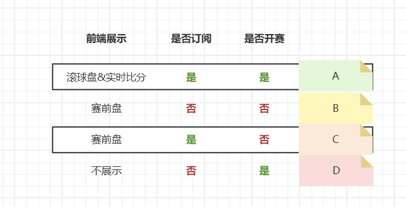
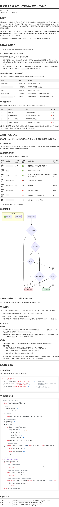

# 体育赛事前端展示与后端分发策略完整技术方案

**作者:** Manus AI  
**日期:** 2025年12月09日  
**版本:** 1.0

---

## 执行摘要

本技术方案为体育数据平台提供了一套完整、清晰的赛事前端展示和后端数据分发逻辑。方案的核心目标是在不同比赛状态（赛前、滚球、结束）、不同订阅级别（是否订阅滚球赔率）以及不同盘口可用性（有无可用盘口、盘口交接）的复杂组合下，智能地决定一个赛事是否应对用户可见，从而提升用户体验并确保数据呈现的准确性。

本方案特别关注并解决了一个关键业务场景：**确保订阅了滚球赔率（Live Odds）的热门赛事，在从赛前盘到滚球盘的短暂"交接阶段"（Handover）中，即使暂时没有可投注的盘口，也依然在前端对用户可见**，避免用户因赛事短暂"消失"而产生平台数据不全的负面印象。

本文档的策略基于对 Sportradar Unified Odds Feed (UOF) 技术文档的深入分析，结合了业务的最佳实践，并提供了可直接落地的实现指南。

---

## 1. 问题背景与用户需求

### 1.1 核心问题

在体育数据平台的实际运营中，我们面临着一个关键决策：**在什么条件下，一个比赛应该在前端展示给用户？**

这个看似简单的问题，实际上涉及多个维度的复杂组合：

1. **订阅状态维度**：我们是否订阅了该赛事的滚球赔率（Live Odds）？还是仅有赛前盘？
2. **比赛状态维度**：比赛是未开始、进行中、还是已结束？
3. **盘口可用性维度**：当前是否有可投注的盘口？盘口是活跃、暂停、还是停用？

不同维度的组合会产生多种场景，每种场景都需要明确的展示策略。

### 1.2 用户特殊需求

用户特别提出了一个关键场景：

> 一个有订阅 liveodds 的比赛在交接阶段没有盘口可用，但我依旧希望其在前端返回，确保关注该比赛（特别是大热门比赛）的用户不会在交接阶段丢失该比赛，从而认为我们平台没有这个比赛。

这个需求的背景是：在比赛从赛前盘切换到滚球盘的过程中，会有一个短暂的"交接阶段"（通常是开赛前30秒到开赛后几秒），此时所有盘口都会被标记为"Handed Over"状态，暂时不可投注。如果在这个阶段将比赛从前端列表中移除，用户会产生"平台没有这个比赛"的错觉，对于热门赛事尤其会造成负面影响。

### 1.3 用户提供的初步方案

用户提供了一个四象限图表，展示了不同场景下的展示策略：



图表中定义了四种场景：

| 场景 | 前端展示 | 是否订阅 | 是否开赛 | 说明 |
| :--- | :--- | :--- | :--- | :--- |
| **A** | 是 | 是 | 是 | 滚球盘&实时比分 - 已订阅且已开赛，应该展示 |
| **B** | 否 | 否 | 否 | 赛前盘 - 未订阅且未开赛，不展示 |
| **C** | 是 | 是 | 否 | 赛前盘 - 已订阅但未开赛，应该展示 |
| **D** | 否 | 否 | 是 | 不展示 - 未订阅但已开赛，不展示 |

这个图表提供了一个良好的起点，但还需要进一步细化和扩展，以覆盖所有可能的场景。

---

## 2. 核心概念与技术基础

为了建立统一的理解，我们首先定义本策略中使用的核心概念。这些概念来源于 Sportradar UOF 的技术规范。

### 2.1 订阅状态 (Subscription Status)

订阅状态决定了我们能从 Sportradar 获取的数据深度和范围。

#### 2.1.1 滚球订阅 (Live Odds Subscribed)

表示该赛事我们拥有 Sportradar 的滚球赔率产品授权。在技术上，这意味着我们会收到来自 `product="1"` (Live Odds) 的 `odds_change` 消息。这类赛事是滚球业务的核心，能够在比赛进行中持续提供实时赔率更新。

**技术识别方法**：检查是否收到过 `product="1"` 的 `odds_change` 消息。

**业务价值**：这类赛事能够提供完整的赛前+滚球体验，是平台的核心竞争力。

#### 2.1.2 仅赛前订阅 (Prematch Only)

表示该赛事我们仅拥有赛前赔率产品授权，不会在比赛开始后收到实时的赔率更新。技术上，只会收到来自 `product="3"` (Prematch) 的消息。

**技术识别方法**：仅收到过 `product="3"` 的消息，从未收到 `product="1"` 的消息。

**业务价值**：这类赛事只能提供赛前投注，开赛后即停止服务。

### 2.2 比赛状态 (Sport Event Status)

比赛状态描述了赛事在真实世界中的进展阶段，来源于 `sport_event_status` 元素。Sportradar 定义了12种不同的比赛状态，但在本策略中，我们主要关注以下几种核心状态：

| 状态值 | 状态码 | 描述 | 业务含义 |
| :--- | :--- | :--- | :--- |
| `not_started` | 0 | 比赛尚未开始 | 赛前阶段，可展示赛前盘 |
| `match_about_to_start` | 22 | 比赛即将开始 | 临近开赛，是交接阶段的前兆 |
| `live` | 1 | 比赛进行中 | 滚球阶段，核心业务场景 |
| `ended` | 100 | 比赛已结束，但结果尚未确认 | 赛事生命周期结束 |
| `closed` | - | 比赛已结束，结果已确认 | 最终状态，不再变化 |
| `cancelled` | 70 | 比赛已取消 | 异常状态，需特殊处理 |
| `postponed` | 60 | 比赛已推迟至稍后日期 | 异常状态，需特殊处理 |

**关键理解**：比赛状态是赛事在真实世界中的客观状态，与我们是否订阅、是否有盘口无关。

### 2.3 盘口状态 (Market Status)

盘口状态定义了单个投注市场的可交易性，来源于 `market` 元素的 `status` 属性。这是决定用户能否下注的直接因素。

| 状态 ID | 状态名称 | 描述 | 是否可投 | 业务含义 |
| :--- | :--- | :--- | :--- | :--- |
| `1` | **Active** (活跃) | 正常提供赔率，可接受投注 | ✅ 是 | 正常交易状态 |
| `-1` | **Suspended** (暂停) | 临时锁盘，赔率可见但不可投 | ❌ 否 | 通常由进球等关键事件触发 |
| `0` | **Deactivated** (停用) | 盘口不再适用，不可投 | ❌ 否 | 盘口暂时不可用，但可能恢复 |
| `-2` | **Handed Over** (交接) | 生产者交接的信号，盘口暂停 | ❌ 否 | **核心场景**，临时过渡状态 |
| `-3` | **Settled** (已结算) | 盘口已结束并完成结算 | ❌ 否 | 最终状态 |
| `-4` | **Cancelled** (已取消) | 盘口被取消 | ❌ 否 | 异常状态 |

**关键区别**：
- **比赛状态** (`live`) 决定赛事是否在滚球阶段
- **盘口状态** (`Active`) 决定用户是否能对某个具体玩法下注

一个 `live` 的比赛可能因为进球而所有盘口暂时 `Suspended`，这是正常现象。

### 2.4 盘口交接机制 (Handover)

这是本方案的核心技术背景，也是用户特殊需求的来源。

#### 2.4.1 交接场景

比赛开始前后（通常是开赛前30秒到开赛后几秒），数据生产者会从"赛前"切换到"滚球"。这是因为赛前盘和滚球盘由不同的数据团队和系统提供，需要进行交接。

#### 2.4.2 交接流程

根据 Sportradar UOF 技术文档，交接流程如下：

1. **赛前生产者发送最后一次消息**：赛前生产者发送 `odds_change` 消息，将所有盘口状态置为 `-2` (Handed Over)
2. **比赛状态变为 live**：此时，比赛状态变为 `live`，但所有盘口都不可投
3. **等待滚球生产者接管**：几秒到几十秒后，滚球生产者发送新的 `odds_change` 消息
4. **盘口恢复活跃**：滚球生产者将盘口状态置为 `1` (Active)，恢复投注

#### 2.4.3 交接阶段的问题

在步骤2和步骤4之间，存在一个短暂的"真空期"：
- 比赛状态是 `live`（已开赛）
- 所有盘口都是 `Handed Over` 或 `Deactivated`（不可投注）
- 如果按照"无可用盘口则不展示"的逻辑，比赛会从前端列表中消失

对于热门赛事，这会造成严重的用户体验问题。

#### 2.4.4 超时处理

根据 Sportradar 建议，如果在收到 `Handed Over` 状态后超过60秒仍未收到来自新生产者的 `odds_change` 消息，应视为异常情况并进行特殊处理。

---

## 3. 核心展示策略

本节定义了后端返回和前端展示的核心逻辑。

### 3.1 核心判断原则

一个赛事是否应该在前端展示，取决于以下原则：

**原则1：订阅优先原则**
- 如果订阅了滚球赔率，只要比赛未结束（`not_started` 或 `live`），就应该展示
- 这确保了用户能够持续跟踪关注的赛事，即使暂时没有可投注的盘口

**原则2：盘口辅助原则**
- 盘口可用性不作为是否展示赛事的决定性因素
- 盘口状态仅作为赛事展示状态的补充说明（如"盘口准备中"）

**原则3：生命周期原则**
- 已结束的比赛（`ended`、`closed`）不在实时列表中展示
- 异常状态的比赛（`cancelled`、`postponed`）需特殊标记或移除

### 3.2 赛事展示策略矩阵

下表定义了在不同组合下的后端返回及前端展示策略：

| 订阅状态 | 比赛状态 | 有无可用盘口 | 后端是否返回 | 前端展示策略 | 对应用户图表场景 |
| :--- | :--- | :--- | :--- | :--- | :--- |
| **滚球订阅** | `not_started` | 是 | ✅ **是** | **展示赛前盘**，正常显示盘口和赔率 | C |
| **滚球订阅** | `not_started` | 否 | ✅ **是** | **展示赛事**，提示"即将开盘"或"盘口准备中" | C (扩展) |
| **滚球订阅** | `live` | 是 | ✅ **是** | **正常展示滚球盘**及实时比分 | A |
| **滚球订阅** | `live` | **否** | ✅ **是** | ⚠️ **（核心场景）继续展示**，提示"盘口准备中"或"暂停投注" | **特殊需求** |
| **滚球订阅** | `ended`/`closed` | - | ❌ **否** | 从实时列表中移除，归入赛果 | - |
| **仅赛前订阅** | `not_started` | 是 | ✅ **是** | **展示赛前盘**，正常显示盘口和赔率 | B (修改) |
| **仅赛前订阅** | `not_started` | 否 | ❌ **否** | 无盘口可投，不展示 | B (原始) |
| **仅赛前订阅** | `live` | - | ❌ **否** | 无滚球数据，开赛后即停止展示 | D |
| **仅赛前订阅** | `ended`/`closed` | - | ❌ **否** | 从实时列表中移除，归入赛果 | - |

**关键说明**：
- 用户图表中的场景 B 被细化为两种情况（有盘口/无盘口）
- 核心场景（滚球订阅 + live + 无盘口）是本方案的重点解决对象

### 3.3 逻辑流程图

下图展示了后端判断一个赛事是否应该返回给前端的完整决策流程：



**流程说明**：
1. 首先判断比赛是否已结束，已结束的比赛直接不展示
2. 如果比赛未结束，判断是否订阅滚球
3. 如果订阅滚球，只要是赛前或滚球状态，就展示
4. 如果未订阅滚球，只在赛前且有盘口时展示

---

## 4. 关键场景处理：盘口交接 (Handover)

这是本规范的核心，旨在解决用户最关切的"热门赛事实时列表消失"问题。

### 4.1 场景识别

后端需要能够准确识别一个赛事是否处于交接阶段。识别方法如下：

**方法1：基于盘口状态**
- 如果一个 `live` 状态的比赛，其所有盘口状态均为 `-2` (Handed Over)，说明正在交接

**方法2：基于盘口数量**
- 如果一个 `live` 状态的比赛，`active_markets_count = 0` 且 `total_markets_count > 0`，说明可能在交接

**方法3：基于时间**
- 如果一个 `live` 状态的比赛，最后一次收到 `odds_change` 的时间距离比赛开始时间在 -30秒到+30秒之间，说明可能在交接

**推荐策略**：结合方法1和方法2，当满足以下条件时，标记为交接状态：
```python
is_in_handover = (
    match.sport_event_status == 'live' and
    match.total_markets_count > 0 and
    match.handover_markets_count == match.total_markets_count
)
```

### 4.2 后端处理策略

**策略1：坚持返回赛事**

根据 3.2 节的策略矩阵，即使 `isInHandover` 为 `true` 且无可用盘口，只要该赛事是"滚球订阅"且状态为 `live`，就**必须**包含在返回给前端的列表中。

**策略2：提供交接状态标识**

在返回给前端的数据中，增加一个 `isInHandover` 字段，让前端能够识别并做出相应的UI调整。

**策略3：监控超时**

记录交接开始时间（`handover_started_at`），如果交接持续超过60秒，触发告警，并在返回数据中标记 `handoverTimeout: true`。

### 4.3 前端展示策略

**策略1：保持赛事可见**

当收到一个 `isInHandover: true` 的赛事时，前端**不得**将其从列表中移除。赛事应继续显示在原有位置，保持列表的稳定性。

**策略2：更新UI状态**

在赛事主干上显示一个明确的提示，让用户理解当前状态：
- **主要提示**："盘口准备中..."或"正在开盘..."
- **次要提示**："比赛已开始，盘口即将开放"
- **视觉效果**：可以使用加载动画或脉冲效果，表示系统正在处理

**策略3：禁用盘口交互**

所有盘口列表应被置灰或显示加载动画，并禁用所有点击事件。用户不应能够点击或尝试下注。

**策略4：保持比赛信息更新**

实时比分、比赛时间等非盘口数据应继续正常更新。用户应该能够看到比赛的实时进展，即使不能下注。

**策略5：超时处理**

如果交接状态持续超过 60 秒（前端收到 `handoverTimeout: true`），应将提示更新为：
- **主要提示**："盘口暂不可用，请稍候"
- **次要提示**："我们正在努力恢复盘口"
- **视觉调整**：可以考虑降低赛事的视觉优先级（如降低透明度），避免长时间占据屏幕焦点

### 4.4 交接场景时序图

下图展示了从交接开始到完成的完整时序：

```
时间轴：T-30s → T-0s → T+5s → T+60s

T-30s: 赛前生产者发送 odds_change (status=-2, Handed Over)
       ↓
       后端：标记 isInHandover = true
       ↓
       前端：显示"盘口准备中..."，盘口置灰

T-0s:  比赛开始 (sport_event_status.status=1, live)
       ↓
       前端：继续显示赛事，更新实时比分

T+5s:  滚球生产者发送 odds_change (status=1, Active)
       ↓
       后端：标记 isInHandover = false
       ↓
       前端：恢复正常显示，盘口可投注

T+60s: 如果仍未收到滚球生产者消息
       ↓
       后端：标记 handoverTimeout = true，触发告警
       ↓
       前端：显示"盘口暂不可用，请稍候"
```

---

## 5. 后端实现指南

本节提供可直接落地的后端实现建议。

### 5.1 数据库模型设计

建议在赛事数据表中增加以下字段，以支持此策略：

```sql
CREATE TABLE `matches` (
  -- 基础字段
  `match_id` VARCHAR(50) PRIMARY KEY COMMENT '赛事ID',
  `sport_id` INT NOT NULL COMMENT '运动类型ID',
  `home_team_id` VARCHAR(50) NOT NULL COMMENT '主队ID',
  `away_team_id` VARCHAR(50) NOT NULL COMMENT '客队ID',
  `scheduled_start_time` TIMESTAMP NOT NULL COMMENT '计划开始时间',
  
  -- 订阅状态字段
  `has_live_subscription` BOOLEAN NOT NULL DEFAULT FALSE COMMENT '是否订阅滚球赔率',
  `last_live_message_at` TIMESTAMP NULL COMMENT '最后收到滚球消息的时间',
  `last_prematch_message_at` TIMESTAMP NULL COMMENT '最后收到赛前消息的时间',
  
  -- 比赛状态字段
  `sport_event_status` VARCHAR(20) NOT NULL DEFAULT 'not_started' COMMENT '比赛状态',
  `home_score` INT DEFAULT 0 COMMENT '主队得分',
  `away_score` INT DEFAULT 0 COMMENT '客队得分',
  `match_time` INT DEFAULT 0 COMMENT '比赛进行时间（分钟）',
  
  -- 盘口统计字段
  `total_markets_count` INT NOT NULL DEFAULT 0 COMMENT '总盘口数量',
  `active_markets_count` INT NOT NULL DEFAULT 0 COMMENT '活跃盘口数量 (status=1)',
  `suspended_markets_count` INT NOT NULL DEFAULT 0 COMMENT '暂停盘口数量 (status=-1)',
  `handover_markets_count` INT NOT NULL DEFAULT 0 COMMENT '交接盘口数量 (status=-2)',
  
  -- 交接状态字段
  `is_in_handover` BOOLEAN NOT NULL DEFAULT FALSE COMMENT '是否处于交接状态',
  `handover_started_at` TIMESTAMP NULL COMMENT '交接开始时间',
  `handover_timeout` BOOLEAN NOT NULL DEFAULT FALSE COMMENT '交接是否超时',
  
  -- 元数据字段
  `created_at` TIMESTAMP DEFAULT CURRENT_TIMESTAMP COMMENT '创建时间',
  `updated_at` TIMESTAMP DEFAULT CURRENT_TIMESTAMP ON UPDATE CURRENT_TIMESTAMP COMMENT '更新时间',
  `last_message_at` TIMESTAMP NULL COMMENT '最后收到任何消息的时间',
  
  -- 索引
  INDEX `idx_sport_event_status` (`sport_event_status`),
  INDEX `idx_has_live_subscription` (`has_live_subscription`),
  INDEX `idx_scheduled_start_time` (`scheduled_start_time`),
  INDEX `idx_updated_at` (`updated_at`)
) ENGINE=InnoDB DEFAULT CHARSET=utf8mb4 COMMENT='赛事表';
```

### 5.2 消息处理逻辑

每次收到 Sportradar 的 `odds_change` 消息时，应执行以下处理逻辑：

```python
def process_odds_change(message):
    """
    处理 odds_change 消息
    
    Args:
        message: Sportradar odds_change 消息对象
    """
    # 1. 查找或创建赛事记录
    match = Match.objects.get_or_create(match_id=message.event_id)
    
    # 2. 更新订阅状态
    if message.product == 1:  # Live Odds
        match.has_live_subscription = True
        match.last_live_message_at = datetime.now()
    elif message.product == 3:  # Prematch
        match.last_prematch_message_at = datetime.now()
    
    # 3. 更新比赛状态
    if message.sport_event_status:
        match.sport_event_status = message.sport_event_status.status
        match.home_score = message.sport_event_status.home_score or 0
        match.away_score = message.sport_event_status.away_score or 0
        match.match_time = message.sport_event_status.match_time or 0
    
    # 4. 更新盘口统计
    if message.odds and message.odds.market:
        active_count = 0
        suspended_count = 0
        handover_count = 0
        total_count = len(message.odds.market)
        
        for market in message.odds.market:
            # 更新单个盘口状态
            update_market_status(market.id, market.status)
            
            # 统计各状态盘口数量
            if market.status == 1:
                active_count += 1
            elif market.status == -1:
                suspended_count += 1
            elif market.status == -2:
                handover_count += 1
        
        match.total_markets_count = total_count
        match.active_markets_count = active_count
        match.suspended_markets_count = suspended_count
        match.handover_markets_count = handover_count
    
    # 5. 判断是否进入交接状态
    previous_handover_state = match.is_in_handover
    
    if (match.sport_event_status == 'live' and 
        match.total_markets_count > 0 and 
        match.handover_markets_count == match.total_markets_count):
        # 进入交接状态
        if not previous_handover_state:
            match.is_in_handover = True
            match.handover_started_at = datetime.now()
            match.handover_timeout = False
    else:
        # 退出交接状态
        if previous_handover_state:
            match.is_in_handover = False
            match.handover_started_at = None
            match.handover_timeout = False
    
    # 6. 检查交接超时
    if match.is_in_handover and match.handover_started_at:
        elapsed = (datetime.now() - match.handover_started_at).total_seconds()
        if elapsed > 60:
            match.handover_timeout = True
            # 触发告警
            alert_handover_timeout(match.match_id)
    
    # 7. 更新最后消息时间
    match.last_message_at = datetime.now()
    
    # 8. 保存到数据库
    match.save()
    
    # 9. 推送到前端（如果需要展示）
    if should_display_match(match):
        push_to_frontend(match)
```

### 5.3 API 返回逻辑

提供一个 API 端点，返回所有应该展示的赛事列表：

```python
def get_displayable_matches(sport_id=None, limit=100):
    """
    获取应该在前端展示的赛事列表
    
    Args:
        sport_id: 运动类型ID（可选）
        limit: 返回数量限制
        
    Returns:
        List[Match]: 应该展示的赛事列表
    """
    displayable_matches = []
    
    # 构建基础查询
    query = Match.objects.all()
    if sport_id:
        query = query.filter(sport_id=sport_id)
    
    for match in query:
        # 规则 1: 结束的比赛不展示
        if match.sport_event_status in ['ended', 'closed', 'cancelled']:
            continue
        
        # 规则 2: 滚球订阅的比赛，只要没结束就展示
        if match.has_live_subscription:
            if match.sport_event_status in ['not_started', 'match_about_to_start', 'live']:
                displayable_matches.append(match)
                continue
        
        # 规则 3: 仅赛前订阅的比赛，只在赛前且有盘口时展示
        if (not match.has_live_subscription and 
            match.sport_event_status == 'not_started' and 
            match.active_markets_count > 0):
            displayable_matches.append(match)
            continue
    
    # 按开始时间排序
    displayable_matches.sort(key=lambda m: m.scheduled_start_time)
    
    # 限制返回数量
    return displayable_matches[:limit]


def should_display_match(match):
    """
    判断单个赛事是否应该展示
    
    Args:
        match: Match 对象
        
    Returns:
        bool: 是否应该展示
    """
    # 规则 1: 结束的比赛不展示
    if match.sport_event_status in ['ended', 'closed', 'cancelled']:
        return False
    
    # 规则 2: 滚球订阅的比赛，只要没结束就展示
    if match.has_live_subscription:
        if match.sport_event_status in ['not_started', 'match_about_to_start', 'live']:
            return True
    
    # 规则 3: 仅赛前订阅的比赛，只在赛前且有盘口时展示
    if (not match.has_live_subscription and 
        match.sport_event_status == 'not_started' and 
        match.active_markets_count > 0):
        return True
    
    return False
```

### 5.4 API 响应格式

建议的 API 响应格式如下：

```json
{
  "success": true,
  "data": {
    "matches": [
      {
        "match_id": "sr:match:12345678",
        "sport_id": 1,
        "home_team": {
          "id": "sr:competitor:1234",
          "name": "曼联"
        },
        "away_team": {
          "id": "sr:competitor:5678",
          "name": "利物浦"
        },
        "scheduled_start_time": "2025-12-09T15:00:00Z",
        "sport_event_status": "live",
        "home_score": 1,
        "away_score": 1,
        "match_time": 45,
        "has_live_subscription": true,
        "active_markets_count": 0,
        "total_markets_count": 150,
        "is_in_handover": true,
        "handover_started_at": "2025-12-09T14:59:30Z",
        "handover_timeout": false,
        "display_status": "handover",
        "display_message": "盘口准备中...",
        "markets": []
      },
      {
        "match_id": "sr:match:87654321",
        "sport_id": 1,
        "home_team": {
          "id": "sr:competitor:9876",
          "name": "皇马"
        },
        "away_team": {
          "id": "sr:competitor:5432",
          "name": "巴萨"
        },
        "scheduled_start_time": "2025-12-09T18:00:00Z",
        "sport_event_status": "not_started",
        "home_score": 0,
        "away_score": 0,
        "match_time": 0,
        "has_live_subscription": true,
        "active_markets_count": 85,
        "total_markets_count": 85,
        "is_in_handover": false,
        "handover_started_at": null,
        "handover_timeout": false,
        "display_status": "prematch",
        "display_message": null,
        "markets": [
          {
            "market_id": 1,
            "market_name": "全场胜平负",
            "status": 1,
            "outcomes": [
              {"id": "1", "name": "主胜", "odds": 1.85},
              {"id": "X", "name": "平局", "odds": 3.40},
              {"id": "2", "name": "客胜", "odds": 4.20}
            ]
          }
        ]
      }
    ],
    "total": 2,
    "timestamp": "2025-12-09T15:00:00Z"
  }
}
```

**关键字段说明**：
- `is_in_handover`: 是否处于交接状态
- `handover_timeout`: 交接是否超时
- `display_status`: 展示状态（`prematch`, `live`, `handover`, `suspended`）
- `display_message`: 展示提示信息（前端可直接使用）

---

## 6. 前端实现指南

本节提供前端实现的具体建议。

### 6.1 赛事列表渲染逻辑

```javascript
// 渲染赛事列表
function renderMatchList(matches) {
  const matchListContainer = document.getElementById('match-list');
  matchListContainer.innerHTML = '';
  
  matches.forEach(match => {
    const matchElement = createMatchElement(match);
    matchListContainer.appendChild(matchElement);
  });
}

// 创建单个赛事元素
function createMatchElement(match) {
  const matchDiv = document.createElement('div');
  matchDiv.className = 'match-item';
  matchDiv.dataset.matchId = match.match_id;
  
  // 根据交接状态添加特殊样式
  if (match.is_in_handover) {
    matchDiv.classList.add('match-handover');
  }
  
  // 比赛基本信息
  matchDiv.innerHTML = `
    <div class="match-header">
      <div class="match-teams">
        <span class="home-team">${match.home_team.name}</span>
        <span class="vs">vs</span>
        <span class="away-team">${match.away_team.name}</span>
      </div>
      <div class="match-score">
        ${match.home_score} - ${match.away_score}
      </div>
      <div class="match-time">
        ${formatMatchTime(match)}
      </div>
    </div>
    ${renderMatchStatus(match)}
    ${renderMarkets(match)}
  `;
  
  return matchDiv;
}

// 渲染比赛状态提示
function renderMatchStatus(match) {
  if (match.is_in_handover) {
    const timeoutClass = match.handover_timeout ? 'timeout' : '';
    const message = match.handover_timeout 
      ? '盘口暂不可用，请稍候' 
      : '盘口准备中...';
    
    return `
      <div class="match-status handover ${timeoutClass}">
        <div class="status-icon">
          <div class="loading-spinner"></div>
        </div>
        <div class="status-message">${message}</div>
      </div>
    `;
  }
  
  if (match.display_message) {
    return `
      <div class="match-status">
        <div class="status-message">${match.display_message}</div>
      </div>
    `;
  }
  
  return '';
}

// 渲染盘口列表
function renderMarkets(match) {
  if (match.is_in_handover || match.active_markets_count === 0) {
    return `
      <div class="markets-container disabled">
        <div class="no-markets-message">
          ${match.is_in_handover ? '盘口准备中，请稍候' : '暂无可用盘口'}
        </div>
      </div>
    `;
  }
  
  let marketsHtml = '<div class="markets-container">';
  match.markets.forEach(market => {
    marketsHtml += renderMarket(market);
  });
  marketsHtml += '</div>';
  
  return marketsHtml;
}

// 渲染单个盘口
function renderMarket(market) {
  const isActive = market.status === 1;
  const disabledClass = isActive ? '' : 'disabled';
  
  let marketHtml = `
    <div class="market ${disabledClass}">
      <div class="market-name">${market.market_name}</div>
      <div class="outcomes">
  `;
  
  market.outcomes.forEach(outcome => {
    const outcomeDisabled = !isActive ? 'disabled' : '';
    marketHtml += `
      <button class="outcome ${outcomeDisabled}" 
              data-outcome-id="${outcome.id}"
              ${!isActive ? 'disabled' : ''}
              onclick="handleOutcomeClick('${market.market_id}', '${outcome.id}')">
        <span class="outcome-name">${outcome.name}</span>
        <span class="outcome-odds">${outcome.odds}</span>
      </button>
    `;
  });
  
  marketHtml += `
      </div>
    </div>
  `;
  
  return marketHtml;
}
```

### 6.2 实时更新处理

```javascript
// WebSocket 连接
const ws = new WebSocket('wss://your-api.com/ws/matches');

ws.onmessage = function(event) {
  const data = JSON.parse(event.data);
  
  switch(data.type) {
    case 'match_update':
      handleMatchUpdate(data.match);
      break;
    case 'match_handover_started':
      handleHandoverStarted(data.match_id);
      break;
    case 'match_handover_completed':
      handleHandoverCompleted(data.match_id, data.markets);
      break;
    case 'match_removed':
      handleMatchRemoved(data.match_id);
      break;
  }
};

// 处理比赛更新
function handleMatchUpdate(match) {
  const matchElement = document.querySelector(`[data-match-id="${match.match_id}"]`);
  
  if (!matchElement) {
    // 如果赛事不在列表中，添加它
    const newMatchElement = createMatchElement(match);
    document.getElementById('match-list').appendChild(newMatchElement);
  } else {
    // 更新现有赛事
    const newMatchElement = createMatchElement(match);
    matchElement.replaceWith(newMatchElement);
  }
}

// 处理交接开始
function handleHandoverStarted(matchId) {
  const matchElement = document.querySelector(`[data-match-id="${matchId}"]`);
  if (matchElement) {
    matchElement.classList.add('match-handover');
    
    // 显示交接提示
    const statusDiv = matchElement.querySelector('.match-status') || 
                      document.createElement('div');
    statusDiv.className = 'match-status handover';
    statusDiv.innerHTML = `
      <div class="status-icon">
        <div class="loading-spinner"></div>
      </div>
      <div class="status-message">盘口准备中...</div>
    `;
    
    // 禁用所有盘口
    const marketsContainer = matchElement.querySelector('.markets-container');
    if (marketsContainer) {
      marketsContainer.classList.add('disabled');
      marketsContainer.querySelectorAll('.outcome').forEach(btn => {
        btn.disabled = true;
      });
    }
  }
}

// 处理交接完成
function handleHandoverCompleted(matchId, markets) {
  const matchElement = document.querySelector(`[data-match-id="${matchId}"]`);
  if (matchElement) {
    matchElement.classList.remove('match-handover');
    
    // 移除交接提示
    const statusDiv = matchElement.querySelector('.match-status.handover');
    if (statusDiv) {
      statusDiv.remove();
    }
    
    // 恢复盘口
    const marketsContainer = matchElement.querySelector('.markets-container');
    if (marketsContainer) {
      marketsContainer.classList.remove('disabled');
      marketsContainer.innerHTML = '';
      markets.forEach(market => {
        marketsContainer.innerHTML += renderMarket(market);
      });
    }
  }
}

// 处理比赛移除
function handleMatchRemoved(matchId) {
  const matchElement = document.querySelector(`[data-match-id="${matchId}"]`);
  if (matchElement) {
    // 添加淡出动画
    matchElement.classList.add('fade-out');
    setTimeout(() => {
      matchElement.remove();
    }, 300);
  }
}
```

### 6.3 CSS 样式建议

```css
/* 交接状态的比赛样式 */
.match-item.match-handover {
  border: 2px solid #ffa500;
  background: linear-gradient(to right, #fff9f0, #ffffff);
}

/* 交接状态提示 */
.match-status.handover {
  display: flex;
  align-items: center;
  justify-content: center;
  padding: 12px;
  background: #fff3cd;
  border-radius: 4px;
  margin: 8px 0;
}

.match-status.handover.timeout {
  background: #f8d7da;
  border: 1px solid #f5c6cb;
}

/* 加载动画 */
.loading-spinner {
  width: 20px;
  height: 20px;
  border: 3px solid #f3f3f3;
  border-top: 3px solid #ffa500;
  border-radius: 50%;
  animation: spin 1s linear infinite;
  margin-right: 8px;
}

@keyframes spin {
  0% { transform: rotate(0deg); }
  100% { transform: rotate(360deg); }
}

/* 禁用的盘口容器 */
.markets-container.disabled {
  opacity: 0.5;
  pointer-events: none;
}

/* 禁用的投注项 */
.outcome.disabled {
  opacity: 0.6;
  cursor: not-allowed;
  background: #e9ecef;
}

/* 淡出动画 */
.match-item.fade-out {
  animation: fadeOut 0.3s ease-out forwards;
}

@keyframes fadeOut {
  from {
    opacity: 1;
    transform: translateX(0);
  }
  to {
    opacity: 0;
    transform: translateX(-20px);
  }
}
```

---

## 7. 监控与告警

为了确保策略的有效执行，建议实施以下监控和告警机制。

### 7.1 关键监控指标

| 指标名称 | 描述 | 告警阈值 | 处理建议 |
| :--- | :--- | :--- | :--- |
| **交接超时率** | 交接时间超过60秒的比赛占比 | > 5% | 检查 Sportradar 连接，联系技术支持 |
| **交接平均时长** | 从交接开始到完成的平均时间 | > 30秒 | 优化消息处理逻辑，检查网络延迟 |
| **消息延迟** | 收到消息的时间与消息生成时间的差值 | > 5秒 | 检查网络连接，优化消息队列 |
| **无盘口比赛数** | `live` 状态但无活跃盘口的比赛数量 | > 10 | 检查是否有大量交接超时 |
| **订阅识别准确率** | 正确识别订阅状态的比赛占比 | < 95% | 检查消息处理逻辑 |

### 7.2 告警规则

```python
# 交接超时告警
def alert_handover_timeout(match_id):
    """
    交接超时告警
    """
    match = Match.objects.get(match_id=match_id)
    
    alert_message = f"""
    【交接超时告警】
    赛事ID: {match.match_id}
    赛事: {match.home_team.name} vs {match.away_team.name}
    交接开始时间: {match.handover_started_at}
    已持续: {(datetime.now() - match.handover_started_at).total_seconds()}秒
    
    请立即检查：
    1. Sportradar 连接状态
    2. 消息队列是否正常
    3. 是否有生产者故障
    """
    
    send_alert(alert_message, level='high')

# 消息延迟告警
def check_message_delay():
    """
    检查消息延迟
    """
    recent_matches = Match.objects.filter(
        sport_event_status='live',
        last_message_at__gte=datetime.now() - timedelta(minutes=5)
    )
    
    high_delay_count = 0
    for match in recent_matches:
        # 假设我们存储了消息的生成时间
        if hasattr(match, 'last_message_generated_at'):
            delay = (match.last_message_at - match.last_message_generated_at).total_seconds()
            if delay > 5:
                high_delay_count += 1
    
    if high_delay_count > 5:
        send_alert(f"有 {high_delay_count} 场比赛的消息延迟超过5秒", level='medium')
```

### 7.3 日志记录

```python
import logging

logger = logging.getLogger('match_display')

# 记录交接事件
def log_handover_event(match, event_type):
    """
    记录交接事件
    
    Args:
        match: Match 对象
        event_type: 'started' 或 'completed' 或 'timeout'
    """
    logger.info(
        f"Handover {event_type}",
        extra={
            'match_id': match.match_id,
            'home_team': match.home_team.name,
            'away_team': match.away_team.name,
            'sport_event_status': match.sport_event_status,
            'handover_started_at': match.handover_started_at,
            'duration': (datetime.now() - match.handover_started_at).total_seconds() if match.handover_started_at else None
        }
    )

# 记录展示决策
def log_display_decision(match, should_display, reason):
    """
    记录展示决策
    
    Args:
        match: Match 对象
        should_display: 是否展示
        reason: 决策原因
    """
    logger.debug(
        f"Display decision: {'SHOW' if should_display else 'HIDE'}",
        extra={
            'match_id': match.match_id,
            'reason': reason,
            'has_live_subscription': match.has_live_subscription,
            'sport_event_status': match.sport_event_status,
            'active_markets_count': match.active_markets_count,
            'is_in_handover': match.is_in_handover
        }
    )
```

---

## 8. 测试建议

### 8.1 单元测试

```python
import unittest
from datetime import datetime, timedelta

class TestMatchDisplayLogic(unittest.TestCase):
    
    def test_live_subscription_not_started_should_display(self):
        """测试：滚球订阅 + 未开赛 -> 应该展示"""
        match = Match(
            has_live_subscription=True,
            sport_event_status='not_started',
            active_markets_count=10
        )
        self.assertTrue(should_display_match(match))
    
    def test_live_subscription_live_no_markets_should_display(self):
        """测试：滚球订阅 + 进行中 + 无盘口 -> 应该展示（核心场景）"""
        match = Match(
            has_live_subscription=True,
            sport_event_status='live',
            active_markets_count=0,
            is_in_handover=True
        )
        self.assertTrue(should_display_match(match))
    
    def test_no_subscription_live_should_not_display(self):
        """测试：无滚球订阅 + 进行中 -> 不应该展示"""
        match = Match(
            has_live_subscription=False,
            sport_event_status='live',
            active_markets_count=0
        )
        self.assertFalse(should_display_match(match))
    
    def test_ended_should_not_display(self):
        """测试：已结束 -> 不应该展示"""
        match = Match(
            has_live_subscription=True,
            sport_event_status='ended'
        )
        self.assertFalse(should_display_match(match))
    
    def test_handover_identification(self):
        """测试：交接状态识别"""
        match = Match(
            sport_event_status='live',
            total_markets_count=100,
            handover_markets_count=100
        )
        # 模拟消息处理
        process_odds_change(mock_handover_message(match.match_id))
        match.refresh_from_db()
        self.assertTrue(match.is_in_handover)
    
    def test_handover_timeout_detection(self):
        """测试：交接超时检测"""
        match = Match(
            is_in_handover=True,
            handover_started_at=datetime.now() - timedelta(seconds=65)
        )
        # 模拟消息处理
        process_odds_change(mock_odds_change_message(match.match_id))
        match.refresh_from_db()
        self.assertTrue(match.handover_timeout)
```

### 8.2 集成测试

```python
class TestMatchDisplayIntegration(unittest.TestCase):
    
    def test_full_handover_flow(self):
        """测试：完整的交接流程"""
        # 1. 创建赛前比赛
        match = create_prematch_match()
        self.assertEqual(match.sport_event_status, 'not_started')
        
        # 2. 模拟收到交接消息
        process_odds_change(mock_handover_message(match.match_id))
        match.refresh_from_db()
        self.assertTrue(match.is_in_handover)
        self.assertTrue(should_display_match(match))
        
        # 3. 模拟比赛开始
        process_odds_change(mock_live_message(match.match_id))
        match.refresh_from_db()
        self.assertEqual(match.sport_event_status, 'live')
        self.assertTrue(match.is_in_handover)
        
        # 4. 模拟滚球生产者接管
        process_odds_change(mock_live_active_message(match.match_id))
        match.refresh_from_db()
        self.assertFalse(match.is_in_handover)
        self.assertTrue(match.active_markets_count > 0)
        self.assertTrue(should_display_match(match))
```

### 8.3 压力测试

```python
def test_high_volume_message_processing():
    """测试：高并发消息处理"""
    import concurrent.futures
    
    # 模拟1000场比赛同时收到消息
    match_ids = [f"sr:match:{i}" for i in range(1000)]
    
    def process_match_message(match_id):
        message = mock_odds_change_message(match_id)
        process_odds_change(message)
    
    start_time = time.time()
    
    with concurrent.futures.ThreadPoolExecutor(max_workers=10) as executor:
        executor.map(process_match_message, match_ids)
    
    end_time = time.time()
    duration = end_time - start_time
    
    # 期望在10秒内处理完成
    assert duration < 10, f"处理时间过长: {duration}秒"
    
    # 验证所有比赛都被正确处理
    for match_id in match_ids:
        match = Match.objects.get(match_id=match_id)
        assert match.last_message_at is not None
```

---

## 9. 常见问题与解答

**Q1: 为什么滚球订阅的比赛在没有盘口时也要展示？**

A: 这是为了避免用户在交接阶段（从赛前盘切换到滚球盘）产生"平台没有这个比赛"的错觉。对于热门赛事，这个短暂的"消失"会严重影响用户体验和平台信任度。

**Q2: 交接阶段通常持续多久？**

A: 根据 Sportradar 的技术规范，正常的交接阶段应该在几秒到几十秒之间完成。如果超过60秒，应视为异常情况并触发告警。

**Q3: 如果一个比赛长时间处于交接状态，应该如何处理？**

A: 应该在前端显示明确的提示（如"盘口暂不可用，请稍候"），并降低赛事的视觉优先级。同时，后端应触发告警，检查 Sportradar 连接状态和生产者状态。

**Q4: 未订阅滚球的比赛，在开赛后为什么不展示？**

A: 因为这类比赛在开赛后不会有实时赔率更新，无法提供滚球投注服务。继续展示会误导用户，认为可以进行滚球投注。

**Q5: 如何判断一个比赛是否订阅了滚球？**

A: 检查是否收到过 `product="1"` (Live Odds) 的 `odds_change` 消息。如果收到过，说明订阅了滚球。

**Q6: 如果后端判断逻辑出错，导致不应该展示的比赛被展示了，会有什么影响？**

A: 最坏的情况是用户看到一个没有可投注盘口的比赛，但不会造成资金损失或数据错误。建议在前端增加兜底逻辑，如果一个比赛长时间没有可用盘口，自动降低其显示优先级。

**Q7: 是否需要对不同运动类型采用不同的展示策略？**

A: 本方案提供的是通用策略，适用于所有运动类型。但在实际应用中，可以根据不同运动的特点进行微调。例如，网球比赛的交接阶段可能比足球更短。

---

## 10. 总结与建议

本技术方案为体育数据平台提供了一套完整、可落地的赛事前端展示和后端分发策略。方案的核心要点如下：

### 10.1 核心原则

1. **订阅优先原则**：订阅了滚球赔率的比赛，只要未结束就应该展示
2. **盘口辅助原则**：盘口可用性不作为是否展示赛事的决定性因素
3. **用户体验优先**：在交接阶段保持赛事可见，避免用户困惑

### 10.2 关键实现

1. **数据库设计**：增加 `has_live_subscription`、`is_in_handover` 等关键字段
2. **消息处理**：准确识别订阅状态和交接状态
3. **API 设计**：提供清晰的展示状态和提示信息
4. **前端实现**：在交接阶段显示明确的UI提示

### 10.3 监控告警

1. **交接超时监控**：超过60秒触发告警
2. **消息延迟监控**：超过5秒触发告警
3. **日志记录**：记录所有关键决策和事件

### 10.4 后续优化建议

1. **个性化展示**：根据用户的关注列表，优先展示用户关注的比赛
2. **智能排序**：根据比赛热度、开赛时间、盘口数量等因素智能排序
3. **预测性交接**：在比赛即将开始时（如开赛前1分钟），提前显示"即将开盘"提示
4. **A/B 测试**：对不同的展示策略进行 A/B 测试，优化用户体验

### 10.5 风险提示

1. **过度展示风险**：如果展示了太多无盘口的比赛，可能会降低用户体验
2. **数据同步风险**：如果后端和前端的状态不同步，可能会造成用户困惑
3. **性能风险**：高并发场景下，消息处理可能会有延迟

建议在实施本方案时，先在小范围内进行灰度测试，收集用户反馈后再全面推广。

---

## 11. 附录

### 11.1 术语表

| 术语 | 英文 | 说明 |
| :--- | :--- | :--- |
| 滚球 | Live Betting | 比赛进行中的实时投注 |
| 赛前盘 | Prematch | 比赛开始前的投注 |
| 盘口 | Market | 投注市场，如"全场胜平负" |
| 投注项 | Outcome | 盘口中的具体选项，如"主胜" |
| 交接 | Handover | 数据生产者从赛前切换到滚球的过程 |
| 订阅 | Subscription | 购买 Sportradar 的数据产品授权 |

### 11.2 参考文献

本方案基于以下 Sportradar UOF 技术文档：

1. **Sportradar `<sport_event_status>` 元素完整指南** - 详细说明了比赛状态的12种类型和状态流转机制
2. **Sportradar UOF 消息处理与 Market 状态流转分析报告** - 详细说明了盘口状态的6种类型和交接机制
3. **Sportradar UOF 实时层消息处理规范** - 详细说明了 `odds_change` 消息的结构和处理逻辑

### 11.3 版本历史

| 版本 | 日期 | 作者 | 变更说明 |
| :--- | :--- | :--- | :--- |
| 1.0 | 2025-12-09 | Manus AI | 初始版本，完整的展示策略方案 |

---

**文档结束**
