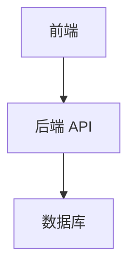

# [模块标题]

## 基本信息

- **模块 ID**: `[module-id]`
- **状态**: `draft`
- **负责人**: `[负责人]`
- **最后更新**: `[YYYY-MM-DD]`

## 模块概述

[待补充: 详细描述模块的核心业务价值、主要功能和目标用户。]

## 包含页面

- [@页面标题](../pages/[page-id].md) - [页面功能简述]
- [待补充]

## 相关模块

- [@模块标题](../[module-id]/README.md) - [依赖关系说明]
- [待补充]

## 技术架构

[待补充: 描述模块的技术实现、前后端交互方式、数据流等,可使用 Mermaid 图表。]

## 变更历史

| 日期 | 版本 | 变更内容 | 变更人 |
|---|---|---|---|
| [YYYY-MM-DD] | v1.0.0 | 初始版本 | [变更人] |
