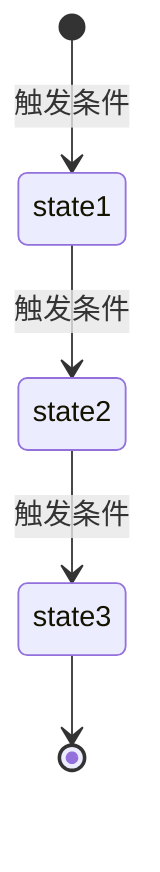

# 服务文档模板

> 本模板用于创建后端服务文档。服务文档是后端设计的核心,包含业务逻辑、数据模型、核心方法等完整信息。

---

```yaml
---
id: {service-id}                 # 服务唯一标识符,使用 kebab-case,如: deposit-service
type: service                    # 固定值: service
title: {服务标题}                 # 服务的中文名称,如: 充值服务
status: draft                    # 文档状态: draft | in-design | in-progress | completed | outdated
stage: design                    # 当前阶段: requirement | design | implementation
complexity: medium               # 复杂度: simple | medium | complex
createdAt: YYYY-MM-DD           # 创建日期
updatedAt: YYYY-MM-DD           # 最后更新日期
author: {作者}                   # 文档作者
---
```

# {服务标题}

## 1. 概述

> 简要描述服务的职责、边界和核心价值。

### 1.1. 服务职责

{描述此服务负责的核心业务功能}

### 1.2. 使用场景

{列出此服务的典型使用场景}

- 场景 1: {描述}
- 场景 2: {描述}
- 场景 3: {描述}

### 1.3. 服务边界

{明确此服务不负责的内容,避免职责混淆}

- ❌ 不负责: {描述}
- ❌ 不负责: {描述}

---

## 2. 业务规则

> 定义服务的核心业务逻辑和约束条件。

### 2.1. {业务规则类别 1}

{详细描述业务规则}

**约束条件**:
- 条件 1: {描述}
- 条件 2: {描述}

### 2.2. {业务规则类别 2}

{详细描述业务规则}

**约束条件**:
- 条件 1: {描述}
- 条件 2: {描述}

---

## 3. 状态机

> 如果服务管理的对象有状态转换,在此定义状态机。如果没有状态管理,可以删除此章节。

### 3.1. 状态定义

| 状态值 | 状态名称 | 说明 | 可转换到的状态 |
|--------|---------|------|---------------|
| {state1} | {状态名} | {说明} | {state2, state3} |
| {state2} | {状态名} | {说明} | {state3} |
| {state3} | {状态名} | {说明} | - |

### 3.2. 状态转换图



### 3.3. 状态转换规则

**state1 → state2**:
- 触发条件: {描述}
- 前置检查: {描述}
- 后置操作: {描述}

**state2 → state3**:
- 触发条件: {描述}
- 前置检查: {描述}
- 后置操作: {描述}

---

## 4. 数据模型

> 定义服务使用的数据模型。数据模型内联在服务文档中,不单独创建模型文档。

### 4.1. {模型名称 1}

**表名**: `{table_name}`

**用途**: {描述此模型的用途}

| 字段 | 类型 | 必填 | 说明 | 约束 |
|------|------|------|------|------|
| id | String | 是 | 主键 | UUID |
| {field1} | {Type} | 是/否 | {说明} | {约束条件} |
| {field2} | {Type} | 是/否 | {说明} | {约束条件} |
| createdAt | DateTime | 是 | 创建时间 | 自动生成 |
| updatedAt | DateTime | 是 | 更新时间 | 自动更新 |

**索引**:
- PRIMARY KEY: `id`
- INDEX: `{field1}`, `{field2}`
- UNIQUE INDEX: `{field3}`

**关系**:
- 属于 {关联模型}（多对一）: `{field}` → `{table}.{field}`
- 拥有多个 {关联模型}（一对多）: `id` ← `{table}.{field}`

**业务约束**:
- {约束 1}: {描述}
- {约束 2}: {描述}

### 4.2. {模型名称 2}

{按照相同格式定义其他模型}

---

## 5. 核心方法

> 定义服务的核心方法。这些方法可能被其他服务调用,也可能通过 API 暴露给外部。

### 5.1. {methodName1}({param1}, {param2})

**功能**: {简要描述方法的功能}

**参数**:
- `{param1}` ({Type}): {参数说明}
- `{param2}` ({Type}): {参数说明}

**返回值**: `{ReturnType}` - {返回值说明}

**异常**:
- `{ExceptionType1}`: {异常说明}
- `{ExceptionType2}`: {异常说明}

**处理流程**:
1. {步骤 1}
2. {步骤 2}
3. {步骤 3}
4. {步骤 4}

**业务规则**:
- {规则 1}
- {规则 2}

### 5.2. {methodName2}({param1})

{按照相同格式定义其他方法}

---

## 6. 暴露的 API

> 列出此服务暴露给外部的所有 API 接口。

| API 名称 | HTTP 方法 | 路径 | 说明 | 文档链接 |
|---------|----------|------|------|---------|
| {API 名称} | POST | `/api/{path}` | {说明} | [@{API 标题}](../apis/{api-id}.md) |
| {API 名称} | GET | `/api/{path}` | {说明} | [@{API 标题}](../apis/{api-id}.md) |

---

## 7. 依赖关系

> 明确此服务依赖的其他服务、外部 API 和基础设施。

### 7.1. 依赖的服务

| 服务名称 | 用途 | 文档链接 |
|---------|------|---------|
| {服务名} | {用途说明} | [@{服务标题}](./{service-id}.md) |

### 7.2. 依赖的外部 API

| API 名称 | 提供方 | 用途 | 文档链接 |
|---------|--------|------|---------|
| {API 名} | {提供方} | {用途} | {URL} |

### 7.3. 依赖的基础设施

| 基础设施 | 用途 | 配置要求 |
|---------|------|---------|
| MySQL | 数据持久化 | 版本 8.0+ |
| Redis | 缓存和幂等性控制 | 版本 6.0+ |
| RabbitMQ | 异步消息队列 | 版本 3.8+ |

---

## 8. 事务处理

> 描述服务的事务处理策略和一致性保证。

### 8.1. {事务场景 1}

**涉及的操作**:
1. {操作 1}
2. {操作 2}
3. {操作 3}

**事务策略**:
- {策略描述}

**一致性保证**:
- {保证措施 1}
- {保证措施 2}

**失败处理**:
- {失败场景}: {处理方式}

### 8.2. {事务场景 2}

{按照相同格式定义其他事务场景}

---

## 9. 技术规格

> 定义服务的技术实现细节。

### 9.1. 技术栈

| 技术 | 版本 | 用途 |
|------|------|------|
| 编程语言 | {语言} {版本} | - |
| 框架 | {框架} {版本} | - |
| ORM | {ORM} {版本} | 数据库访问 |
| 数据库 | {数据库} {版本} | 数据持久化 |

### 9.2. 性能指标

| 指标 | 目标值 | 说明 |
|------|--------|------|
| {方法名} 响应时间 (P95) | < {X}ms | {说明} |
| {方法名} 吞吐量 (QPS) | > {X} | {说明} |

### 9.3. 安全性

- {安全措施 1}
- {安全措施 2}
- {安全措施 3}

### 9.4. 可观测性

**日志**:
- {日志类型 1}: {说明}
- {日志类型 2}: {说明}

**监控指标**:
- {指标 1}: {说明}
- {指标 2}: {说明}

**告警规则**:
- {告警 1}: {触发条件}
- {告警 2}: {触发条件}

---

## 10. 变更历史

| 日期 | 版本 | 变更内容 | 变更人 |
|------|------|---------|--------|
| YYYY-MM-DD | v1.0.0 | 初始版本 | {作者} |

---

## 填写说明

### 必填章节
- 1. 概述
- 2. 业务规则
- 4. 数据模型
- 5. 核心方法
- 6. 暴露的 API

### 可选章节
- 3. 状态机（如果没有状态管理可以删除）
- 7. 依赖关系（如果没有外部依赖可以简化）
- 8. 事务处理（简单服务可以简化）
- 9. 技术规格（可以在实现阶段补充）

### 填写技巧

1. **概述章节**: 用一句话说清楚服务是干什么的
2. **业务规则**: 重点描述约束条件和边界情况
3. **数据模型**: 字段定义要完整,业务约束要明确
4. **核心方法**: 处理流程要清晰,异常处理要完整
5. **状态机**: 如果有状态转换,一定要画图
6. **事务处理**: 重点说明失败场景的处理方式

### 复杂度判断

| 复杂度 | 业务规则 | 数据模型 | 事务处理 | 示例 |
|--------|---------|---------|---------|------|
| simple | 简单或无 | 单表 | 无 | 用户资料修改 |
| medium | 有一定规则 | 2-3 个表 | 单一事务 | 订单创建 |
| complex | 复杂规则、状态机 | 多表、复杂关联 | 分布式事务 | 充值提现、双边账 |
